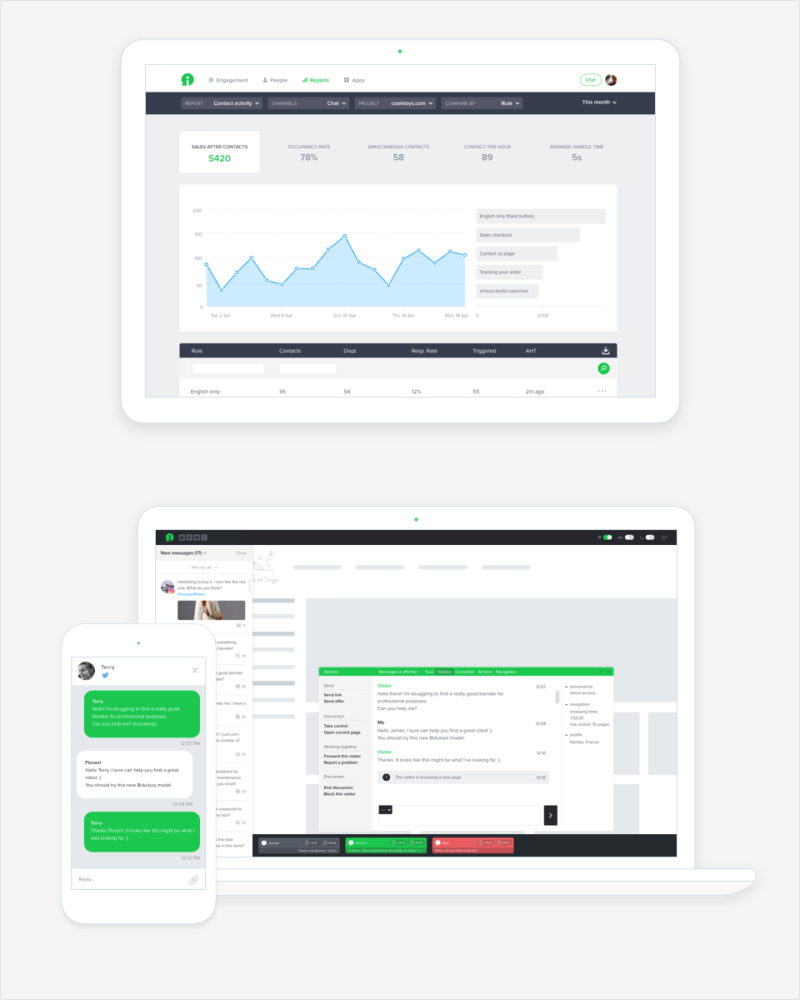
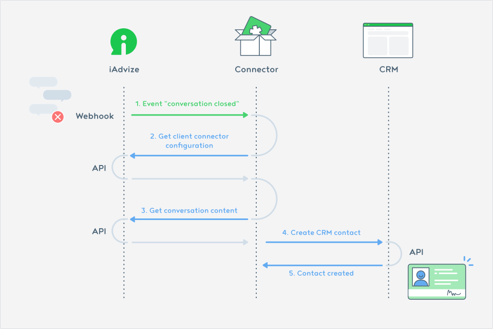
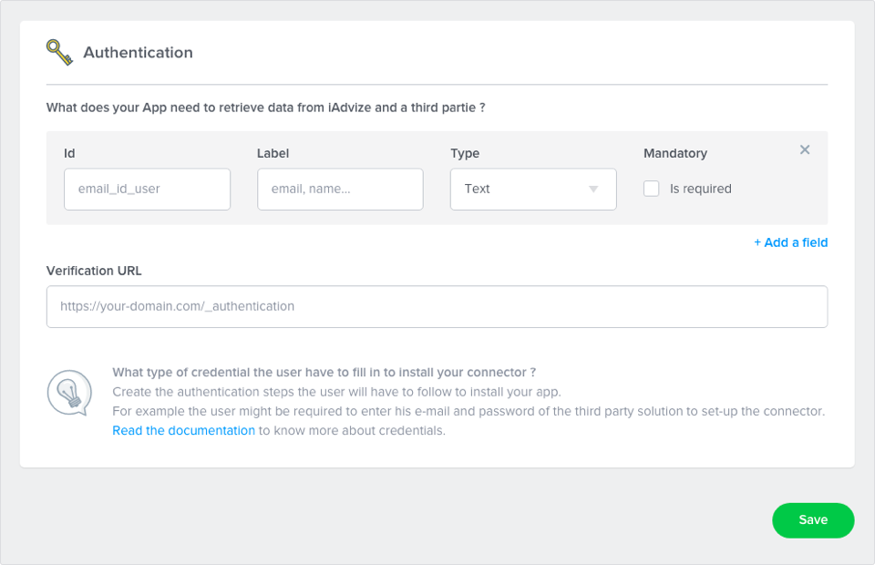
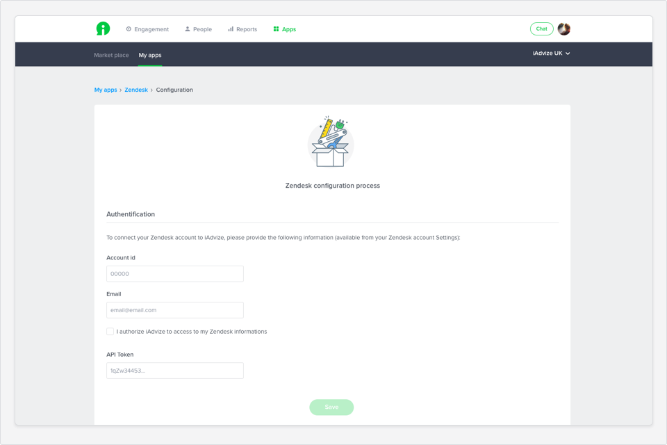
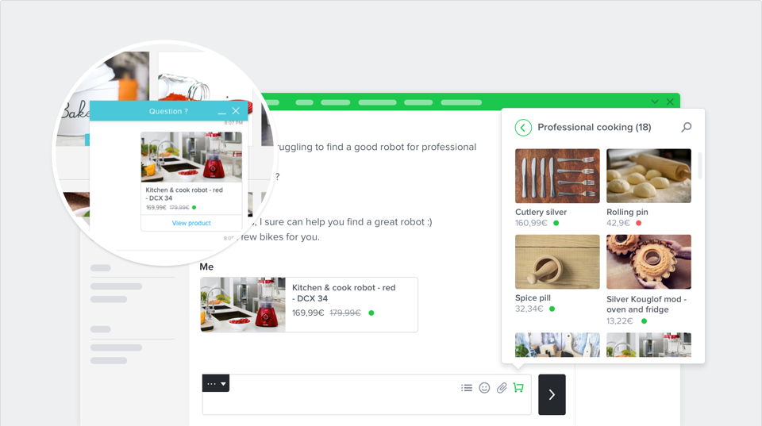
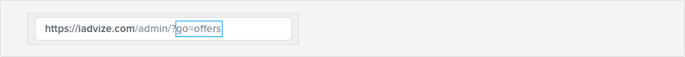

# General information
Welcome to iAdvize’s developer documentation!
If you want to use our API, create integrations for your own personal use or to share with the rest of the world, you are in the right place.

iAdvize provides you with a Developer platform for you to easily publish your apps on our marketplace so that our users can install them directly from their administration interface.

Whether you are a developer, an integrator, a customer or just curious, here, you will find an overview of how to get started, our Developer Guidelines, our API with practical examples and a guide to build and publish your future integrations.

## What is iAdvize?
[iAdvize](http://iadvize.com) is a SaaS conversational commerce platform that enables businesses to engage their customers and prospects whether they’re on the website or on social media from one messaging solution (chat, voice, video).

Visitors can get real-time advice from customer service but also from advocates, members of the brand community.

Implementing iAdvize is child's play. You just have to insert a tag on each page of your website. Once the solution is deployed, your customer service and marketing teams are completely independent and can set up the solution as they wish.

The iAdvize platform has 2 interfaces:

* The administration: administrators and managers of the solution can configure the platform's settings and monitor the agent's activity.

* The agent's console panel: it gives superpowers to your agents. That's the place where professional agents or experts can respond intuitively to all the messages they receive.

## What is the Developer Platform?

The iAdvize Developer Platform allows developers to build apps and use our public APIs.
Do you want to develop an app? We are providing you with documentation and a private testing environment.

## Why to build apps to iAdvize?

There are three main reasons for building an app with the iAdvize Developer Platform: 

* You build apps and publish them for our customer community. (We've got more than 500 customers to amaze!)
* You build apps in private mode and make them available only for one or more specific customers
* You get rewarded based on how frequently your apps are used

Here is the example of a potential protocol between iAdvize and a CRM software thanks to a connector:

# Getting Started
Do you want to join our developer community as a beta tester 🤘🏽? Follow these steps to be part of the adventure:

## Get a Developer Account
To build apps that iAdvize’s customers can use, first, you need to get a developer account:   

* Apply and sign up by sending a request to developers@iadvize.com,
* The iAdvize team will contact you within 48 hours,
* We provide you with credentials and a testing environment.

## Features Overview
iAdvize provides you with some easy-to-use tools so you can:

* Manager the privacy mode of your app for it to be public or private
* Set up the authentication process for your app
* Define custom settings such as object mapping (in progress)
* Create interactions to enhance some of iAdvize's predefined features
* Use outgoing webhooks to receive updates in real-time

Once your app is ready, you will be able to submit your connector for review.
Then, the iAdvize team will review your app to make sure it fits the Developer Platform policies, and will get back to you within 48 hours (on working days).
And then hurrah... You can publish your app on iAdvize’s marketplace!

# Build apps
Once you are logged in your developer account, you are ready to build apps.
So let's go through the different sections of the Developer Platform:

## My apps
This is the place where you can see the list of all the apps you have built on iAdvize. You can also see their current status:
* Published: your app is ready to be installed on the iAdvize Marketplace
* Under review: your app has been submitted for review
* Sandbox: you can edit your app

## App information
Our team is still working on the accessibility mode of your app when it is private.
In alpha version, the accessibility mode will be available for you to change manually for the customers you have selected. 

**How does the Private mode work?**
Our team is still working on the accessibility mode under the Private mode.
In alpha version, we will make it available manually for the specific customers you have selected.

## Authentication
The authentication section is where you set your app’s needs to retrieve data from iAdvize and the app you want it to be connected to. Users will need to follow these authentication steps to install your app.

**Define authentication fields**
You can add fields and define the type of entry you need (text, numeric, etc.).

* Label: it’s the name of your field, this is what users will see.
* Type: it defines the type of entry (text, numeric, alphanumeric).
* ID: you should choose the name of your field ID according to your code.

You can add as much fields as you need.
This is the first thing users will see once they click on the "install" button on the iAdvize Marketplace.
Fields appear to users according to their order of creation (the 1st entry created is the 1st on displayed on the page).

*i.e. if your primary goal is to know your users’ usernames, it is the first information you should ask them for.*

* Configure your verification URL
This is the URL on which we will check your app. It also helps us check if your credentials are valid. We'll call this URL and your connector will be sent back if the authentication parameters have been correctly set up to go to the next installation step.

*i.e. users might be required to authenticate with an email and a password. In this case, you need to create two different fields, one for the email and one for the password.*

Users have to fill in the fields during the installation process first, on the iAdvize Marketplace.

## Settings
This part is still under development. This is where you will be able to add specific configuration steps such as mapping.

## Interactions
Add interactions to enhance the iAdvize interface by adding or editing predefined features.

The features that are already available are: 

* The product List (on the discussion panel)
* The visitor profile (on the discussion panel)
* The end of conversation (on the discussion panel)

### The Product List
The integration of the product list enables users to browse a product catalog from the iAdvize discussion panel.
Agents can look for a product while they are chatting and send it in just a click within their conversation.

Products are displayed in the form of a card within conversations: visitors can see their image, title, availability and price.
In just a click on the "view product" button, visitors are redirected to the product page on your website.

**Add a Product List Connector and Configure it**
In order to set the right connector parameters, all you have to do is declare:
* The product list URL - this is your catalog’s URL
* The categories url - this is where your connector will get the list of your product categories

#### Example of categories data a connector must return
<pre class="prettyprint lang-js">
[
    {
        "id": "123",
        "label": "category",
        "idParent": null,
        "productsCount": 3
     },
     {
         "id": "456",
         "label": "category",
         "idParent": null,
         "productsCount": 7
      }
 ]
</pre>

#### Example of products data a connector must return
<pre class="prettyprint lang-js">
[
    {
        "id": "123",
        "title": "Product's title",
        "productUrl": "http://www.e-commerce.com/url-product",
        "brand": null,
        "description": "product's description",
        "shortDescription": null,
        "available": true,
        "imageUrl": "http://www.e-commerce.com/url-product-image.jpg",
        "reference": null,
        "priceCatalog": "99.9 €",
        "pricePromotion": null
    },
    {
        "id": "456",
        "title": "Product's title",
        "productUrl": "http://www.e-commerce.com/url-product",
        "brand": null,
        "description": "product's description",
        "shortDescription": null,
        "available": true,
        "imageUrl": "http://www.e-commerce.com/url-product-image.jpg",
        "reference": null,
        "priceCatalog": "9.9 €",
        "pricePromotion": null
    }
]
</pre>

### The Visitor profile (in progress)
This type of interaction is not available yet.

### Closing conversation feature (in-progress)
This type of interaction is not available yet.

### Submit your apps

Apps must be submitted to iAdvize for review.
The versioning declaration must be done by the developer during the submission process.
iAdvize will approve or refuse the app based on specific criteria.
iAdvize will get in touch within 48 hours to the developers.

### Submit your apps

Apps must be submitted to iAdvize for review.
Developers have to make their versioning declaration during the submission process.
iAdvize will approve or refuse the app based on specific criteria.
iAdvize will get back to you within 48 hours.

## Webhooks
The webhook system allows external applications to subscribe to events (via callback URLs) to receive updates in real-time.
When you build your app, you can subscribe to a list of events.
When customers install your app, it automatically creates webhooks for these customers as well as for events based on your app's configuration.

This subscription is based on the events happening on different domains. See the list of events available in the [Webhook API documentation](#webhook).

### Create a webhook for your connector
You can create as much outgoing webhooks as you need.
A webhook can cover several events.
An event can be linked to a customer (example customers.website.created)
or linked to a website (example customers.website.created)

* Name of the webhook: an optional label you can give to the webhook
* webhook URL: the server URL that will receive the webhook
* Security token: Token provided by iAdvize (this field cannot be edited)
* Content-type: Application / json ; Application / x-www-form-urlencoded
* Events: you can select the events in the list. You can subscribe to all
iAdvize events, all events of a specific domain, or only one event.

## Developer Policy (in progress)
Developers host their code on their own host service.
Developers are responsible for the connector maintenance.
Developers can set their app’s price (monthly fee or based on the number of conversations).
If it’s not a free app, developers must be a legal person.

# API
## REST API
**Current version:** 2.0

This API provides access and basic CRUD operations (create, read, update, delete) for the resources described in the documentation.
The REST API uses JSON exclusively. XML is not supported.

### Base URL

All URLs referenced in the documentation have the following base:

| Standard platform | High availability platform |
| --- | --- |
| `https://www.iadvize.com/api/2` | `https://ha.iadvize.com/api/2` |

The iAdvize REST API is served over HTTPS and HTTP.

### Authentication

The API key must be attached to each request. You can use it in one of the following ways:

*   Passed in as a `X-API-Key` HTTP header
*   Passed in as a `key` GET parameter
*   Passed in as the username <small>(with an arbitrary password)</small> via `HTTP Basic authentication`

### Calls, errors & responses

#### Authentication failed

<pre class="prettyprint lang-js">{
  meta: {
    status: "error",
    message: "Forbidden"
  }
}
</pre>

#### Create

##### `POST /my_resource my_field=my_value`

<pre class="prettyprint lang-js">{
  meta: {
    status: "success"
  },
  data: {
    id: 123,
    my_field: "my_value",
    _link: "/my_resource/123"
  }
}
</pre>

##### `POST /my_resource my_field=my_value (with error)`

<pre class="prettyprint lang-js">{
  meta: {
    status: "fail",
    message: "Field 'my_field_2' is missing.",
  }
}
</pre>

#### Read

##### `GET /my_resource`

<pre class="prettyprint lang-js">{
  meta: {
    status: "success"
  },
  data: [
    {
      id: 789,
      _link: "/my_resource/789"
    },
    {
      id: 456,
      _link: "/my_resource/456"
    },
    {
      id: 123,
      _link: "/my_resource/123"
    }
  ],
  pagination: {
    page: 1,
    pages: 1,
    limit: 20,
    count: 3
  }
}
</pre>

**Common filters**

| Filter | Description | Values |
| --- | --- | --- |
| page | Page number | ?page=1 |
| limit | Maximum number of resources per page (maximum possible value is 100) | ?limit=1 |
| full | Show all fields of the resource | ?full=1 |

Use the `*` character to broaden the scope of your search. E.g.: `filters[name]=*uli*`

##### `GET /my_resource/123`

<pre class="prettyprint lang-js">{
  meta: {
    status: "success"
  },
  data: {
    id: 123,
    my_field: "my_value",
    _link: "/my_resource/123"
  }
}
</pre>

##### `GET /my_resource/456` (with error)

<pre class="prettyprint lang-js">{
  meta: {
    status: "fail",
    message: "Unknown 'my_resource' with 'id' 456."
  }
}
</pre>

#### Update

##### `PUT /my_resource/123 my_field=my_new_value`

<pre class="prettyprint lang-js">{
  meta: {
    status: "success"
  },
  data: {
    id: 123,
    my_field: "my_new_value",
    _link: "/my_resource/123"
  }
}
</pre>

##### `PUT /my_resource/123 my_field=my_value` (with error)

<pre class="prettyprint lang-js">{
  meta: {
    status: "fail",
    message: "Value of field 'my_field' is not valid."
  }
}
</pre>

#### Delete

##### `DELETE /my_resource/123`

<pre class="prettyprint lang-js">{
  meta: {
    status: "success"
  }
}</pre>

**DELETE /my_resource/456 (with error)**

<pre class="prettyprint lang-js">{
  meta: {
    status: "fail"
    message: "Unknown 'my_resource' with 'id' 456"
  }
}
</pre>

### Resources

#### Client

##### List all clients

`GET /client`

See below to discover used fields and see [reading section](#read) to discover some output examples.

This list is displayed depending on the rights of your API key.

##### Showing client

`GET /client/1`

See [reading section](#read) to discover some output examples.

**Fields**

| Field | Description | Values |
| --- | --- | --- |
| id | Identifier | Integer |
| lang | Language | String (2 chars) |

#### Website

##### List all your websites

`GET /website`

See below to discover used fields and see [reading section](#read) to discover some output examples.

##### Get a website details

`GET /website/1`

See [reading section](#read) to discover some output examples.

**Fields**

| Field | Description | Values |
| --- | --- | --- |
| id | Identifier | Integer |
| url | URL | String |
| label | Label | String |

##### Update a website

`PUT /website/1`

See [updating section](#update) to discover some output examples.

#### Operator

##### List your operators

`GET /operator`

See below to discover used fields and see [reading section](#read) to discover some output examples.

**Filters**

| Filter | Description | Values | Use |
| --- | --- | --- |
| group_id | Group identifier | | ?filters[group_id]=123 |
| website_id | Website identifier | | ?filters[website_id]=123 |
| skill_id | Skill identifier | | ?filters[skill_id]=123 |
| name | Operator name | | ?filters[name]=genius |
| external_id | External identifier | | ?filters[external_id]=MyExternalId |
| connected | Operator online status | 0 (offline) or 1 (online) | ?filters[connected]=1 |

##### Get an operator details

`GET /operator/1`

See [reading section](#read) to discover some output examples.

**Fields**

| Field | Description | Values |
| --- | --- | --- |
| id | Operator identifier | Integer |
| name | Name | String |
| first_name | First name | String |
| pseudo | Pseudonym | String |
| email | Email | Valid email |
| external_id | Your id if provided | String |
| role `deprecated, use roles property instead` | Role | `operator`, `manager` or `admin` |
| roles | Roles | List of string `expert`, `operator`, `manager` or `admin` |
| chat_enabled | Ability to process chat | Boolean |
| call_enabled | Ability to process call | Boolean |
| video_enabled | Ability to process video | Boolean |
| chat_max_number | Max. amount of chats an operator can process at the same time | Integer |
| chat_and_call | Ability to process chat and call simultaneously | Boolean |
| chat_priority | Chat priority of the operator | `0` or `10` |
| call_priority | Call priority of the operator | `0` or `10` |
| video_priority | Video priority of the operator | `0` or `10` |
| language_list | List of languages the operator can process | List of ISO2 (e.g. en, fr...) |
| language_admin | Admin language | `de`, `en`, `es` or `fr` |
| group_id | Group identifier | Integer |
| website_list | Website list identifiers | List of integer |
| skill_list | Skill list identifiers | List of integer |
| sso_key | [SSO token](/?p=sso) | String |

##### Create an operator

`POST /operator`

See [creating section](#create) to discover some output examples.

##### Update an operator

`PUT /operator/1`

See [updating section](#update) to discover some output examples.

##### Delete an operator

`DELETE /operator/1`

See [deleting section](#responses-delete) to discover some output examples.

##### Get the live availability of your operators

`GET /operator/live`

<pre class="prettyprint lang-js">{
  meta: {
    status: "success"
  },
  data: [
    {
      id: 456,
      connected: true,
      chat: {
        enabled: true,
        slot_number: 2,
        slot_max_number: 4,
        busy: false,
        available: true
      },
      call: {
        enabled: false,
        slot_number: 0,
        slot_max_number: 1,
        busy: false,
        available: false
      },
      video: {
        enabled: false,
        slot_number: 0,
        slot_max_number: 1,
        busy: false,
        available: false
      }
    },
    {
      id: 123,
      connected: false,
      chat: {
        enabled: false,
        slot_number: 1,
        slot_max_number: 2,
        busy: false,
        available: false
      },
      call: {
        enabled: true,
        slot_number: 1,
        slot_max_number: 1,
        busy: true,
        available: false
      },
      video: {
        enabled: false,
        slot_number: 0,
        slot_max_number: 1,
        busy: false,
        available: false
      }
    }
  ]
}
</pre>

You can use previous filters.

##### Get the live availability of an operator

`GET /operator/123/live`

<pre class="prettyprint lang-js">{
  meta: {
    status: "success"
  },
  data: {
    id: 123,
    connected: false,
    chat: {
      enabled: false,
      slot_number: 1,
      slot_max_number: 2,
      busy: false,
      available: false
    },
    call: {
      enabled: true,
      slot_number: 1,
      slot_max_number: 1,
      busy: true,
      available: false
    },
    video: {
      enabled: false,
      slot_number: 0,
      slot_max_number: 1,
      busy: false,
      available: false
    }
  }
}
</pre>

##### Set availability of an operator

`PUT /operator/123/live`

**Fields**

| Field | Description | Value |
| --- | --- | --- |
| chat[available] | Set operator availability for chat channel | `1` (available) or `0` (unavailable) |
| call[available] | Set operator availability for call channel | `1` (available) or `0` (unavailable) |
| video[available] | Set operator availability for video channel | `1` (available) or `0` (unavailable) |
| connected | Set operator connection status | `0` (offline) - unique value possible |

**Response**

<pre class="prettyprint lang-js">{
  meta: {
    status: "success",
    message: "Operator is now available|unavailable for chat channel."
  }
}
</pre>

##### Get operator statistics

`GET /operator/123/statistic`

See [reading section](#read) to discover some output examples.

**Fields**

| Field | Description | Values |
| --- | --- | --- |
| id | Operator identifier | Integer |
| conversation_number | Conversations number done by operator | Integer |
| satisfaction_global_rate | Satisfaction average for operator conversations | Float |
| experience | Operator experience | Integer |

**Response**

<pre class="prettyprint lang-js">{
  meta: {
    status: "success"
  },
  data: {
    id: 123,
    conversation_number: 589,
    satisfaction_global_rate: 0.86,
    experience: 5630
  }
}
</pre>

##### Get operator statistics

`GET /operator/123/profile`

See [reading section](#read) to discover some output examples.

**Fields**

| Field | Description | Values |
| --- | --- | --- |
| user_id | Operator identifier | Integer |
| status | Short text satus written by operator | String |
| description | Operator profile escription | String |
| facebook | Facebook identifier | String |
| twitter | Twitter identifier | String |
| city | City | String |
| country | Country | String |

**Response**

<pre class="prettyprint lang-js">{
  meta: {
    status: "success"
  },
  data: {
    user_id: 123,
    status: "Je suis disponible pour vous aider",
    description: "Passionné par la menuiserie depuis plusieurs années, j'aime vous apporter des conseils.",
    facebook: "john.doe",
    twitter: "johndoe45",
    city: "Nantes",
    country: "France"
  }
}
</pre>

#### Group

##### List your groups

`GET /group`

See below to discover used fields and see [reading section](#read) to discover some output examples.

**Filters**

| Filter | Description | Use |
| --- | --- | --- |
| parent_id | Parent group identifier | ?filters[parent_id]=1987 |

##### Get a group details

`GET /group/1984`

See [reading section](#read) to discover some output examples.

**Fields**

| Field | Description | Values |
| --- | --- | --- |
| id | Group identifier | Integer |
| name | Group name | String |
| created_at | Date of creation | Date `YYYY-MM-DD HH:MM:SS` |
| parent_id | Parent identifier | Integer |
| operator_list | List of operators identifiers | List of integers |

##### Create a group

`POST /group`

See [creating section](#create) to discover some output examples.

##### Update a group

`PUT /group/1`

See [updating section](#update) to discover some output examples.

##### Delete a group

`DELETE /group/1`

See [deleting section](#responses-delete) to discover some output examples.

#### Skill

##### List your skills

`GET /skill`

See below to discover used fields and see [reading section](#read) to discover some output examples.

**Filters**

| Filter | Description | Use |
| --- | --- | --- |
| operator_id | Operator identifier | ?filters[operator_id]=123 |
| parent_id | Parent skill identifier | ?filters[parent_id]=123 |

##### Get a skill details

`GET /skill/1984`

See [reading section](#read) to discover some output examples.

**Fields**

| Field | Description | Values |
| --- | --- | --- |
| id | Skill identifier | Integer |
| name | Name | String |
| order | Order | Integer |
| created_at | Date of creation | Date `YYYY-MM-DD HH:MM:SS` |
| parent_id | Parent skill identifier | Integer |
| operator_list`deprecated, use the Operator resource with the skill_id filter instead` | List of operator identifiers | List of integers |

##### Create a skill

`POST /skill`

See [creating section](#create) to discover some output examples.

##### Update a skill

`PUT /skill/1`

See [updating section](#update) to discover some output examples.

##### Delete a skill

`DELETE /skill/1`

See [deleting section](#responses-delete) to discover some output examples.

#### Conversation

##### List your conversations

`GET /conversation`

See below to discover used fields and see [reading section](#read) to discover some output examples.

**Filters**

| Filter | Description | Values | Use |
| --- | --- | --- | --- |
| channel | Channel | `chat`, `call`, `video` or `social` | ?filters[channel]=chat |
| from | Date from (see more information below) | `YYYY-MM-DD` or `YYYY-MM-DD HH:MM:SS` | ?filters[from]=2013-08-22 |
| to | Date to (see more information below) | `YYYY-MM-DD` or `YYYY-MM-DD HH:MM:SS` | ?filters[to]=2013-08-25 |
| website_id | Website identifier | ?filters[website_id]=123 |
| operator_id | Operator identifier | ?filters[operator_id]=123 |
| visitor_id | Visitor identifier | ?filters[visitor_id]=123 |
| skill_id | Skill identifier | ?filters[skill_id]=123 |
| tag_id | Tag identifier | ?filters[tag_id]=123 |
| rule_id | Rule identifier | ?filters[rule_id]=123 |

A request cannot fetch the conversations for a period over 3 months.
The following rules apply :

*   If `from` and `to` are not specified, the last 3 months are fetched
*   If `from` is specified but not `to`, the 3 months after `from` are fetched
*   If `to` is specified but not `from`, the 3 months before `to` are fetched
*   If `from` and `to` are specified but with an interval over 3 months, an error is returned in the `meta` attribute of the response

##### Get a conversation details

`GET /conversation/666`

See [reading section](#read) to discover some output examples.

**Fields**

| Field | Description | Values |
| --- | --- | --- |
| id | Conversation identifier | Integer |
| channel | Conversation channel | `chat`, `call` or `video` |
| visitor_uid | Visitor unique identifier | String |
| history | Conversation history | String `[5,"2016-02-16 11:24:21","http://test.com/"],``[2,"2016-02-16 11:24:23","Hello",1455618264049],``[3,"2016-02-16 11:24:31","The chat rule has been activated."],``[1,"2016-02-16 11:24:43","Hello, how can I help you?",1455618283869],``[2,"2016-02-16 11:25:26","I would like to know if my order: xxx has been sent",1455618327321],``[1,"2016-02-16 11:25:45","I check it, thank you for your patience",1455618346030],``[1,"2016-02-16 11:26:02","Your order has been shipped",1455618363054],``[2,"2016-02-16 11:26:09","Thanks, goodbye",1455618370072],``[1,"2016-02-16 11:26:17","Goodbye",1455618377364],``[3,"2016-02-16 11:26:43","OPERATOR_CHAT_CLOSE"]` |
| operator_answer | Conversation answered by operator | Boolean |
| operator_closed | Conversation closed by operator | Boolean |
| waitinglist | Waiting list status | Boolean |
| page_type | Page type | String |
| created_at | Conversation start time | Date `YYYY-MM-DD HH:MM:SS` |
| closed_at | Conversation end time | Date `YYYY-MM-DD HH:MM:SS` |
| website_id | Website identifier | Integer |
| operator_id | Operator identifier | Integer |
| skill_id | Skill indentifier | Integer |
| tag_list | List of tag identifiers | List of integers |
| rule_id | Rule indentifier | Integer |
| xmpp_id | XMPP related identifier | UUID |

#### Tag

##### List your tags

`GET /tag`

See below to discover used fields and see [reading section](#read) to discover some output examples.

**Filters**

| Filter | Description | Use |
| --- | --- | --- |
| website_id | Website identifier | ?filters[website_id]=123 |

##### Get a tag details

`GET /tag/123`

See [reading section](#read) to discover some output examples.

**Fields**

| Field | Description | Values |
| --- | --- | --- |
| id | Tag identifier | Integer |
| name | Name | String |
| website_id | List of website identifiers | List of integers |

##### Create a tag

`POST /tag`

See [creating section](#create) to discover some output examples.

#### Transaction

##### List your transactions

`GET /transaction`

See below to discover used fields and see [reading section](#read) to discover some output examples.

**Filters**

| Filter | Description | Values | Use |
| --- | --- | --- | --- |
| website_id | Website identifier | | `?filters[website_id]=123` |
| operator_id | Operator identifier | | `?filters[operator_id]=123` |
| conversation_id | Conversation identifier | Conversation identifier. You can also use `!null` & `null` to filter all transactions associated or not to a conversation. | `?filters[conversation_id]=123` `?filters[conversation_id]=null` `?filters[conversation_id]=!null` |
| from | Date from | `YYYY-MM-DD` or `YYYY-MM-DD HH:MM:SS` | `?filters[from]=YYYY-MM-DD HH:MM:SS` |
| to | Date to | `YYYY-MM-DD` or `YYYY-MM-DD HH:MM:SS` | `?filters[to]=YYYY-MM-DD HH:MM:SS` |

##### Get a transaction details

`GET /transaction/123`

See [reading section](#read) to discover some output examples.

**Fields**

| Field | Description | Values |
| --- | --- | --- |
| id | Tag identifier | Integer |
| external_id | External identifier | String |
| visitor_uid | Visitor unique identifier | String |
| visitor_email | Visitor email | String |
| amount | Amount | Double |
| created_at | Date of creation | Date `YYYY-MM-DD HH:MM:SS` |
| website_id | Website identifier | Integer |
| operator_id | Operator identifier | Integer |
| conversation_id | Conversation identifier | Integer |

#### Satisfaction

##### List your satisfactions

`GET /satisfaction`

See below to discover used fields and see [reading section](#read) to discover some output examples.

**Filters**

| Filter | Description | Values | Use |
| --- | --- | --- | --- |
| website_id | Website identifier | ?filters[website_id]=123 |
| operator_id | Operator identifier | ?filters[operator_id]=123 |
| conversation_id | Conversation identifier | ?filters[conversation_id]=123 |
| from | Date from | `YYYY-MM-DD` or `YYYY-MM-DD HH:MM:SS` | ?filters[from]=YYYY-MM-DD HH:MM:SS |
| to | Date to | `YYYY-MM-DD` or `YYYY-MM-DD HH:MM:SS` | ?filters[to]=YYYY-MM-DD HH:MM:SS |

##### Get a satisfaction details

`GET /satisfaction/123`

See [reading section](#read) to discover some output examples.

**Fields**

| Field | Description | Values |
| --- | --- | --- |
| id | Satisfaction identifier | Integer |
| note_welcome | Welcome note | Double (percentage) |
| note_resolution | Resolution note | Double (percentage) |
| node_delay | Delay note | Double (percentage) |
| created_at | Date of creation | Date `YYYY-MM-DD HH:MM:SS` |
| website_id | Website identifier | Integer |
| operator_id | Operator identifier | Integer |
| conversation_id | Conversation identifier | Integer |

#### Statistic

##### Get statistics

`GET /statistic`

See below to discover used fields and see [reading section](#read) to discover some output examples.

**Filters**

| Filter | Description | Values | Use |
| --- | --- | --- | --- |
| website_id `deprecated, use website_list property instead` | Website identifier | `?filters[website_id]=123` |
| website_list | Website identifiers | `?filters[website_list]=123,24,32` |
| channel | Channel | `chat`, `call` or `video` | `?filters[channel]=chat` |
| resource | Resource to group the data by | `operator`, `group`, `skill`, `rule`, `contact_type` or `page_type` | `?filters[resource]=operator` |
| resource_id | Resource ID to get only the data of this resource | `?filters[resource_id]=32` |
| indicators | Indicators to filter | See list below | `?filters[indicators]=indicator1,indicator2` |
| from | Date from | `YYYY-MM-DD` or `YYYY-MM-DD HH:MM:SS` | `?filters[from]=YYYY-MM-DD` |
| to | Date to | `YYYY-MM-DD` or `YYYY-MM-DD HH:MM:SS` | `?filters[to]=YYYY-MM-DD` |
| granularity | Get data per hour, per day or per month (only when 1 indicator is requested) | `hour`, `day`, `month` | `?filters[indicators]=indicator1&filters[granularity]=day` |

**Indicators**

| Indicator | Label | Description |
| --- | --- | --- |
| cart_after_contact_amount | Average order value after contact | Average order value following a contact. |
| cart_global_amount | Average order value on the website | Average Order Value, all visitor categories. |
| contact_answered_after_first_message_duration | Response time after first message | Average response time between a customer's first question and the agent's answer. |
| contact_answered_duration | Response time | Average reponse time between a customer's request and the agent's response. |
| contact_closed_after_last_message_duration | Length of time between last message and closing of chat | Average amount of time between the visitor's last message and the closing of the chat discussion on the panel. |
| contact_duration | Average processing time | Average length of all contacts, the length of a contact being defined as the difference between the end time (closure) and start time. |
| contact_missed_number | Missed contact opportunities | Estimated number of missed contact opportunities because the agents were totally busy, offline or not in production. |
| contact_missed_with_busy_operators_number | Missed contact opportunities (agents busy) | Estimated number of missed contact opportunities due to agents being totally busy. |
| contact_missed_with_no_operators_number | Missed contact opportunities (agents absent) | Estimated number of contacts missed because the agents were either not connected or not in production. |
| contact_number | Initiated contacts | Number of contacts initiated during the selected period. |
| contact_per_hour_average_number | Contacts / hr of the website | Average number of contacts processed by all agents for an hour of production. |
| contact_per_hour_number | Contacts per hour | Average number of contacts processed by an agent for an hour of production. |
| contact_simultaneous_number | Simultaneous contacts | Average number of contacts processed simultaneously by an agent during his online presence. |
| contact_unanswered_number | Contacts initiated with no response | Number of contacts initiated by a visitor with no response from an agent. |
| contact_waiting_abort_number | Abandoned contacts | Number of contacts initiated in the queue who left before being processed. |
| contact_waiting_answered_number | Processed contacts | Number of processed contacts coming from the queue. |
| contact_waiting_before_quit_duration | Waiting time before abandonment | Average time before a visitor abandons the queue. |
| contact_waiting_duration | Waiting time before contact | Average waiting time of visitors in the queue. |
| contact_waiting_number | Initiated contacts | Average waiting time of visitors in the queue. |
| conversion_rate | Conversion rate | Proportion of conversations which led to transactions. |
| max_and_partial_occupation_duration | Global occupation | Period during which an agent is connected to the panel and is occupied partially or to the maximum. |
| max_and_partial_occupation_rate | Global occupation rate | Part of production time during which an agent is connected to the panel and is occupied partially or to the maximum. |
| max_occupation_duration | Maximum occupation | Period during which an agent is connected to the panel and is occupied to maximum capacity. |
| max_occupation_rate | Maximum occupation rate | Part of production time during which an agent is connected to the panel and is occupied to a maximum. |
| non_occupation_duration | Inocc. | Period of time during which an agent is connected to the panel and is simultaneously available and not busy. |
| non_occupation_rate | Rate of non-occupation | Part of production time during which an agent is connected to the panel and is simultaneously available and not busy. |
| non_production_duration | Not in production | Period during which an agent is connected to the panel, unavailable and yet not busy. |
| non_production_rate | Not in production rate | Proportion of connection time during which an agent is connected to the panel, unavailable and yet not busy. |
| occupation_duration | Partial occupation | Period during which an agent is connected to the panel, unavailable and yet not busy. |
| occupation_rate | Partial occupation rate | Part of production time during which an agent is connected to the panel and is partially busy. |
| presence_duration | Total period of presence | Total period during which the agents were connected to the desk. |
| presence_smoothed_duration | Smoothed period of presence | Period during which operators were connected. Length of the time slot covered with at least one agent present. |
| presentation_duration | Smoothed period of button presentation | Period during which buttons are displayable. Length of the time slot covered with at least one agent available. |
| production_duration | In production | Period during which an agent is connected to the panel and is available or busy. |
| production_smoothed_duration | Smoothed period of production | Period during which operators were in production. Length of the time slot covered with at least one agent in production. |
| rule_contact_rate | Response rate | Proportion of displays having generated a contact. |
| rule_display_number | Displays | Number of chat/call displays generated on the website during the period. |
| targeting_rule_triggered | Triggers | Number of times a targeting rule has been triggered, as a consequence of visitors meeting the right criteria. |
| satisfaction_delay_rate | Waiting time | Visitor satisfaction rate with the waiting time before receiving an answer. |
| satisfaction_global_rate | Overall satisfaction | Overall satisfaction rate of visitors. |
| satisfaction_resolution_rate | Quality of response | Visitors' satisfaction rate with the response given by the agent. |
| satisfaction_respondent_number | Number of respondents | Number of visitors who replied to a satisfaction survey following a discussion. |
| satisfaction_respondent_rate | Response rate | Proportion of conversations after which visitors completed the satisfaction survey. |
| satisfaction_welcome_rate | Quality of welcome | Visitor satisfaction rate with the welcome. |
| transaction_after_contact_amount | T/O after contact | Total turnover from visitors who dialogued and completed a transaction after a contact. |
| transaction_after_contact_duration | Transformation time after contact | Average time between the first exchange and the transaction. |
| transaction_after_contact_number | Transactions after contact | Total number of transactions from visitors who have dialogued and then completed a transaction following a contact. |
| transaction_date | Transaction date | Date on which the transaction was made. |
| transaction_in_session | In-session transaction | Whether the transaction has been completed during a conversation. |
| transaction_missed_with_busy_operators_amount | T/O missed (agents totally busy) | Estimated lost turnover due to agents being totally busy. |
| transaction_missed_with_busy_operators_number | Missed transaction opportunities (agents totally busy) | Estimated number of missed transaction opportunities because the agents were totally busy. |
| transaction_missed_with_no_operators_amount | Missed T/O opportunity (agents absent) | Estimated turnover missed because the agents were not connected or not in production. |
| transaction_missed_with_no_operators_number | Missed transaction opportunities (agents absent) | Estimated number of missed transaction opportunities because the agents were not connected or not in production. |
| transaction_total_amount | Website T/O | Total turnover, all visitor categories. |
| transaction_total_number | Website transactions | Total number of transactions (all categories). |
| transaction_amount_per_conversation | Website transactions amount per conversation | Average turnover generated for each conversation done |
| transaction_after_conversation_amount_per_hour | Website transactions amount per hour | Average turnover generated by an agent after a contact on an hourly basis |

#### Visitor

##### Get visitors

`GET /visitor`

See below to discover used fields and see [reading section](#read) to discover some output examples.

**Filters**

| Filter | Description | Use |
| --- | --- | --- |
| unique_id | Unique identifier | `?filters[unique_id]=123` |
| external_id | External identifier | `?filters[external_id]=123` |
| website_id | Website identifier | `?filters[website_id]=123` |

##### Get a visitor details

`GET /visitor/560`

See [reading section](#read) to discover some output examples.

**Fields**

| Field | Description | Values |
| --- | --- | --- |
| id | Visitor identifier | Integer |
| unique_id | Visitor unique identifier | String |
| external_id | Your id if provided | String |
| lastname | Lastname | String |
| firstname | Firstname | String |
| address | Address | String |
| city | City | String |
| zip | Zip code | String |
| country | Country | String |
| phone | Phone number | String |
| email | Email | String |
| browser | Browser used by visitor | String |
| website_id | List of website identifiers | List of integers |
| created_at | Visitor creation date | Date `YYYY-MM-DD HH:MM:SS` |

##### Create a visitor

`POST /visitor`

See [creating section](#create) to discover some output examples.

##### Update a visitor

`PUT /visitor/560`

See [updating section](#update) to discover some output examples.

##### Delete a visitor

`DELETE /visitor/560`

See [deleting section](#responses-delete) to discover some output examples.

#### Call meeting

##### Get call meetings

`GET /callmeeting`

See below to discover used fields and see [reading section](#read) to discover some output examples.

**Filters**

| Filter | Description | Use |
| --- | --- | --- |
| website_id | Website identifier | `?filters[website_id]=123` |
| from | Period start date | `?filters[from]=2015-03-31 19:00:00` |
| to | Period end date | `?filters[to]=2015-06-31 18:00:00` |

**Fields**

| Field | Description | Values |
| --- | --- | --- |
| id | Call meeting identifier | Integer |
| phone_number | Visitor phone number | String |
| visitor_uid | Visitor unique identifier | String |
| status | Call meeting status (pending, progress, done, failed, working) | String |
| start_at | Date of call | DateTime |
| website_id | Website identifier | Integer |
| targeting_rule_id | Targeting rule identifier associated to call meeting | String |
| skill_id | Skill identifier associated to call meeting | String |

#### Callback Odigo

##### Pick up callback

`POST /odigocallback/pickup`

**Parameters** (sent as application/x-www-form-urlencoded)

| Parameter | Description | Values | Mandatory |
| --- | --- | --- | --- |
| operator_external_id | Operator external identifier | String | Yes |
| website_id | Website identifier | Integer | Yes |
| phone_number | Visitor phone number | String | Yes |

**Response**

<pre class="prettyprint lang-js">{
    meta: {
        status: "success"
    },
    data: {
        targeting_rule_id: 107,
        website_id: 1,
        conversation_id: 139,
        skill_id: null,
        visitor_phone_number: "0614037735",
        visitor_uid: "0a1572b7cc5027fe443f4203eaf0b98d4cbea6d313afa"
    }
}
</pre>

##### Hang up callback

`POST /odigocallback/hangup`
**Parameters** (sent as application/x-www-form-urlencoded)

| Parameter | Description | Values | Mandatory |
| --- | --- | --- | --- |
| operator_external_id | Operator external identifier | String | Yes |
| website_id | Website identifier | Integer | Yes |
| phone_number | Visitor phone number | String | Yes |

**Response**

<pre class="prettyprint lang-js">{
  meta: {
    status: "success"
  },
  data: []
}
</pre>

## GraphQL API
**In-progress**

The new API is under development and documentation.

## Webhook API

### Events description

| Domain | Name | Description |
| --- | --- | --- |
| conversations.domain | `conversation.chat.started` | Chat conversations only |
| conversations.domain | `conversation.chat.closed` | Chat conversations only |
| conversations.domain | `conversation.call.started` | Call conversations only |
| conversations.domain | `conversation.call.closed` | Call conversations only |
| conversations.domain | `conversation.video.started` | Video conversations only |
| conversations.domain | `conversation.video.closed` | Video conversations only |
| conversations.domain | `conversation.social.started` | Social conversations only |
| conversations.domain | `conversation.social.closed` | Social conversations only |
| conversations.domain | `conversation.*.closed` | All conversations |
| users.domain | `user.created` | User created |
| users.domain | `user.updated` | User information updated |
| users.domain | `visitor.updated` | Visitor information updated |
| users.domain | `satisfaction.filled` |
| connectors.domain | `connector.installed ` |
| connectors.domain | `connector.uninstalled` |

### Payloads
When an event occurs, an HTTP POST call is issued on the callback urls you set up with the event data. 
Data is sent with “application/json” header content-type, and “json” format as payload. 
Callback urls must be defined with HTTPS protocol and should be available with POST and GET http verbs:
- POST verb to send data payload,
- GET verb, to let iAdvize check the availability of the callback (more information in security section below).
iAdvize expect to have à 20x http status in callback result.

**Output examples of Conversations domain:**
##### conversation.chat.started

<pre class="prettyprint lang-js">{
    "eventId": "d36cd3c4-2d16-4a77-97c2-620bde859b29",
    "eventType": "conversation.chat.started",
    "platform": "SD",
    "websiteId": 1,
    "conversationId": 1,
    "operatorId": 1,
    "channel": "chat",
    "visitorId": "593de0891b628a50b09835dc6c0e92565329c74baa90e",
    "createdAt": "2017-04-22T11:01:00+02:00",
    "sentAt": "2017-04-22T11:01:00+02:00"
}
</pre>

##### conversation.chat.closed
<pre class="prettyprint lang-js">{
    "eventId": "d36cd3c4-2d16-4a77-97c2-620bde859b29",
    "eventType": "conversation.chat.closed",
    "platform": "SD",
    "websiteId": 1,
    "conversationId": 1,
    "operatorId": 1,
    "channel": "chat",
    "visitorId": "593de0891b628a50b09835dc6c0e92565329c74baa90e",
    "createdAt": "2017-04-22T11:01:00+02:00",
    "sentAt": "2017-04-22T11:01:00+02:00"
}
</pre>

##### conversation.call.started
<pre class="prettyprint lang-js">{
    "eventId": "d36cd3c4-2d16-4a77-97c2-620bde859b29",
    "eventType": "conversation.call.started",
    "platform": "SD",
    "websiteId": 1,
    "conversationId": 1,
    "operatorId": 1,
    "channel": "call",
    "visitorId": "593de0891b628a50b09835dc6c0e92565329c74baa90e",
    "createdAt": "2017-04-22T11:01:00+02:00",
    "sentAt": "2017-04-22T11:01:00+02:00"
}
</pre>

##### conversation.call.closed
<pre class="prettyprint lang-js">{
    "eventId": "d36cd3c4-2d16-4a77-97c2-620bde859b29",
    "eventType": "conversation.call.closed",
    "platform": "SD",
    "websiteId": 1,
    "conversationId": 1,
    "operatorId": 1,
    "channel": "call",
    "visitorId": "593de0891b628a50b09835dc6c0e92565329c74baa90e",
    "createdAt": "2017-04-22T11:01:00+02:00",
    "sentAt": "2017-04-22T11:01:00+02:00"
}
</pre>

##### conversation.video.started
<pre class="prettyprint lang-js">{
    "eventId": "d36cd3c4-2d16-4a77-97c2-620bde859b29",
    "eventType": "conversation.video.started",
    "platform": "SD",
    "websiteId": 1,
    "conversationId": 1,
    "operatorId": 2,
    "channel": "video",
    "visitorId": "593de0891b628a50b09835dc6c0e92565329c74baa90e",
    "createdAt": "2017-04-22T11:01:00+02:00",
    "sentAt": "2017-04-22T11:01:00+02:00"
}
</pre>

##### conversation.video.closed
<pre class="prettyprint lang-js">{
    "eventId": "d36cd3c4-2d16-4a77-97c2-620bde859b29",
    "eventType": "conversation.video.closed",
    "platform": "SD",
    "websiteId": 1,
    "conversationId": 1,
    "operatorId": 2,
    "channel": "video",
    "visitorId": "593de0891b628a50b09835dc6c0e92565329c74baa90e",
    "createdAt": "2017-04-22T11:01:00+02:00",
    "sentAt": "2017-04-22T11:01:00+02:00"
}
</pre>

##### user.created
<pre class="prettyprint lang-js">{
    "eventId": "d36cd3c4-2d16-4a77-97c2-620bde859b29",
    "eventType": "user.created",
    "platform": "SD",
    "userId": 1,
    "createdAt": "2017-04-22T11:01:00+02:00",
    "sentAt": "2017-04-22T11:01:00+02:00"
}
</pre>

##### user.updated
<pre class="prettyprint lang-js">{
    "eventId": "d36cd3c4-2d16-4a77-97c2-620bde859b29",
    "eventType": "user.updated",
    "platform": "SD",
    "userId": 1,
    "createdAt": "2017-04-22T11:01:00+02:00",
    "sentAt": "2017-04-22T11:01:00+02:00"
}
</pre>

##### visitor.updated
<pre class="prettyprint lang-js">{
    "eventId": "d36cd3c4-2d16-4a77-97c2-620bde859b29",
    "eventType": "visitor.updated",
    "platform": "SD",
    "operatorId": 1,
    "visitorId": "593de0891b628a50b09835dc6c0e92565329c74baa90e",
    "createdAt": "2017-04-22T11:01:00+02:00",
    "sentAt": "2017-04-22T11:01:00+02:00"
}
</pre>

##### satisfaction.filled
<pre class="prettyprint lang-js">{
    "eventId": "d36cd3c4-2d16-4a77-97c2-620bde859b29",
    "eventType": "satisfaction.filled",
    "platform": "SD",
    "websiteId": 1,
    "conversationId": 1,
    "operatorId": 2,
    "visitorId": "593de0891b628a50b09835dc6c0e92565329c74baa90e",
    "score": 3,
    "createdAt": "2017-04-22T11:01:00+02:00",
    "sentAt": "2017-04-22T11:01:00+02:00"
}
</pre>

##### connector.installed
<pre class="prettyprint lang-js">{
    "eventId": "d36cd3c4-2d16-4a77-97c2-620bde859b29",
    "eventType": "connector.installed",
    "platform": "SD",
    "websiteId": 1,
    "connectorId": "3f0e6840-48fe-4e87-8f3b-6ef3f75f18d8",
    "connectorVersionId": "3f0e6840-48fe-4e87-8f3b-6ef3f75f18d8",
    "createdAt": "2017-04-22T11:01:00+02:00",
    "sentAt": "2017-04-22T11:01:00+02:00"
}
</pre>

##### connector.uninstalled
<pre class="prettyprint lang-js">{
    "eventId": "d36cd3c4-2d16-4a77-97c2-620bde859b29",
    "eventType": "connector.uninstalled",
    "platform": "SD",
    "websiteId": 1,
    "connectorId": "3f0e6840-48fe-4e87-8f3b-6ef3f75f18d8",
    "connectorVersionId": "3f0e6840-48fe-4e87-8f3b-6ef3f75f18d8",
    "createdAt": "2017-04-22T11:01:00+02:00",
    "sentAt": "2017-04-22T11:01:00+02:00"
}
</pre>

#####HTTP stack trace example for “conversation.chat.closed” event
`POST /webhook HTTP/1.1`

<pre class="prettyprint lang-js">
Host: localhost
X-iAdvize-CorrelationId: 332e8400-e34b-11d4-a716-446655444444
X-iAdvize-Delivery: 110e8400-e29b-11d4-a716-446655440000
Content-Type: application/json
Content-Length: 3442

{
    "eventId": "d36cd3c4-2d16-4a77-97c2-620bde859b29",
    "eventType": "conversation.closed",
    "platform": "SD",
    "websiteId": 1,
    "conversationId": 1,
    "operatorId": 1,
    "channel": "chat",
    "visitorId": "593de0891b628a50b09835dc6c0e92565329c74baa90e",
    "createdAt": "2017-04-22T11:01:00+02:00",
    "sentAt": "2017-04-22T11:01:00+02:00"
}
</pre>

**Retry management**
iAdvize will retry to send callback in failure X times if http status code isn’t part of 50x code.

### Delivery headers
iAdvize will send payload with two additionals headers:
X-iAdvize-Delivery: UUID, unique identifier to describe a webhook
X-iAdvize-CorrelationId: UUID, unique identifier used in retry webhooks to track same callback calls.

### Security
(documentation in-progress)

## Push API

The iAdvize Push API will be deprecated on january 30th, 2018. From now, prefer to use our webhook API.
The Push API allows data to be pushed to URI callbacks when an event is fired.  
The Push API uses JSON exclusively. XML is not supported. Push requests are sent with a POST method. 

### Events

#### operator.login

When an operator connects to the desk.

**Returned data**
    
    
   <pre class="prettyprint lang-js"> {
    	"name": "operator.login",
    	"datetime": {
    		"created": "2014-01-01 00:00:00",
    		"sent": "2014-01-01 00:00:01"
    	},
    	"parameters": {
    		"operator_id": 1
    	}
    }
    </pre> 

#### operator.logout

When an operator disconnects from the desk.

**Returned data**
    
   <pre class="prettyprint lang-js"> {
    	"name": "operator.logout",
    	"datetime": {
    		"created": "2014-01-01 00:00:00",
    		"sent": "2014-01-01 00:00:01"
    	},
    	"parameters": {
    		"operator_id": 1
    	}
    }
     </pre> 

#### conversation.start

When a conversation is started.

**Returned data**
        
   <pre class="prettyprint lang-js"> {
    	"name": "conversation.start",
    	"datetime": {
    		"created": "2014-01-01 00:00:00",
    		"sent": "2014-01-01 00:00:01"
    	},
    	"parameters": {
    		"conversation_id": 1,
    		"type":            "chat|call|video",
    		"operator_id":     1,
    		"website_id":      1,
    		"group_id":        1,
    		"custom_data":     {
    			"example":     "value"
    		}
    	}
    }
    </pre> 
    

#### conversation.end

When a conversation is ended by the operator.

**Returned data**
    
    
   <pre class="prettyprint lang-js" {
    	"name": "conversation.end",
    	"datetime": {
    		"created": "2014-01-01 00:00:00",
    		"sent": "2014-01-01 00:00:01"
    	},
    	"parameters": {
    		"conversation_id": 1,
    		"type":            "chat|call|video",
    		"operator_id":     1,
    		"website_id":      1,
    		"group_id":        1
    	}
    }
    </pre> 

# Single Sign On

iAdvize offers a [Single Sign On](http://en.wikipedia.org/wiki/Single_sign-on) method that allows you to provide a unique authentification system to your operators who are already logged to your app.

## Benefits

If your users have to switch between several apps (including iAdvize) during their daily work, Single Sign On method has some interesting benefits :

*   Reducing password fatigue from different user name and password combinations
*   Reducing time spent re-entering passwords for the same identity
*   Reducing IT costs due to lower number of IT help desk calls about passwords

## Implementation

To connect an operator to its iAdvize console :

*   Get his sso_key in the [operator resource of the REST API](/?p=api2-rest#resource-operator). The sso_key only changes when the operator's email is changed
*   Use it in the following URL : `http://www.iadvize.com/auto-auth.php?auth={SSO_KEY}`

That's all! When a user visit the URL, he will be automatically logged to its iAdvize account and no login / password will be asked to him.

## Use specific links

It's possible to use a specific link with a parameter called `url` to go to a specific page.

Examples below:

| Page | URL |
| --- | --- |
| Discussion panel | `http://www.iadvize.com/auto-auth.php?auth={SSO_KEY}&url=**/pupitre**` |
| Users | `http://www.iadvize.com/auto-auth.php?auth={SSO_KEY}&url=**/users**` |

To find the parameter `url` that interest you, look the URL address of the page in your favorite web browser.

With this example, the SSO URL address will be:
`http://www.iadvize.com/auto-auth.php?auth={SSO_KEY}&url=**go=offers**`

# SDK

## Android - alpha

iAdvize mobile livechat SDK for Android is available in alpha version.

We will provide you the documentation with a simple integration scenario as well as pointers on available functions upon request.
Please send us an email at developers@iadvize.com or contact your Customer Success Manager.
