# Build apps
Once you are logged in your developer account, you are ready to build apps.
So let's go through the different sections of the Developer Platform:

## Milestones of the app creation process
Here are the different steps of an app creation:
* Sign up to our [developer platform](https://developers.iadvize.com/login).
* You'll receive within 48 hours a confirmation of your subscription and your credentials to access your test environment.
* You build your awesome app and send it for approval when it's finished.
* You get notified of the acceptance or not of your app publication (see app validation process section).
* If your app is approved, congratulations, iAdvize customer can now benefit from your work!
* If your app is private: one or few selected customers can install it on their production environment.
* If your app is public: any iAdvize customer can install it directly on the marketplace.
* If you need to create a new version of your app, please refer to the "versioning of your apps" section of this documentation.

## My apps
This is the place where you can see the list of all the apps you have built on iAdvize. You can also see their current status:
* Published: your app is ready to be installed on the iAdvize Marketplace
* Under review: your app has been submitted for review
* Sandbox: you can edit your app

## App information
This is where you will be able to define your app's profile. Also, this is where you can set the Privacy mode of your application: public or private.

**How does the Private mode work?**
Your App can be available for all iAdvize's customers or for selected customers.
Our team is still working on the accessibility mode under the Private mode.
We will make it available manually for the specific customers you have selected.

### Health check 
In order to ensure satisfaction from our customers we require that every integrator provide an health check route. Using the provided endpoint iAdvize must be able to detect that a connector is healthy and is behaving as expected. You are required to implement an healthcheck endpoint as specified below.

#### Healthcheck endpoint
###### Request - GET method

| Query parameter | Description | Values |
| --- | --- | --- |
| No parameter | | |

###### Response - status object
<pre class="prettyprint lang-js">
{
    "status": "UP"
}
</pre>

| Field | Description | Values | Required |
| --- | --- | --- | --- |
| status | The current status of your connector | `UP` | ✓ |

Note that this endpoint will be checked on a regular basis at the url you specified in the App information section. It **MUST** be public and **MUST** return `200` status or it will be considered unhealthy.

## App Parameters
By adding parameters to the installation process, the client has the possibility to configure your connector. 

You can request two kinds of parameters:
* sensitive parameters such as API keys, emails... it must be declared under the [Authentication parameter step](/documentation/build-apps#1.-define-authentication-parameters)
* regular parameters such as texts, boolean it must be declared under the  [App parameter step](/documentation/build-apps#2.-define-app-settings-parameters)

A connector parameter has 4 to 5 properties:
* Key: the key of your parameter according to your code.
* Label: the name of your parameter, this is what users will see in the marketplace during the installation process
* Type: it defines the type of entry. (For instance: text)
* Url: only required for type "selectpicker". To dynamically retrieve options from the given url 
* Required: specify if the parameter is required for your connector

Currently, we support 3 types of parameters:
* "text". For textual input values
* "toggle". For enabling / disabling a part of the parameters. It is useful if you want to allow your clients to enable / disable specific features of your connector 
* "selectpicker". For dynamically loaded options from the configured url

##### Text parameter
###### Usage in the dev platform
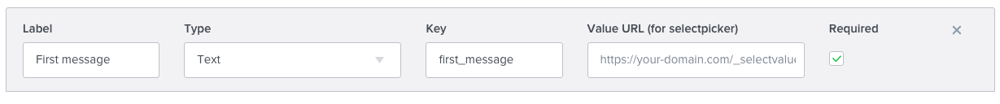

###### Result in the marketplace
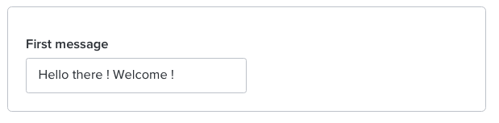

##### Toggle parameter
###### Usage in the dev platform
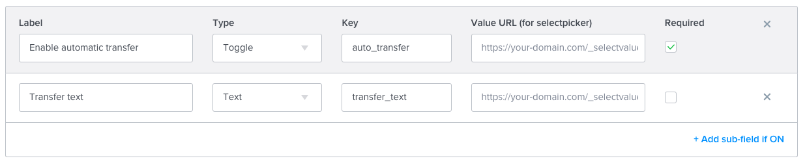

###### Result in the marketplace
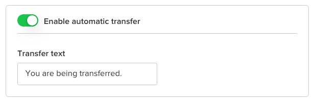

##### Select picker parameter
###### Usage in the dev platform
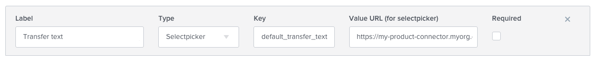

###### Result in the marketplace
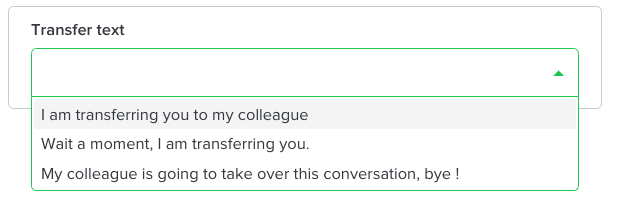

Note: To retrieve the options of the selectpicker, we will call the endpoint:

###### Request - GET method

| Query parameter | Description | Values |
| --- | --- | --- |
| idWebsite | Unique identifier of the website on which your connector is being installed on | ?idWebsite=ha-123  |

###### Response - Array of options (must NOT be empty)

<pre class="prettyprint lang-js">
[
  {
    "label": "I am transferring you to my colleague",
    "value": "direct_transfer"
  },
  {
    "label": "Wait a moment, I am transferring you.",
    "value": "wait_a_moment"
  },
  {
    "label": "My colleague is going to take over this conversation, bye !",
    "value": "colleague_take_over"
  }
]
</pre> 

| Field | Description | Values | Required |
| --- | --- | --- | --- |
| label | The displayed label in the select picker | String | ✓ |
| value | The value of the option | String | ✓ |

### 1. Define Authentication parameters
The App Authentication section is where you can set the authentication information that the final user will have to enter in order to install your connector. Once the user is authenticated, the connector will be able to access the right data from iAdvize and from the third-party app. For example, you can ask the user for his/her third app's email and password.
Users will need to follow these authentication steps to install your app.

You can add parameters and define the type of entry you need (text, numeric, etc.).

You can add as much parameters as you need.
This is the first thing users will see once they click on the "install" button on the iAdvize Marketplace.
Parameters appear to users according to their order of creation (the 1st entry created is the 1st on displayed on the page).

*i.e. if your primary goal is to know your users’ usernames, it is the first information you should ask them for.*

*i.e. users might be required to authenticate with an email and a password. In this case, you need to create two different parameters, one for the email and one for the password.*

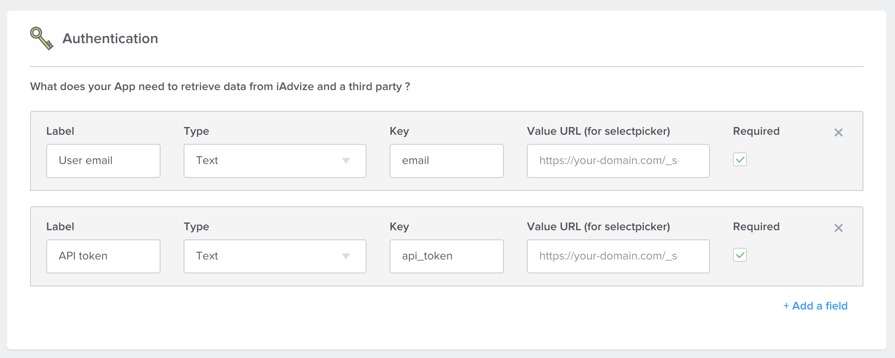

Users have to fill in the parameters during the installation process first, on the iAdvize Marketplace.

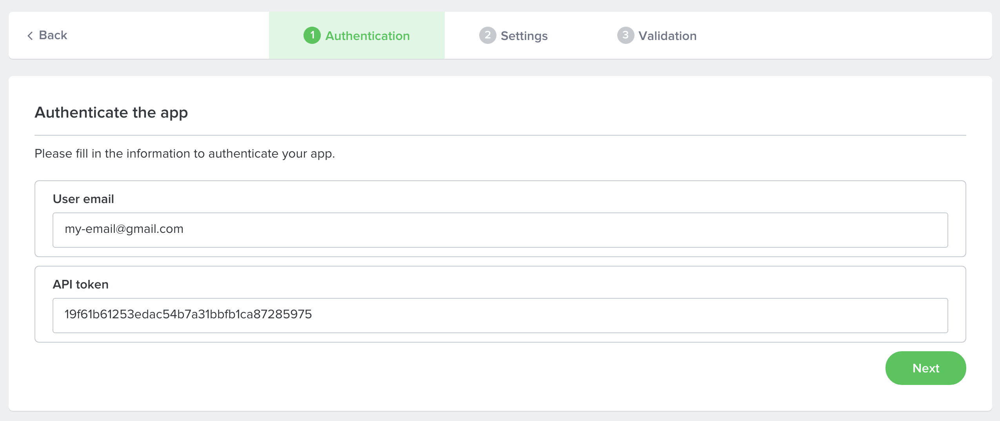

### 2. Define App Settings parameters

Just as in the section dedicated to your app's authentication, you are able to set the parameters that users will need to install your connector.
These are the parameters that the iAdvize administrator will fill in to install and configure your connector from the iAdvize Marketplace.

Define your app's settings parameters

You can add as many parameters as the installation and configuration of your application requires.
For each of these parameters you will have to specify the type of input required.

*Label: it is the name of your parameter. (This is what the users will see).
For instance it could be: Username
*Type: it defines the type of entry. (For instance: alphanumeric)
*ID: the identifier (key) of your parameter according to your code.

These configuration steps will take place immediately after authentication (if any).
The order of appearance of the steps depends on their order of creation. The first created parameter will appear first and the last created parameter will appear last to the user.

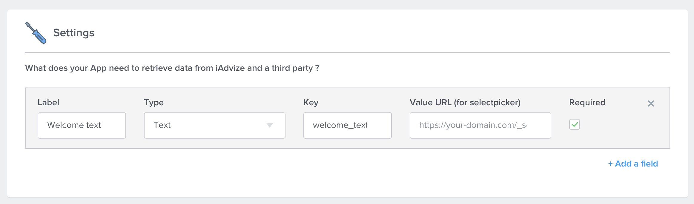

Users have to fill in the parameters during the installation process first, on the iAdvize Marketplace.

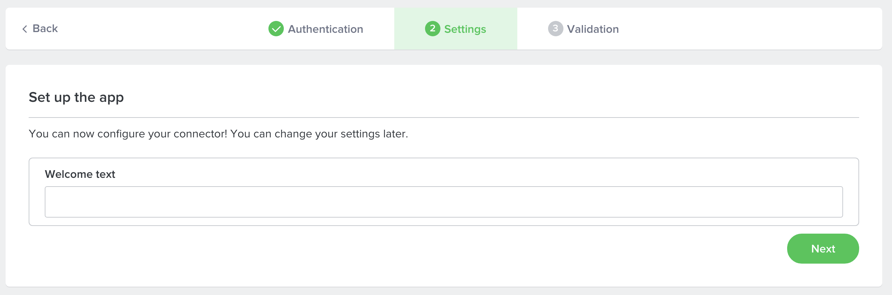

## App Plugins
Use plugins to enhance the iAdvize interface by adding or editing predefined features.

Plugins are basically HTTP endpoints whose json responses fit the plugin json-schema. For each plugin one or more endpoint have to be defined. When a plugin is used on user interface, we will make a GET http call to endpoint with documented query parameters. Your http response have to comply with plugin json-schema. You can find a link of the json schema below each plugin route. It can be used to validate your http responses on your side.

The plugins already available are:

* The product List (on the discussion panel)
* The customer information (on the discussion panel)
* The conversation closing form (on the discussion panel)
* The bot (add an external bot within iadvize chatbox)

### Product list
The integration of the product list enables iAdvize's Console panel users to browse a product catalog from the iAdvize discussion panel.
Agents can look for a product while they are chatting and send it in just a click within their conversation.

Products are displayed in a popup window just over the conversations view: When shared, visitors can see their image, title, availability and price.
By clicking on the "view product" button, visitors are redirected to the product page on your website.

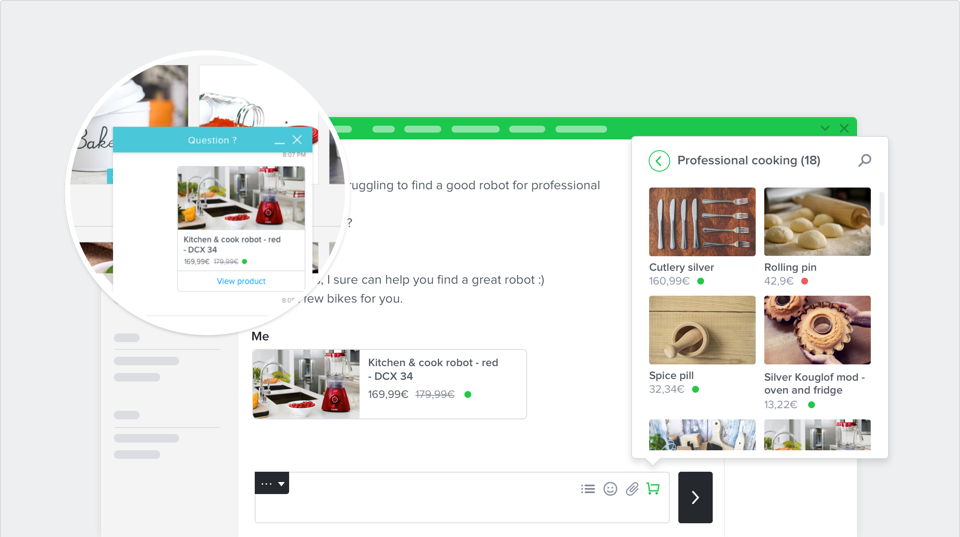

**Add the Product list plugin**

To make sure your connector uses the Product list plugin correctly, all you have to do is to declare:
* The product list URL - this is your catalog’s URL
* The categories url - this is where your connector will get the list of your product categories

#### Categories data

###### Request - GET method

| Query parameter | Description | Values |
| --- | --- | --- |
| idConnectorVersion | Connector version id | ?idConnectorVersion=c008849d-7cb1-40ca-9503-d6df2c5cddd8 |
| idParent | Unique identifier of the parent category | ?idParent=123  |
| idWebsite | Unique identifier of the website on which your connector is installed | ?idWebsite=ha-123  |
| idOperator | Unique identifier of the operator loading the categories | ?idOperator=9999  |
| limit | Maximum number of resources per page | ?limit=10 |
| offset | Number of resources skipped before beginning to return resources | ?offset=10 |

###### Response - Array of categories

<pre class="prettyprint lang-js">
[
    {
        "id": "123",
        "idParent": "123",
        "label": "category",
        "products": [
            "123",
            "456"
        ],
        "productsCount": 3
    },
    {
        "id": "456",
        "idParent": null,
        "label": "category",
        "products": null,
        "productsCount": 7
    }
 ]
</pre>

| Field | Description | Values | Required |
| --- | --- | --- | --- |
| id | Unique identifier | Integer | ✓ |
| idParent | Unique identifier of the parent category  | Integer |  |
| label | Label | String | ✓ |
| products | products | Array of strings |  |
| productsCount | Number of products | Integer | ✓ |

You can validate your response data format with the associated [json schema](/json-schemas/product-list/category.json)

#### Products data

###### Request - GET method

| Query parameter | Description | Values |
| --- | --- | --- |
| idConnectorVersion | Connector version id | ?idConnectorVersion=c008849d-7cb1-40ca-9503-d6df2c5cddd8 |
| idCategory | Category id | ?idCategory=123  |
| idWebsite | Unique identifier of the website on which your connector is installed | ?idWebsite=ha-123  |
| idOperator | Unique identifier of the operator loading the products | ?idOperator=9999  |
| limit | Maximum number of resources per page | ?limit=10 |
| offset | Number of resources skipped before beginning to return resources | ?offset=10 |
| searchQuery | Product search query | ?searchQuery=query |

###### Response - Array of products

<pre class="prettyprint lang-js">
[
    {
        "id": "123",
        "title": "Product's title",
        "productUrl": "http://www.e-commerce.com/url-product",
        "brand": "brand",
        "description": "product's description",
        "shortDescription": "shrot description",
        "available": true,
        "imageUrl": "http://www.e-commerce.com/url-product-image.jpg",
        "reference": "reference",
        "priceCatalog": "99.9 €",
        "pricePromotion": "90 €",
        "priceSpecial": "80 €"
    },
    {
        "id": "456",
        "title": "Product's title",
        "productUrl": "http://www.e-commerce.com/url-product",
        "brand": null,
        "description": "product's description",
        "shortDescription": null,
        "available": true,
        "imageUrl": "http://www.e-commerce.com/url-product-image.jpg",
        "reference": null,
        "priceCatalog": "9.9 €",
        "pricePromotion": null,
        "priceSpecial": null
    }
]
</pre>

| Field | Description | Values | Required |
| --- | --- | --- | --- |
| id | Unique identifier | Integer | ✓ |
| title | Title | String | ✓ |
| productUrl | Product's url | String | ✓ |
| brand | Brand | String |  |
| description | Description | String | ✓ |
| shortDescription | Short description | String |  |
| available | Availability | Boolean |  |
| imageUrl | Image's url | String | ✓ |
| reference | Reference | String | ✓ |
| priceCatalog | Price catalog | String | ✓ |
| pricePromotion | Price promotion | String |  |
| priceSpecial | Price special | String |  |

You can validate your response data format with the associated [json schema](/json-schemas/product-list/product.json).

### Customer information

The customer information plugin enables iAdvize's Console panel users to access to customer information in a single click.
Agents can overview the customer information in a new window while they are chatting. Operators can then edit it or simply look for information.

To be able to retrieve the customer information, iAdvize must be able to identify the visitor thanks to an email and/or an external ID.

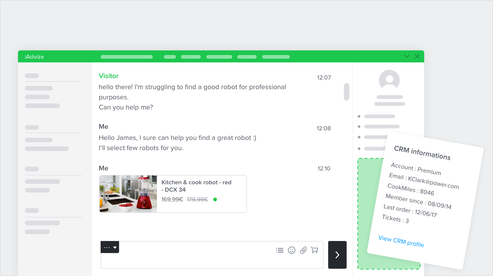

**Add the customer information plugin**
In order to set the right plugin parameters, all you have to do is to declare:
* The customer information URL - this is your customer information URL (mandatory).
* The customer information action URL - This URL will be triggered, if agent click on ACTION type field. This field is not mandatory.

#### Customer information data

###### Request - GET method

| Query parameter | Description | Values |
| --- | --- | --- |
| emailVisitor | Visitor email | ?emailVisitor=email@iadvize.com  |
| idConnectorVersion | Connector version id | ?idConnectorVersion=c008849d-7cb1-40ca-9503-d6df2c5cddd8 |
| idVisitorExternal | Visitor external id | ?idVisitorExternal=123  |
| idVisitorUnique | Visitor unique id | ?idVisitorUnique=a7b94266db827c5b8f04586e8e543abd4b7e976e9a723  |
| idWebsite | Unique identifier of the website on which your connector is installed | ?idWebsite=ha-123  |
| operatorLocale | Operator locale | ?operatorLocale=en  |
| idOperator | Unique identifier of the operator loading the visitor profile | ?idOperator=9999  |

###### Response - Array of fields

<pre class="prettyprint lang-js">
[
    {
        "id":"crm_profile_link",
        "label": "CRM profile",
        "value": "https://www.crm.fr/customer-information",
        "fieldType":"URL"
    },
    {
        "id":"crm_visitor_tag",
        "label": "CRM tag",
        "value": "tag",
        "fieldType": "TEXT"
    },
    {
        "id":"crm_create_case_action",
        "label": "Create a case",
        "value": "OPEN_CASE",
        "fieldType": "ACTION"
    }
]
</pre>

| Field | Description | Values | Required |
| --- | --- | --- | --- |
| id | Unique identifier | String | ✓ |
| label | Label | String | ✓ |
| value | Value | String | ✓ |
| fieldType | Field type | `ACTION`, `TEXT` or `URL` | ✓ |

You can validate your response data format with the associated [json schema](/json-schemas/customer/information.json).

#### Customer information action URL

###### Request - POST method

| Body parameters | Description | Values |
| --- | --- | --- |
| action | Action to execute on the connector |  OPEN_CASE |
| idConnectorVersion | Connector version id | c008849d-7cb1-40ca-9503-d6df2c5cddd8 |
| idVisitorUnique | Visitor unique id | a7b94266db827c5b8f04586e8e543abd4b7e976e9a723  |
| idWebsite | Unique identifier of the website on which your connector is installed | ha-123  |
| idConversation | Identifier of the current conversation | ha-123  |
| idOperator | Operator identifier who has clicked on the action | ha-12345  |

###### Response - Array of fields

<pre class="prettyprint lang-js">
{
    "success": true,
    "message": "Case created with success"
}
</pre>

| Field | Description | Values | Required |
| --- | --- | --- | --- |
| success | Result of the action | Boolean | ✓ |
| message | Result message of the action | String |  |

You can validate your response data format with the associated [json schema](/json-schemas/customer/action.json).

### Conversation closing form

The conversation closing form plugin enables iAdvize's Console panel users to provide additional information manually at the end of conversation.

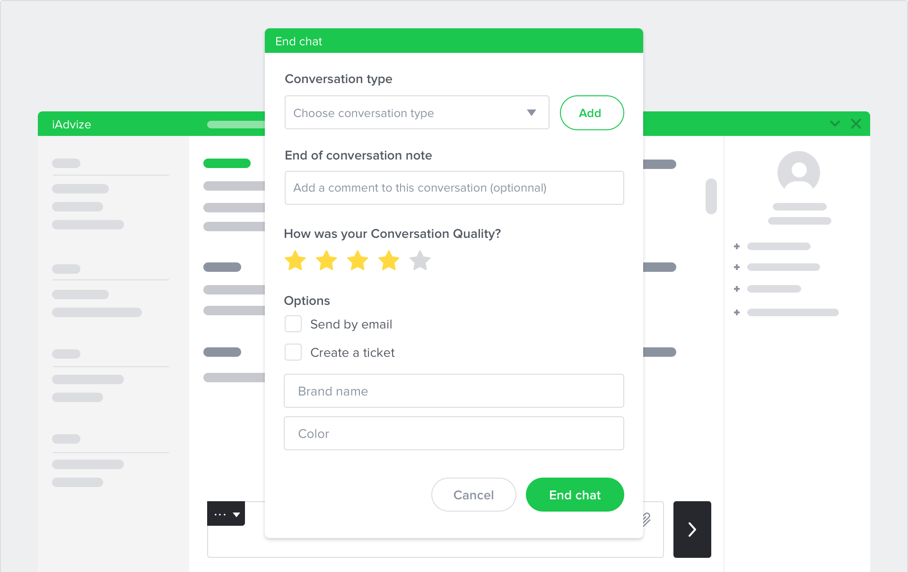

**Add the conversation closing form plugin**

In order to set the right plugin parameters, all you have to do is to declare:
* The connector URL - this is your form's url

#### Conversation Closing Form data

###### Request - GET method

| Query parameter | Description | Values |
| --- | --- | --- |
| idConnectorVersion | Connector version id | ?idConnectorVersion=c008849d-7cb1-40ca-9503-d6df2c5cddd8 |
| idWebsite | Unique identifier of the associated website (assigned to you by iAdvize) | ?idWebsite=ha-123  |
| operatorLocale | Operator locale | ?operatorLocale=en  |
| idOperator | Unique identifier of the operator loading the form | ?idOperator=9999  |

###### Response - Array of inputs

| Field | Description | Values | Required |
| --- | --- | --- | --- |
| id | Unique identifier | string | ✓ |
| idParent | Parent identifier, if the field depends on it| string | |
| label | Label | string | ✓ |
| fieldType | Field type | `TEXT`, `CHECKBOX`, `SELECT`, `TEXTAREA`, `INTEGER` or `DECIMAL` | ✓ |
| isRequired | Required | Boolean | ✓ |
| options | List of options object for `SELECT` type | array |  |
| options.label | Label displayed for this option | string | ✓ |
| options.value | Value saved when option is selected | string | ✓ |

<pre class="prettyprint lang-js">
[
    {
        "id": "create_crm_ticket",
        "label": "Create a CRM ticket",
        "fieldType": "CHECKBOX",
        "isRequired": true
    },
    {
        "id": "brand_name",
        "label": "Brand name",
        "fieldType": "TEXT",
        "isRequired": true
    },
    {
        "id": "brand_description",
        "label": "Brand name brings a totally new concept \n to their customers.",
        "fieldType": "TEXTAREA",
        "isRequired": true
    },
    {
        "id": "ticket_priority",
        "idParent": "create_crm_ticket",
        "label": "Priority",
        "fieldType": "SELECT",
        "isRequired": true,
        "options": [
            {
                "label": "Major",
                "value": "MAJOR"
            },
            {
                "label": "Minor",
                "value": "MINOR"
            },
            {
                "label": "Trivial",
                "value": "TRIVIAL"
            }
        ]
    },
    {
        "id": "order_id",
        "label": "The order id related to the claim",
        "fieldType": "INTEGER",
        "isRequired": false
    },
    {
        "id": "order_discount",
        "label": "The discount granted to the customer",
        "fieldType": "DECIMAL",
        "isRequired": false
    }
]
</pre>

You can validate your response data format with the associated [json schema](/json-schemas/conversation-closing-form/field.json).

⚠️ iAdvize can save up to 1024 characters in each field

### Conversation panel app
Conversation panel apps extends the capabilities of the Desk by allowing our clients to embed their own apps in a dedicated panel.

#### App development
The apps that can be embedded in the Desk are web apps coded in any web compliant technology - static web page,
dynamic web pages such as php or jsp generated, single page applications written in Angular or React, etc...

These apps will be embedded in an `iframe` element in the Desk, and the web server serving these apps must allow them to run 
in an iframe on the iAdvize domains: https://www.iadvize.com or https://ha.iadvize.com.
This is done by configuring the `X-FRAME-OPTIONS` header.

The app can communicate with the desk by using a library provided by iAdvize.

To use the library an app must include a javascript bundle in the html with the following code.
```html
<script src="https://static.iadvize.com/conversation-panel-app-lib/1.0.0/idzcpa.umd.production.min.js"></script>
```

Then in the javascript code of the app the library can be used as follows.
```js
idzCpa.init().then(client => {
  client.insertTextInComposeBox('Hello world!');
});
```

The client is obtained via the `idzCpa.init` function that returns a Promise.
In the `then` statement of the promise the `client` can then be used to invoke functions to interact with the desk.

At present the library only allows to send some text to the compose zone with the following function.
```ts
function insertTextInComposeBox(value: string) {}
```
Please note that one iframe is created per conversation in order to keep a context for an app for each conversation.
It is recommended to keep the app very lightweight and avoid heavy processing or streaming updates.

#### Configuration
Under the Plugins section create a Conversation Panel App and then edit the following fields:

#### App name
This is the name that will show in the toolbar button that starts your app.
The name must be provided as a json object that contains a `default` name and then names for each language the app needs
to support.

For instance
```json
{"default": "Orders", "EN": "Orders", "FR":  "Commandes"}
```
#### Icon name
The icon name refers to a set of predefined icons provided by iAdvize that will appear in the button that starts the app.

Here is the list of available options by domain - the name must be entered in upper case.
```
Coupon
COUPON, DOLLAR, PERCENTAGE, TICKETS

Qualify lead
STAMP
 
Segmentation
TARGET, CARD

Delivery
DELIVERY, PACKAGE

Orders
ORDER, BOXES

Stock
STOCK, WAREHOUSE

Knowledge base
RECOMMENDATION, FILES, FOLDERS, SEARCH

User account
PROFILE, TARGETING, PROFILECARDS

Invoicing
INVOICING

Payment
PAYMENT

Shopping cart
SHOPPINGCART, SEARCHSHOPPINGCART

Product availability
BAGQUESTION, BAGSEARCH, PACKAGESEARCH

Stores
STORE

Location
LOCATION, POSITION, LOCATIONPIN

Assistance
TOOLS, TOOLING, HELP

Note
NOTE

Booking
BOOKING

Tags
TAG

Hotels & Services
HOTELS, HOTELOFFER, SERVICES

Generic/Random
NOTEBOOK, DIAMOND, BOUSSOLE, SHIRT, GEAR, FRAME45, TARGETING
```
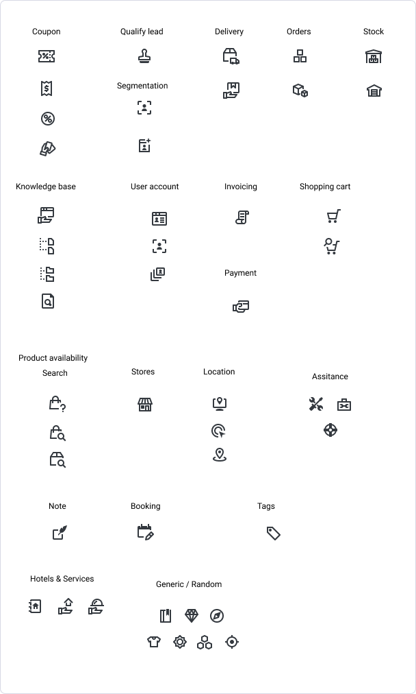

#### iFrame URL
This option provides the URL that the Desk will use to start your app. It must be a public URL that can be targeted by
the browser that runs the desk and available via https.

For instance: `https://mycompany.com/ordersapp`

## External bots
Bots are an important part of iAdvize integration ecosystem. That's why they have their [own dedicated documentation](/documentation/building-your-bot-on-iadvize#building-your-bot-on-iadvize).

## Add webhooks
The webhook system allows external applications to subscribe to events (via callback URLs) to receive updates in real-time.
When you build your app, you can subscribe to a list of events.
When customers install your app, it automatically creates webhooks for these customers as well as for events based on your app's configuration.

This subscription is based on the events happening on different domains. See the list of events available in the [Webhooks documentation](webhooks#webhooks).

You can create as much outgoing webhooks as you need.
A webhook can cover several events.
An event can be linked to a customer (example customers.website.created)
or linked to a website (example customers.website.created)

* Name of the webhook: an optional label you can give to the webhook
* webhook URL: the server URL that will receive the webhook
* Security token: Token provided by iAdvize (this field cannot be edited)
* Content-type: Application / json ; Application / x-www-form-urlencoded
* Events: you can select the events in the list. You can subscribe to all
iAdvize events, all events of a specific domain, or only one event.

## Submit your apps

Apps must be submitted to iAdvize for review.
The versioning declaration must be done by the developer during the submission process.
iAdvize will approve or refuse the app based on specific criteria.
iAdvize will get in touch within 48 hours to the developers.

## App security

For security reasons iAdvize provides you with a method to verify and secure your apps. You will be able to make sure that the payloads have not been subjected to modifications, and to verify its source in order for example to limit the requests to those coming from iAdvize.

Once your server is configured to receive payloads, you can set up a secret token and verify the information.

### Set you secret token

First, you need to get one secret token depending on your connector.
You can retrieve this token in the 'App information' section on our developer platform.

Once your server is configured to receive payloads, you can set up a secret token and verify the information.

Note: If you want to use the webhook system without building a connector, you will have to use one token per webhook.
To retrieve the token(s) you must contact us at developers@iadvize.com and we will generate the token for you.

### Validating payloads from iAdvize

Once the secret token set, iAdvize will create a hash signature.
This hash signature is passed along with each request in the headers as `X-iAdvize-Signature`.

For `GET` requests, hash signature starts with algorithm name `sha256=` and is computed by hashing the **raw query string** with HMAC hexdigest algorithm and your secret token as salt.

For `POST`, `PUT`... requests, hash signature starts with algorithm name `sha256=` and is computed by hashing the **raw body string** with HMAC hexdigest algorithm and your secret token as salt.

<pre class="prettyprint lang-js">
X-iAdvize-Signature: sha256=110e8400-e29b-11d4-a716-446655440000
</pre>

You have to compute a new hash using your secret token, and to compare it with `X-iAdvize-Signature` and make sure it matches.
Here is an example of a PHP implementation:

<pre class="prettyprint lang-php">
// Example for a POST request
$secretToken       = 'yourSecretToken';
$headers           = getallheaders();
$iAdvizeSignature  = $headers['X-iAdvize-Signature'];

// Get alogrithm and hash
list($algorithm, $iAdvizeHash) = explode('=', $iAdvizeSignature, 2);

// Get body payload from webhook
$bodyPayload = file_get_contents('php://input');

// Computed hash with body payload
$bodyPayloadHash = hash_hmac($algorithm, $bodyPayload, $secretToken);

// Final check
if (! hash_equals($iAdvizeHash, $bodyPayloadHash)) {
    exit('Validation hash failed');
}
</pre>


We strongly recommend you, to use the **constant time** string comparison method (`hash_equals` vs `===`  in our example),
to be less vulnerable to timing attacks.

### Validate our IPs
We use 3 IPs when we call your webhooks or plugins :
- 35.158.241.155 
- 35.158.90.142
- 35.156.32.28

## Developer Policy
Developers host their code on their own host service.
Developers are responsible for their connector's maintenance.
Developers can set their app’s price (monthly fee per user).
If it’s not a free app, developers must be a legal person.
