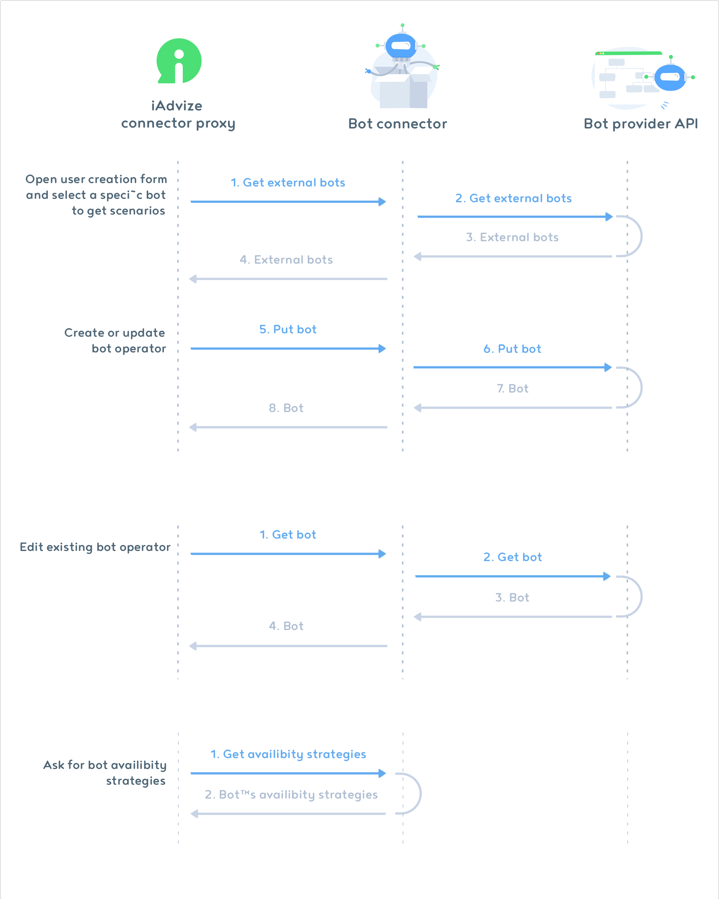

# Build apps
Once you are logged in your developer account, you are ready to build apps.
So let's go through the different sections of the Developer Platform:

## Milestones of the app creation process
Here are the different steps of an app creation:
* Sign up to our [developer platform](https://developers.iadvize.com/login).
* You'll receive within 48 hours a confirmation of your subscription and your credentials to access your test environment.
* You build your awesome app and send it for approval when it's finished.
* You get notified of the acceptance or not of your app publication (see app validation process section).
* If your app is approved, congratulations, iAdvize customer can now benefit from your work!
* If your app is private: one or few selected customers can install it on their production environment.
* If your app is public: any iAdvize customer can install it directly on the marketplace.
* If you need to create a new version of your app, please refer to the "versioning of your apps" section of this documentation.

## My apps
This is the place where you can see the list of all the apps you have built on iAdvize. You can also see their current status:
* Published: your app is ready to be installed on the iAdvize Marketplace
* Under review: your app has been submitted for review
* Sandbox: you can edit your app

## App information
This is where you will be able to define your app's profile. Also, this is where you can set the Privacy mode of your application: public or private.

**How does the Private mode work?**
Your App can be available for all iAdvize's customers or for selected customers.
Our team is still working on the accessibility mode under the Private mode.
We will make it available manually for the specific customers you have selected.

### Health check 
In order to ensure satisfaction from our customers we require that every integrator provide an health check route. Using the provided endpoint iAdvize must be able to detect that a connector is healthy and is behaving as expected. You are required to implement an healthcheck endpoint as specified below.

#### Healthcheck endpoint
###### Request - GET method

| Query parameter | Description | Values |
| --- | --- | --- |
| No parameter | | |

###### Response - status object
<pre class="prettyprint lang-js">
{
    "status": "UP"
}
</pre>

| Field | Description | Values | Required |
| --- | --- | --- | --- |
| status | The current status of your connector | `UP` | ✓ |

Note that this endpoint will be checked on a regular basis at the url you specified in the App information section. It **MUST** return `200` status or it will be considered unhealthy.

## App Parameters
By adding parameters to the installation process, the client has the possibility to configure your connector. 

You can request two kinds of parameters:
* sensitive parameters such as API keys, emails... it must be declared under the [Authentication parameter step](/documentation/build-apps#1.-define-authentication-parameters)
* regular parameters such as texts, boolean it must be declared under the  [App parameter step](/documentation/build-apps#2.-define-app-settings-parameters)

A connector parameter has 4 to 5 properties:
* Key: the key of your parameter according to your code.
* Label: the name of your parameter, this is what users will see in the marketplace during the installation process
* Type: it defines the type of entry. (For instance: text)
* Url: only required for type "selectpicker". To dynamically retrieve options from the given url 
* Required: specify if the parameter is required for your connector

Currently, we support 3 types of parameters:
* "text". For textual input values
* "toggle". For enabling / disabling a part of the parameters. It is useful if you want to allow your clients to enable / disable specific features of your connector 
* "selectpicker". For dynamically loaded options from the configured url

##### Text parameter
###### Usage in the dev platform

###### Result in the marketplace

##### Toggle parameter
###### Usage in the dev platform

###### Result in the marketplace

##### Select picker parameter
###### Usage in the dev platform

###### Result in the marketplace

Note: To retrieve the options of the selectpicker, we will call the endpoint:

###### Request - GET method

| Query parameter | Description | Values |
| --- | --- | --- |
| idWebsite | Unique identifier of the website on which your connector is being installed on | ?idWebsite=ha-123  |

###### Response - Array of options (must NOT be empty)

<pre class="prettyprint lang-js">
[
  {
    "label": "I am transferring you to my colleague",
    "value": "direct_transfer"
  },
  {
    "label": "Wait a moment, I am transferring you.",
    "value": "wait_a_moment"
  },
  {
    "label": "My colleague is going to take over this conversation, bye !",
    "value": "colleague_take_over"
  }
]
</pre> 

| Field | Description | Values | Required |
| --- | --- | --- | --- |
| label | The displayed label in the select picker | String | ✓ |
| value | The value of the option | String | ✓ |

### 1. Define Authentication parameters
The App Authentication section is where you can set the authentication information that the final user will have to enter in order to install your connector. Once the user is authenticated, the connector will be able to access the right data from iAdvize and from the third-party app. For example, you can ask the user for his/her third app's email and password.
Users will need to follow these authentication steps to install your app.

You can add parameters and define the type of entry you need (text, numeric, etc.).

You can add as much parameters as you need.
This is the first thing users will see once they click on the "install" button on the iAdvize Marketplace.
Parameters appear to users according to their order of creation (the 1st entry created is the 1st on displayed on the page).

*i.e. if your primary goal is to know your users’ usernames, it is the first information you should ask them for.*

*i.e. users might be required to authenticate with an email and a password. In this case, you need to create two different parameters, one for the email and one for the password.*

Users have to fill in the parameters during the installation process first, on the iAdvize Marketplace.

### 2. Define App Settings parameters

Just as in the section dedicated to your app's authentication, you are able to set the parameters that users will need to install your connector.
These are the parameters that the iAdvize administrator will fill in to install and configure your connector from the iAdvize Marketplace.

Define your app's settings parameters

You can add as many parameters as the installation and configuration of your application requires.
For each of these parameters you will have to specify the type of input required.

*Label: it is the name of your parameter. (This is what the users will see).
For instance it could be: Username
*Type: it defines the type of entry. (For instance: alphanumeric)
*ID: the identifier (key) of your parameter according to your code.

These configuration steps will take place immediately after authentication (if any).
The order of appearance of the steps depends on their order of creation. The first created parameter will appear first and the last created parameter will appear last to the user.

Users have to fill in the parameters during the installation process first, on the iAdvize Marketplace.

## App Plugins
Use plugins to enhance the iAdvize interface by adding or editing predefined features.

Plugins are basically HTTP endpoints whose json responses fit the plugin json-schema. For each plugin one or more endpoint have to be defined. When a plugin is used on user interface, we will make a GET http call to endpoint with documented query parameters. Your http response have to comply with plugin json-schema. You can find a link of the json schema below each plugin route. It can be used to validate your http responses on your side.

The plugins already available are:

* The product List (on the discussion panel)
* The customer information (on the discussion panel)
* The conversation closing form (on the discussion panel)
* The bot (add an external bot within iadvize chatbox)

### Product list
The integration of the product list enables iAdvize's Console panel users to browse a product catalog from the iAdvize discussion panel.
Agents can look for a product while they are chatting and send it in just a click within their conversation.

Products are displayed in a popup window just over the conversations view: When shared, visitors can see their image, title, availability and price.
By clicking on the "view product" button, visitors are redirected to the product page on your website.

**Add the Product list plugin**

To make sure your connector uses the Product list plugin correctly, all you have to do is to declare:
* The product list URL - this is your catalog’s URL
* The categories url - this is where your connector will get the list of your product categories

#### Categories data

###### Request - GET method

| Query parameter | Description | Values |
| --- | --- | --- |
| idConnectorVersion | Connector version id | ?idConnectorVersion=c008849d-7cb1-40ca-9503-d6df2c5cddd8 |
| idParent | Unique identifier of the parent category | ?idParent=123  |
| idWebsite | Unique identifier of the website on which your connector is installed | ?idWebsite=ha-123  |
| idOperator | Unique identifier of the operator loading the categories | ?idOperator=9999  |
| limit | Maximum number of resources per page | ?limit=10 |
| offset | Number of resources skipped before beginning to return resources | ?offset=10 |

###### Response - Array of categories

<pre class="prettyprint lang-js">
[
    {
        "id": "123",
        "idParent": "123",
        "label": "category",
        "products": [
            "123",
            "456"
        ],
        "productsCount": 3
    },
    {
        "id": "456",
        "idParent": null,
        "label": "category",
        "products": null,
        "productsCount": 7
    }
 ]
</pre>

| Field | Description | Values | Required |
| --- | --- | --- | --- |
| id | Unique identifier | Integer | ✓ |
| idParent | Unique identifier of the parent category  | Integer |  |
| label | Label | String | ✓ |
| products | products | Array of strings |  |
| productsCount | Number of products | Integer | ✓ |

You can validate your response data format with the associated [json schema](/json-schemas/product-list/category.json)

#### Products data

###### Request - GET method

| Query parameter | Description | Values |
| --- | --- | --- |
| idConnectorVersion | Connector version id | ?idConnectorVersion=c008849d-7cb1-40ca-9503-d6df2c5cddd8 |
| idCategory | Category id | ?idCategory=123  |
| idWebsite | Unique identifier of the website on which your connector is installed | ?idWebsite=ha-123  |
| idOperator | Unique identifier of the operator loading the products | ?idOperator=9999  |
| limit | Maximum number of resources per page | ?limit=10 |
| offset | Number of resources skipped before beginning to return resources | ?offset=10 |
| searchQuery | Product search query | ?searchQuery=query |

###### Response - Array of products

<pre class="prettyprint lang-js">
[
    {
        "id": "123",
        "title": "Product's title",
        "productUrl": "http://www.e-commerce.com/url-product",
        "brand": "brand",
        "description": "product's description",
        "shortDescription": "shrot description",
        "available": true,
        "imageUrl": "http://www.e-commerce.com/url-product-image.jpg",
        "reference": "reference",
        "priceCatalog": "99.9 €",
        "pricePromotion": "90 €",
        "priceSpecial": "80 €"
    },
    {
        "id": "456",
        "title": "Product's title",
        "productUrl": "http://www.e-commerce.com/url-product",
        "brand": null,
        "description": "product's description",
        "shortDescription": null,
        "available": true,
        "imageUrl": "http://www.e-commerce.com/url-product-image.jpg",
        "reference": null,
        "priceCatalog": "9.9 €",
        "pricePromotion": null,
        "priceSpecial": null
    }
]
</pre>

| Field | Description | Values | Required |
| --- | --- | --- | --- |
| id | Unique identifier | Integer | ✓ |
| title | Title | String | ✓ |
| productUrl | Product's url | String | ✓ |
| brand | Brand | String |  |
| description | Description | String | ✓ |
| shortDescription | Short description | String |  |
| available | Availability | Boolean |  |
| imageUrl | Image's url | String | ✓ |
| reference | Reference | String | ✓ |
| priceCatalog | Price catalog | String | ✓ |
| pricePromotion | Price promotion | String |  |
| priceSpecial | Price special | String |  |

You can validate your response data format with the associated [json schema](/json-schemas/product-list/product.json).

### Customer information

The customer information plugin enables iAdvize's Console panel users to access to customer information in a single click.
Agents can overview the customer information in a new window while they are chatting. Operators can then edit it or simply look for information.

To be able to retrieve the customer information, iAdvize must be able to identify the visitor thanks to an email and/or an external ID.

**Add the customer information plugin**
In order to set the right plugin parameters, all you have to do is to declare:
* The customer information URL - this is your customer information URL (mandatory).
* The customer information action URL - This URL will be triggered, if agent click on ACTION type field. This field is not mandatory.

#### Customer information data

###### Request - GET method

| Query parameter | Description | Values |
| --- | --- | --- |
| emailVisitor | Visitor email | ?emailVisitor=email@iadvize.com  |
| idConnectorVersion | Connector version id | ?idConnectorVersion=c008849d-7cb1-40ca-9503-d6df2c5cddd8 |
| idVisitorExternal | Visitor external id | ?idVisitorExternal=123  |
| idVisitorUnique | Visitor unique id | ?idVisitorUnique=a7b94266db827c5b8f04586e8e543abd4b7e976e9a723  |
| idWebsite | Unique identifier of the website on which your connector is installed | ?idWebsite=ha-123  |
| operatorLocale | Operator locale | ?operatorLocale=en  |
| idOperator | Unique identifier of the operator loading the visitor profile | ?idOperator=9999  |

###### Response - Array of fields

<pre class="prettyprint lang-js">
[
    {
        "id":"crm_profile_link",
        "label": "CRM profile",
        "value": "https://www.crm.fr/customer-information",
        "fieldType":"URL"
    },
    {
        "id":"crm_visitor_tag",
        "label": "CRM tag",
        "value": "tag",
        "fieldType": "TEXT"
    },
    {
        "id":"crm_create_case_action",
        "label": "Create a case",
        "value": "OPEN_CASE",
        "fieldType": "ACTION"
    }
]
</pre>

| Field | Description | Values | Required |
| --- | --- | --- | --- |
| id | Unique identifier | String | ✓ |
| label | Label | String | ✓ |
| value | Value | String | ✓ |
| fieldType | Field type | `ACTION`, `TEXT` or `URL` | ✓ |

You can validate your response data format with the associated [json schema](/json-schemas/customer/information.json).

#### Customer information action URL

###### Request - POST method

| Body parameters | Description | Values |
| --- | --- | --- |
| action | Action to execute on the connector |  OPEN_CASE |
| idConnectorVersion | Connector version id | c008849d-7cb1-40ca-9503-d6df2c5cddd8 |
| idVisitorUnique | Visitor unique id | a7b94266db827c5b8f04586e8e543abd4b7e976e9a723  |
| idWebsite | Unique identifier of the website on which your connector is installed | ha-123  |
| idConversation | Identifier of the current conversation | ha-123  |
| idOperator | Operator identifier who has clicked on the action | ha-12345  |

###### Response - Array of fields

<pre class="prettyprint lang-js">
{
    "success": true,
    "message": "Case created with success"
}
</pre>

| Field | Description | Values | Required |
| --- | --- | --- | --- |
| success | Result of the action | Boolean | ✓ |
| message | Result message of the action | String |  |

You can validate your response data format with the associated [json schema](/json-schemas/customer/action.json).

### Conversation closing form

The conversation closing form plugin enables iAdvize's Console panel users to provide additional information manually at the end of conversation.

**Add the conversation closing form plugin**

In order to set the right plugin parameters, all you have to do is to declare:
* The connector URL - this is your form's url

#### Conversation Closing Form data

###### Request - GET method

| Query parameter | Description | Values |
| --- | --- | --- |
| idConnectorVersion | Connector version id | ?idConnectorVersion=c008849d-7cb1-40ca-9503-d6df2c5cddd8 |
| idWebsite | Unique identifier of the associated website (assigned to you by iAdvize) | ?idWebsite=ha-123  |
| operatorLocale | Operator locale | ?operatorLocale=en  |
| idOperator | Unique identifier of the operator loading the form | ?idOperator=9999  |

###### Response - Array of inputs

| Field | Description | Values | Required |
| --- | --- | --- | --- |
| id | Unique identifier | string | ✓ |
| idParent | Parent identifier, if the field depends on it| string | |
| label | Label | string | ✓ |
| fieldType | Field type | `TEXT`, `CHECKBOX`, `SELECT`, `TEXTAREA`, `INTEGER` or `DECIMAL` | ✓ |
| isRequired | Required | Boolean | ✓ |
| options | List of options object for `SELECT` type | array |  |
| options.label | Label displayed for this option | string | ✓ |
| options.value | Value saved when option is selected | string | ✓ |

<pre class="prettyprint lang-js">
[
    {
        "id": "create_crm_ticket",
        "label": "Create a CRM ticket",
        "fieldType": "CHECKBOX",
        "isRequired": true
    },
    {
        "id": "brand_name",
        "label": "Brand name",
        "fieldType": "TEXT",
        "isRequired": true
    },
    {
        "id": "brand_description",
        "label": "Brand name brings a totally new concept \n to their customers.",
        "fieldType": "TEXTAREA",
        "isRequired": true
    },
    {
        "id": "ticket_priority",
        "idParent": "create_crm_ticket",
        "label": "Priority",
        "fieldType": "SELECT",
        "isRequired": true,
        "options": [
            {
                "label": "Major",
                "value": "MAJOR"
            },
            {
                "label": "Minor",
                "value": "MINOR"
            },
            {
                "label": "Trivial",
                "value": "TRIVIAL"
            }
        ]
    },
    {
        "id": "order_id",
        "label": "The order id related to the claim",
        "fieldType": "INTEGER",
        "isRequired": false
    },
    {
        "id": "order_discount",
        "label": "The discount granted to the customer",
        "fieldType": "DECIMAL",
        "isRequired": false
    }
]
</pre>

You can validate your response data format with the associated [json schema](/json-schemas/conversation-closing-form/field.json).

### External bot

Let your bot interact with online visitors directly within iAdvize’s chatbox.
The External bot plugin enables iAdvize's Admins and Managers to create users with the role “bot” from iAdvize’s administration. The scenario and availability of the bot are managed by your app.

To put it in a nutshell, the External bot plugin:
* Allows bots providers to create their connector thanks to the Developer Platform
* Allows customers to connect their iAdvize account to a bot provider and connect bots seamlessly. These bots interact with iAdvize like a human agent.

#### The External bot user flow

The iAdvize Administrator/Manager:

* Activates your connector from the iAdvize marketplace,
* Creates a new user with the role "bot" from the "People" section of iAdvize,
* Select an external bot and a scenario,

** Add the External bot plugin **
To make sure your connector uses the External Bot plugin correctly, all you have to do is to declare the base url that will be postfixed by seven endpoints described below.

#### Operator form flow endpoints

There are 4 endpoints related to Operator form flow. This is related to the creation of an Operator with a Bot role, within iAdvize in order to link it to the External bot.

##### List external bots (endpoint)

###### Request - GET /external-bots

| Query parameter | Description | Values |
| --- | --- | --- |
| idConnectorVersion | Connector version id | ?idConnectorVersion=c008849d-7cb1-40ca-9503-d6df2c5cddd8 |
| idWebsite | Unique identifier of the website on which your connector is installed | ?idWebsite=ha-123  |

###### Response

<pre class="prettyprint lang-js">
[
    {
        "idBot": "Hal12343",
        "name": "Hal",
        "description": "Hal is good, bro",
        "editorUrl": "http://your-saas/Hal12343/editor"
    },
    {
        "idBot": "brt123569",
        "name": "Bart Simpson",
        "editorUrl": "http://your-saas/brt123569/editor"
    },
]
</pre>

| Field | Description | Values | Required |
| --- | --- | --- | --- |
| idBot | Unique identifier of the bot | String | ✓ |
| name | Name of the bot | String | ✓ |
| description | Description of the bot | String |  |
| editorUrl | Url used to redirect user to your bot editor| A valid URL | ✓ |

You can validate your response data format with the associated [json schema](/json-schemas/bot/external-bot.json).

##### Modify bot information (endpoint)

###### Request - PUT /bots/:idOperator:

<pre class="prettyprint lang-js">
{
    "name": "Hal",
    "pseudo": "Hal is good, bro",
    "language": "fr",
    "distributionRules": [
        {
            "id": "ef4670c3-d715-4a21-8226-ed17f354fc44",
            "label": "Human SAV guys"
        }
    ],
    "external": {
        "idBot": "Hal12343"
    }
}
</pre>

| Parameters | In | Description | Values |
| --- | --- | --- | --- |
| idConnectorVersion | Query | Connector version id | ?idConnectorVersion=c008849d-7cb1-40ca-9503-d6df2c5cddd8 |
| idWebsite | Query | Unique identifier of the website on which your connector is installed | ?idWebsite=ha-123  |
| idOperator | Path | iAdvize bot operator identifier that we associate to your bot scenario | /bots/456678  |

| Field | Description | Values | Constraints |
| --- | --- | --- | --- |
| name | Bot name on your platform | String |  |
| pseudo | Bot pseudo used during the conversation | String |  |
| language | Language spoken by the bot | String | ISO 3166-1 alpha-2 |
| distributionRules | distribution rule that can be used inside transfer replies | Array |  |
| distributionRules.id | Distribution rule identifier | String | UUID |
| distributionRules.label | Distribution rule label | String |  |
| external.idBot | Existing bot unique identifier for this connector| String |  |

###### Response

<pre class="prettyprint lang-js">
{
    "idOperator": "local-23232",
    "external": {
      "idBot":"R3R3ZFDKOEZ",
      "name": "Hal",
      "description": "Hal is good, bro",
      "editorUrl": "http://your-saas/R3R3ZFDKOEZ/editor"
    },
    "distributionRules": [
      {
        "id": "ef4670c3-d715-4a21-8226-ed17f354fc44",
        "label": "Human SAV guys"
      }
    ],
    "createdAt": "2017-11-22T12:04:00Z",
    "updatedAt": "2017-11-22T12:04:00Z"
  }
</pre>

| Field | Description | Values | Required | Constraints |
| --- | --- | --- | --- | --- |
| idOperator | iAdvize bot operator identifier | String | ✓ |  |
| external.idBot | Bot identifier on your platform | String | ✓ |  |
| external.name | Bot name on your platform | String |  |  |
| external.description | Bot description on your plateform | String |  |  |
| external.editorUrl | Bot edition url on your platform | String | ✓ | URL |
| distributionRules | distribution rule that can be used inside transfer replies | Array |  |  |
| distributionRules.id | Distribution rule identifier | String | ✓ | UUID |
| distributionRules.label | Distribution rule label | String | ✓ | |
| createdAt | Creation date of you bot | String | ✓ | ISO 8601 |
| updatedAt | Last modification date of your bot| String | ✓ | ISO 8601 |

You can validate your response data format with the associated [json schema](/json-schemas/bot/bot.json).

##### Get bot information (endpoint)

###### Request - GET /bots/:idOperator:

| Parameters | In | Description | Values |
| --- | --- | --- | --- |
| idConnectorVersion | Query | Connector version id | ?idConnectorVersion=c008849d-7cb1-40ca-9503-d6df2c5cddd8 |
| idWebsite | Query | Unique identifier of the website on which your connector is installed | ?idWebsite=ha-123  |
| idOperator | Path | iAdvize bot operator identifier that we associate to your bot scenario | /bots/456678  |

###### Response

<pre class="prettyprint lang-js">
{
    "idOperator": "local-23232",
    "external": {
        "idBot":"R3R3ZFDKOEZ",
        "name": "Hal",
        "description": "Hal is good, bro",
        "editorUrl": "http://your-saas/R3R3ZFDKOEZ/editor"
    },
    "distributionRules": [
        {
            "id": "ef4670c3-d715-4a21-8226-ed17f354fc44",
            "label": "Human SAV guys"
        }
    ],
    "createdAt": "2017-11-22T12:04:00Z",
    "updatedAt": "2017-11-22T12:04:00Z"
}
</pre>

| Field | Description | Values | Required | Constraints |
| --- | --- | --- | --- | --- |
| idOperator | iAdvize bot operator identifier | String | ✓ |  |
| external.idBot | Bot identifier on your platform | String | ✓ |  |
| external.name | Bot name on your platform | String |  |  |
| external.description | Bot description on your plateform | String |  |  |
| external.editorUrl | Bot edition url on your platform | String | ✓ | URL |
| distributionRules | distribution rule that can be used inside transfer replies | Array |  | |
| distributionRules.id | Distribution rule identifier | String | ✓ | UUID |
| distributionRules.label | Distribution rule label | String | ✓ | |
| createdAt | Creation date of you bot | String | ✓ | ISO 8601 |
| updatedAt | Last modification date of your bot| String | ✓ | ISO 8601 |

You can validate your response data format with the associated [json schema](/json-schemas/bot/bot.json).

##### Get bot availability strategies (endpoint)

Bot is ready and should be available accordingly to the availability strategy and distributions rules.

###### Request - GET /availability-strategies

| Parameters | In | Description | Values | Required |
| --- | --- | --- | --- | --- |
| idConnectorVersion | Query | Connector version id | ?idConnectorVersion=c008849d-7cb1-40ca-9503-d6df2c5cddd8 | ✓ |
| idWebsite | Query | Unique identifier of the website on which your connector is installed | ?idWebsite=ha-123  | ✓ |
| idOperator | Query | iAdvize bot operator identifier that we associate to your bot scenario | ?idOperator=456678  | ✓ |

###### Response

<pre class="prettyprint lang-js">
[
    {
        "strategy": "atLeastOne",
        "distributionRulesToCheck": [
            "ef4670c3-d715-4a21-8226-ed17f354fc44"
        ]
    }
]
</pre>

<pre class="prettyprint lang-js">
[
    {
        "strategy": "customAvailability",
        "availability": true
    }
]
</pre>

| Field | Description | Values | Required | Constraints |
| --- | --- | --- | --- | --- |
| strategy | How we should aggregate the availability if several distribution rules are provided | `atLeastOne` or `all` or `notAvailable` or `customAvailability` | ✓ | |
| distributionRulesToCheck | All distribution rules we should check for availability. This is subset of DistributionRules returned by the Get bot endpoint. | Array of String | | Required if strategy is equal to `atLeastOne` or `all` |
| availability | Allow the connector to handle the availability of the bot | Boolean | | Required if strategy is equal to `customAvailability` |

You can validate your response data format with the associated [json schema](/json-schemas/bot/availability-strategies.json).

#### Conversation flow endpoints

There are 3 Conversation flow endpoints :

* Each time a conversation is created, we call the _conversation initialisation endpoint_. In the current setup, the visitor is always the first to talk, so you should response with an empty array of replies.
* This initialisation call will be immediately followed by a call to the _new message & reply reception endpoint_, this second call will contain the first message of the visitor. You should response to this call with some reply (usually a welcoming message reply).
* **Be careful**, from this point the calls to _new message & reply reception endpoint_ can contains the visitor's messages or **your own replies**. See the example below.

Here is a full conversation example :
* 00:00 - The visitor sends _"Hi, are you there ? Shall we begin ?"_ in the conversation. We call the new message reception endpoint with the message in the request. Your plugin response with an await 1 second and send an _"How are you ?"_ message with two quick replies (_"Fine"_ or _"Bad"_).
* 00:01 - Our operator/bot sends _"How are you ?"_ in the conversation. We call the new message reception endpoint with this message in the request. Your plugin response with an await 3 minutes and send _"Are you there ?"_ message.
* 03:01 - Our operator/bot sends _"Are you there ?"_, your plugin response with an empty array of replies.
* 03:12 - The visitor sends _"Yes I'm here, sorry"_, your plugin response with an await 1 second and send _"How are you ?"_ message with two quick replies (_"Fine"_ or _"Bad"_).
* 03:13 - Our operator/bot sends _"How are you ?"_, your plugin response with an await 3 minutes and send _"Are you there ?"_ message.
* 03:42 - The visitor sends _"BAD"_, the bot schedules a reply in 1 second with an _"Ok, i'm transferring you to a human"_ message followed by a transfer.
* 03:43 - Our operator/bot sends _"Ok, i'm transferring you to a human"_, your plugin response with an immediate transfer.

##### Conversation initialisation (endpoint)

###### Request - POST /conversations

<pre class="prettyprint lang-js">
{
    "idOperator": "local-22",
    "idConversation": "f1c64107-25b0-4865-ad20-88419275eb64",
    "history": [
        {
            "idMessage": "42e3de6f-84f2-4883-b5d1-6710bc5dc488",
            "author": {
                "role": "operator"
            },
            "payload": {
                "contentType": "text",
                "value": "Please answer the following questions."
            },
            "createdAt": "2017-11-22T12:04:00Z"
        }
    ]
}
</pre>

| Parameters | Description | Values | Required |
| --- | --- | --- | --- |
| idConnectorVersion | Connector version id | ?idConnectorVersion=c008849d-7cb1-40ca-9503-d6df2c5cddd8 | ✓ |
| idWebsite  | Unique identifier of the website on which your connector is installed | ?idWebsite=ha-123  | ✓ |

| Field | Description | Values | Constraints |
| --- | --- | --- | --- |
| idOperator | iAdvize bot operator identifier that we associate to your bot scenario | String |  |
| idConversation | Conversation unique identifier, you can use it or return your own internal id in the response body. We will make the join for you. | String | UUID |
| history | First messages of the conversations | Array |  |
| history.idMessage | Unique identifier of this message | String | UUID |
| history.author.role | author of the message | `operator` or `visitor` |  |  |
| history.payload | Typed payload of the message | Object | `text` or `card/content` |
| history.createdAt | Date the message was sent | String | ISO-8601 |

###### Response

<pre class="prettyprint lang-js">
{
    "idConversation": "a0c65ae0-4e04-4909-a5cc-80dd0f05de96",
    "idOperator": "local-22",
    "replies": [],
    "variables": [
        {
            "key": "visitor_state_of_mind",
            "value": "Ok"
        }
    ],
    "createdAt": "2018-07-16T13:53:57.961Z",
    "updatedAt": "2018-07-16T13:53:57.961Z"
}
</pre>

| Field | Description | Values | Required | Constraints |
| --- | --- | --- | --- | --- |
| idConversation | Conversation unique identifier | String | ✓ | UUID |
| idOperator | iAdvize bot operator identifier that we associate to your bot scenario | String | ✓ |  |
| replies | Array of replies | Array | ✓ |  |
| replies.type | Reply/action type | `await` or `message` or `transfer` or `close` | ✓ |  |
| replies.duration.unit | Awaiting unit of time | `millis` or `seconds` or `minutes` |  | replies.type == `await` |
| replies.duration.value | Awaiting value of time | Long |  | replies.type == `await` |
| replies.payload | Typed payload of the message | [Payload](#message-payloads) | ✓ | replies.type == `message`, [payload](#message-payloads) can be `text` or `card/content` |
| replies.payload.contentType | Type of the message’s content | `text` or `text/quick-reply`  | ✓ | replies.type == `message` |
| replies.quickReplies | Quick replies proposed to the visitor | Array of [Quick replies](#quick-reply-:-choices-in-a-multiple-choice-question) |  | replies.type == `message` |
| variables | Collected variables | Array | ✓ | |
| variables.key | Key of the variable collected | String | ✓ |  |
| variables.value | Value of the variable collected | String | ✓ |  |
| createdAt | Creation date of the conversation | DateTime |  ✓ | ISO-8601 |
| updateAt | Date of the last message received | DateTime |  ✓ | ISO-8601 |

You can validate your response data format with the associated [json schema](/json-schemas/bot/conversation.json).

##### New message & reply reception (endpoint)

###### Request - POST /conversations/:conversationId:/messages

| Parameters | Description | Values | Required |
| --- | --- | --- | --- | --- |
| idConnectorVersion | Connector version id | ?idConnectorVersion=c008849d-7cb1-40ca-9503-d6df2c5cddd8 | ✓ |
| idWebsite | Unique identifier of the website on which your connector is installed | ?idWebsite=ha-123  | ✓ |

<pre class="prettyprint lang-js">
{
    "idOperator": "local-23232",
    "message":   {
        "idMessage": "ba4e1f71-7012-4b1a-86c3-d2fce8883dc7",
        "author": {
            "role": "visitor"
        },
        "payload": {
            "contentType": "text",
            "value": "Hi, are you there ? Shall we begin ?"
        },
        "createdAt": "2017-11-22T12:04:00.762Z[Etc/UTC]"
    }
}
</pre>

| Field | Description | Values | Constraints |
| --- | --- | --- | --- |
| idOperator | iAdvize bot operator identifier that we associate to your bot scenario | String |  |
| message.idMessage | The unique identifier for this message |  | UUID |
| message.author.role | The author of the message | `visitor` or `operator` |  |
| message.payload | Typed payload of the message | Object | can be of `text` or `card/content` type |

###### Response

<pre class="prettyprint lang-js">
{
    "idConversation": "ce41ba2c-c25a-4351-b946-09527d8b940b",
    "idOperator": "local-423232",
    "replies": [
        {
            "type": "await",
            "duration": {
                "unit": "seconds",
                "value": 1
            }
        },
        {
            "type": "message",
            "payload": {
                "contentType": "text",
                "value": "How are you ?"
            },
            "quickReplies": [
                {
                    "contentType": "text/quick-reply",
                    "value": "Fine",
                    "idQuickReply": "1ef5145b-a9b6-4e86-8743-b6e3b4026b2c"
                },
                {
                    "contentType": "text/quick-reply",
                    "value": "Bad",
                    "idQuickReply": "13594c9b-dcff-4add-81fc-5e1093e443a7"
                }
            ]
        }
    ],
    "variables": [],
    "createdAt": "2017-11-22T12:04:00Z",
    "updatedAt": "2017-11-22T13:04:00Z"
}
</pre>

| Field | Description | Values | Required | Constraints |
| --- | --- | --- | --- | --- |
| idConversation | Conversation unique identifier | String | ✓ | UUID |
| idOperator | iAdvize bot operator identifier that we associate to your bot scenario | String | ✓ |  |
| replies | Array of replies | Array | ✓ |  |
| replies.type | Reply/action type | `await` or `message` or `transfer` or `close` | ✓ |  |
| replies.duration.unit | Awaiting unit of time | `millis` or `seconds` or `minutes` |  | replies.type == `await` |
| replies.duration.value | Awaiting value of time | Long |  | replies.type == `await` |
| replies.payload | Typed payload of the message | [Payload](#message-payloads) | ✓ | replies.type == `message`, [payload](#message-payloads) can be `text` or `card/content` |
| replies.content.contentType | Type of the message’s content | `text` or `text/quick-reply`  | ✓ | replies.type == `message` |
| replies.quickReplies | Quick replies proposed to the visitor | Array of [Quick replies](#multiple-choice-question) |  | replies.type == `message`|
| variables | Collected variables | Array | ✓ |  |
| variables.key | Key of the variable collected | String | ✓ |  |
| variables.value | Value of the variable collected | String | ✓ |  |
| createdAt | Creation date of the conversation | DateTime | ✓ | ISO-8601 |
| updateAt | Date of the last message received | DateTime | ✓ | ISO-8601 |

You can validate your response data format with the associated [json schema](/json-schemas/bot/conversation.json).

##### Get the conversation content (endpoint)

###### Request - GET /conversations/:conversationId:

| Parameters | Description | Values | Required |
| --- | --- | --- | --- |
| idConnectorVersion | Connector version id | ?idConnectorVersion=c008849d-7cb1-40ca-9503-d6df2c5cddd8 | ✓ |
| idWebsite | Unique identifier of the website on which your connector is installed | ?idWebsite=ha-123  | ✓ |
| idOperator | iAdvize bot operator identifier that we associate to your bot scenario | ?idOperator=456678  | ✓ |

###### Response

<pre class="prettyprint lang-js">
{
    "idConversation": "ce41ba2c-c25a-4351-b946-09527d8b940b",
    "idOperator": "local-232323",
    "replies": [
        {
            "type": "await",
            "duration": {
                "unit": "millis",
                "value": 10
            }
        },
        {
            "type": "message", #Enum that can take message|await|close|transfer
            "payload": {
                "contentType": "text",
                "value": "All Right, my job is done here."
             },
            "quickReplies": []
        },
        {
            "type": "transfer",
            "distributionRule": "ef4670c3-d715-4a21-8226-ed17f354fc44"
        },
        {
            "type": "close"
        }
    ],
    "variables": [
        {
            "key": "visitor_state_of_mind",
            "value": "Ok"
        }
    ],
    "createdAt": "2017-11-22T12:04:00Z",
    "updatedAt": "2017-11-22T12:23:00Z"
}
</pre>

| Field | Description | Values | Required | Constraints |
| --- | --- | --- | --- | --- |
| idConversation | Conversation unique identifier | String | ✓ | UUID |
| idOperator | iAdvize bot operator identifier that we associate to your bot scenario | String | ✓ |  |
| replies | Array of replies | Array | ✓ |  |
| replies.type | Reply/action type | `await` or `message` or `transfer` or `close` | ✓ |  |
| replies.duration.unit | Awaiting unit of time | `millis` or `seconds` or `minutes` |  | replies.type == `await` |
| replies.duration.value | Awaiting value of time | Long |  | replies.type == `await` |
| replies.content | Typed payload of the message | Object | ✓ | replies.type == `message` |
| replies.content.contentType | Type of the message’s content | `text` | ✓ | replies.type == `message` |
| replies.content.value | Textual content of the message | String | ✓ | replies.type == `message` |
| replies.payload | Typed payload of the message | [Payload](#message-payloads) | ✓ | replies.type == `message`, [payload](#message-payloads) can be `text` or `card/content` |
| replies.content.contentType | Type of the message’s content | `text` or `text/quick-reply`  | ✓ | replies.type == `message` |
| replies.quickReplies | Quick replies proposed to the visitor | Array of [Quick replies](#quick-reply-:-choices-in-a-multiple-choice-question) |  | replies.type == `message` |
| replies.distributionRule | Distribution rules to transfer to | String |  | replies.type == `transfer` |
| variables | Collected variables | Array |  | UUID |
| variables.key | Key of the variable collected | String | ✓ |  |
| variables.value | Value of the variable collected | String | ✓ |  |
| createdAt | Creation date of the conversation | DateTime | ✓ | ISO-8601 |
| updateAt | Date of the last message received | DateTime | ✓ | ISO-8601 |

You can validate your response data format with the associated [json schema](/json-schemas/bot/conversation.json).

#### Conversation objects

**Disclaimer:** The following conversation objects `Carousel`, `Product offer` and `Action` are only working with our new chatbox. Get in touch with us if you need such objects in your conversation flow.

Several kinds of payloads can be used within your bot replies in order to enrich your responses. You will find in this section information about every type of content you can send with your iAdvize bot.

##### Sending a simple message 

&nbsp;

A text payload is a simple text message.

<pre class="prettyprint lang-js">
{
    "contentType": "text",
    "value": "Hi, i am a simple message."
}
</pre>

| Field | Description | Values | Constraints |
| --- | --- | --- | --- |
| contentType | Type of the message’s content | String | `text` |
| value | Textual content of the message | String | |

&nbsp;

##### Quick reply : multiple choice question

&nbsp;

A quick reply is used for offering several choices to a visitor. Each choice needs to be specified in the "quickReplies" field  of a [reply](#conversation-flow-endpoints). The answer sent by the visitor to the multiple choice question can only contain text. There is no maximum number of quick replies you can display. However we recommend not to use more than 3 quick replies for a single question.

&nbsp;

<em>Quick replies example (Text payload reply with two quick replies)</em>

&nbsp;

<pre class="prettyprint lang-js">
{
    "contentType": "text/quick-reply",
    "value": "Yes",
    "idQuickReply": "1ef5145b-a9b6-4e86-8743-b6e3b4026b2c"
}
</pre>

&nbsp;

| Field | Description | Values | Constraints |
| --- | --- | --- | --- |
| contentType | Type of the message’s content | String | `text/quick-reply` |
| value | Textual content of the quick-reply | String | |
| idQuickReply | id of the quick reply | String | UUID |

&nbsp;

##### Generic card : Sending rich-content

&nbsp;

A generic card is a payload you can use to send a more structured message. It always contains at least one link and can be used to help a visitor to navigate on a website by redirecting him to specific pages. You can specify multiple links on a single generic card. Generic card can also include a title, a description and an image. This help give context to the visitor about the links you are sending.

&nbsp;

<em>A generic card with a title, a text, an image and a single link.</em>

&nbsp;

<em>A generic card with several links.</em>

&nbsp;

<pre class="prettyprint lang-js">
{
    "contentType": "card/content",
    "image": {
        "url": "http://image.net/delivery.jpg",
        "description": "delivery picture"
    },
    "title": "Delivery & Pickup",
    "text": "Learn more about dispatch and delivery times, methods and costs.",
    "actions": [{
        "type": "LINK",
        "name": "See more",
        "url": "http://mylink/delivery"
    }]
}
</pre>

<pre class="prettyprint lang-js">
{
    "contentType": "card/content",
    "actions": [{
        "type": "LINK",
        "name": "How to print on an A4 page"
        "url": "http://mylink/a4page"
    },{
          "type": "LINK",
          "name": "I could not print my stamps"
          "url": "http://mylink/stamps"
    },{
        "type": "LINK",
        "name": "What are the different support and formats for etiquette?"
        "url": "http://mylink/etiquette"
    }]
}
</pre>

| Field | Description | Values | Required | Constraints |
| --- | --- | --- | --- | --- |
| contentType | Type of the message’s content | String | ✓ | `card/content` |
| image | Json describing attached picture | [Image](#image) | | |
| title | Title of the card | String | | |
| text | Textual content of the message | String | | |
| action | List of actions to be sent with the card | Array of [Action](#action) | ✓ | length > 0 |

*Constraint* : action must include at least one link.

&nbsp;

##### Generic card bundle : Carousel

&nbsp;

With the generic card bundle you can create a carousel for the visitor. Sliders are an efficient tool to present multiple services, offers or products to your visitors.

&nbsp;

<em>Example of a carousel built with a bundle of generic cards.</em>

&nbsp;

<pre class="prettyprint lang-js">
{
    "contentType": "bundle/card",
    "cards": [
        { ... },
        {
            "contentType": "card/content",
            "image": {
                "url": "http://image.net/delivery.jpg",
                "description": "delivery picture"
            },
            "title": "Delivery & Pickup",
            "text": "Learn more about our policies",
            "actions": [{
                "type": "LINK",
                "name": "See more",
                "url": "http://mylink/delivery"
            }]
        },
        { ... }
    ]
}
</pre>

| Field | Description | Values | Required | Constraints |
| --- | --- | --- | --- | --- |
| contentType | Type of the message’s content | String | ✓ | `bundle/card` |
| cards | List of cards to send | Array of [Generic Card](#generic-card-:-sending-rich-content) | ✓ | |

&nbsp;

##### Sending a product offer

&nbsp;

A product offer payload lets you send a product offer to your visitor. Using the product offer you can showcase various attributes of your product such as the price, the photography of your product, the availability or a special offer. To show your visitors a carousel of product offers please see [Product offer bundle](#product-offer-bundle-(carousel)-:-sending-multiple-product-offers-at-once)

&nbsp;

<em>Example of a product offer with the price, avaibility, image and special offer.</em>

&nbsp;

<pre class="prettyprint lang-js">
{
    "contentType": "product-offer",
    "image": {
        "url": "http://image.net/tvsamsumg.jpg",
        "description": "picture of a TV"
    },
    "name": "Samsung Frame 4K UHD TC",
    "price": "€1,499.99",
    "offerPrice": "€1,299.99",
    "availability": {
        "status": "AVAILABLE"
    },
    "actions": [{
        "type": "LINK",
        "name": "See more",
        "url": "http://mylink/TvSamsung"
    }]
}
</pre>

| Field | Description | Values | Required | Constraints |
| --- | --- | --- | --- | --- |
| contentType | Type of the message’s content | String | ✓ | `product-offer` |
| image | Json describing attached picture | [Image](#image) | | |
| name | Name of the product | String | ✓ | |
| price | Price of the product without offer | String | ✓ | |
| offerPrice | Price of the product with offer | String | | |
| description | Description of the product | String | | |
| availability.status | Status of availability | String | | `AVAILABLE` or `UNAVAILABLE`|
| action | List of actions to be sent with the card | Array of [Action](#action) | ✓ | |

&nbsp;

##### Product offer bundle (Carousel) : Sending multiple product offers at once

&nbsp;

A product offer bundle is an efficient tool to showcase multiple products at one to your visitor. The visitor can navigate among the offers you sent using a slider.

&nbsp;

<em>Example of a product offers bundle.</em>

&nbsp;

<pre class="prettyprint lang-js">
{
    "contentType": "bundle/product-offer",
    "offers": [
        { ... },
        {
            "contentType": "product-offer",
            "image": {
                "url": "http://image.net/tvpanasonic.jpg",
                "description": "picture of a TV"
            },
            "name": "Panasonic Smart TV 4K",
            "price": "€1,499.99",
            "offerPrice": "€1,299.99",
            "description": "Enhance your everyday space with The Frame TV that reflects your style and fits your space",
            "availability": {
                "status": "AVAILABLE"
            },
            "actions": [{
                "type": "LINK",
                "name": "See more",
                "url": "http://mylink/TvPanasonic"
            }]
        },
        { ... }
    ]
}
</pre>

| Field | Description | Values | Required | Constraints |
| --- | --- | --- | --- | --- |
| contentType | Type of the message’s content | String | ✓ | `bundle/product-offers` |
| offers | List of product offers to display | Array of [Product Offer](#sending-a-product-offer) | ✓ | |

&nbsp;

##### Attachment : Sending a file

&nbsp;

An attachment lets you send files directly in the chatbox. If you send an image it will be directly shown to the visitors if it is in a supported format by the visitor's browser. For a non-picture file it will offer the possibility to download it. 

&nbsp;

<em>Example of a message with a pdf attachment payload.</em>

&nbsp;

<em>Example of a message with a picture attachment payload.</em>

&nbsp;

<pre class="prettyprint lang-js">
{
    "contentType": "file",
    "fileName": "Can I add more information about my order?",
    "mimeType": "application/pdf",
    "url": "http://my-website/order.pdf"
}
</pre>

| Field | Description | Values | Required | Constraints |
| --- | --- | --- | --- | --- |
| contentType | Type of the message’s content | String | ✓ | `file` |
| fileName | Name of the file to be displayed | String | ✓ | |
| mimeType | Mime type of the file | String | ✓ | Mime types available on desk (including `image/gif`) |
| url | Textual content of the message | String | ✓ | URL |

&nbsp;

##### Generic JSON types used

&nbsp;

###### Image

An Image object can be used to display one image. **The picture linked need to be of dimension 240x120(px) and should be displayable on browsers.**

<pre class="prettyprint lang-js">
{
    "url": "http://image.net/image.jpg",
    "description": "picture of an image"
}
</pre>

| Field | Description | Values | Required | Constraints |
| --- | --- | --- | --- | --- |
| url | Url pointing at a picture | String/URL | ✓ | Any picture supported by navigators |
| description | Textual description of the picture (alt field) | String | ✓ | |

&nbsp;

###### Action

Actions can be used to offers options to one visitor. Today, only link actions can be used. A link action is one action that can redirect one user to a given url link.

<pre class="prettyprint lang-js">
{
    "type": "LINK",
    "name": "My link"
    "url": "http://mylink"
}
</pre>

| Field | Description | Values | Required | Constraints |
| --- | --- | --- | --- | --- |
| type | Type of the action | String | ✓ | `LINK` |
| name | name to display link | String | ✓ | |
| url | Link to be used in action | String/URL | ✓ | |

&nbsp;

## Add webhooks

The webhook system allows external applications to subscribe to events (via callback URLs) to receive updates in real-time.
When you build your app, you can subscribe to a list of events.
When customers install your app, it automatically creates webhooks for these customers as well as for events based on your app's configuration.

This subscription is based on the events happening on different domains. See the list of events available in the [Webhooks documentation](webhooks#webhooks).

You can create as much outgoing webhooks as you need.
A webhook can cover several events.
An event can be linked to a customer (example customers.website.created)
or linked to a website (example customers.website.created)

* Name of the webhook: an optional label you can give to the webhook
* webhook URL: the server URL that will receive the webhook
* Security token: Token provided by iAdvize (this field cannot be edited)
* Content-type: Application / json ; Application / x-www-form-urlencoded
* Events: you can select the events in the list. You can subscribe to all
iAdvize events, all events of a specific domain, or only one event.

## Submit your apps

Apps must be submitted to iAdvize for review.
The versioning declaration must be done by the developer during the submission process.
iAdvize will approve or refuse the app based on specific criteria.
iAdvize will get in touch within 48 hours to the developers.

## App security

For security reasons iAdvize provides you with a method to verify and secure your apps. You will be able to make sure that the payloads have not been subjected to modifications, and to verify its source in order for example to limit the requests to those coming from iAdvize.

Once your server is configured to receive payloads, you can set up a secret token and verify the information.

### Set you secret token

First, you need to get one secret token depending on your connector.
You can retrieve this token in the 'App information' section on our developer platform.

Once your server is configured to receive payloads, you can set up a secret token and verify the information.

Note: If you want to use the webhook system without building a connector, you will have to use one token per webhook.
To retrieve the token(s) you must contact us at developers@iadvize.com and we will generate the token for you.

### Validating payloads from iAdvize

Once the secret token set, iAdvize will create a hash signature.
This hash signature is passed along with each request in the headers as `X-iAdvize-Signature`.

For `GET` requests, hash signature starts with algorithm name `sha256=` and is computed by hashing the **raw query string** with HMAC hexdigest algorithm and your secret token as salt.

For `POST`, `PUT`... requests, hash signature starts with algorithm name `sha256=` and is computed by hashing the **raw body string** with HMAC hexdigest algorithm and your secret token as salt.

<pre class="prettyprint lang-js">
X-iAdvize-Signature: sha256=110e8400-e29b-11d4-a716-446655440000
</pre>

You have to compute a new hash using your secret token, and to compare it with `X-iAdvize-Signature` and make sure it matches.
Here is an example of a PHP implementation:

<pre class="prettyprint lang-php">
// Example for a POST request
$secretToken       = 'yourSecretToken';
$headers           = getallheaders();
$iAdvizeSignature  = $headers['X-iAdvize-Signature'];

// Get alogrithm and hash
list($algorithm, $iAdvizeHash) = explode('=', $iAdvizeSignature, 2);

// Get body payload from webhook
$bodyPayload = file_get_contents('php://input');

// Computed hash with body payload
$bodyPayloadHash = hash_hmac($algorithm, $bodyPayload, $secretToken);

// Final check
if (! hash_equals($iAdvizeHash, $bodyPayloadHash)) {
    exit('Validation hash failed');
}
</pre>

We strongly recommend you, to use the **constant time** string comparison method (`hash_equals` vs `===`  in our example),
to be less vulnerable to timing attacks.

## Developer Policy
Developers host their code on their own host service.
Developers are responsible for their connector's maintenance.
Developers can set their app’s price (monthly fee per user).
If it’s not a free app, developers must be a legal person.
