# Building your Bot on iAdvize
Let your bot interact with online visitors directly within iAdvize’s chatbox.
The Bot plugin enables iAdvize's Admins and Managers to create users with the role “bot” from iAdvize’s administration. The scenario and availability of the bot are managed by your app.
  
In a nutshell, the Bot plugin:
* Allows bots providers to create their connector thanks to the Developer Platform
* Allows customers to connect their iAdvize account to a bot provider and connect bots seamlessly. These bots interact with iAdvize like a human agent

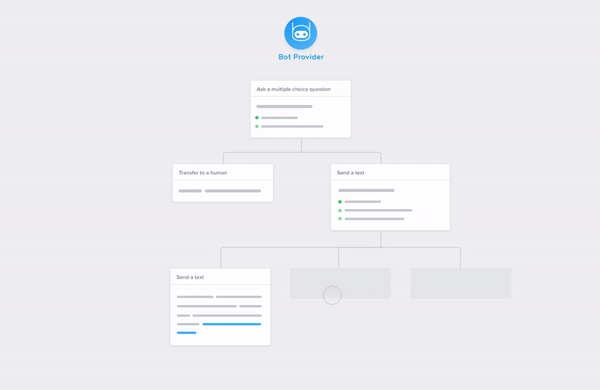

## What is a bot at iAdvize ?
A bot is a regular agent. It has all the properties of an agent and can interact with visitors.

### Bots can
Among other things, bot are able to:
* Be available to chat.
* Handle a conversation in one language.
* Reply to a user:
  * ask questions and act on replies;
  * send rich content such as links, carousels, and much more;
  * schedule messages to be sent later on;
* Escalate a conversation to another operator.
* Prequalify some visitor data (identification number, email address…).
* And much more !

### Bots really cannot
This is what bots are not able to do:
* Send a message directly to the user (reply only mode)
* Be part of a conversation at the same time than another agent

## Create and configure a bot in iAdvize
To be able to create a bot on the iAdvize platform, you will need to:
* 1 - Create a bot application, in the dev platform
* 2 - Browse, find and install this newly created bot application, in the marketplace tab of your iAdvize administration
* 3 - Create a bot agent selecting the freshly installed bot application
* 4 - Configure some rules to route incoming conversations to your bot

⚠️ In order to be be able to complete this process you will have to implement the [Bot creation flow](#implement-the-bot-creation-flow) first (or you will be stuck at the “Create bot agent” step) ⚠️

### In the dev platform
Creating a bot application in the developer platform is quite straightforward. 

#### Create a bot connector
First, you hav to be logged in. Then go to “My apps” section, and click on “Build”. In our case we will call it “My bot”. To build a bot, you need to go to “Plugins” then select “Bot”. You have just one URL to set: the base URL of your connector.  All the requests will go to this URL. Note that it has to be secured with HTTPS.

Click on save and… congratulations! You created your bot application. Of course this is just a stub. If you want this to be fully functional you have to implement the flows listed in the “Implement a bot” section (link).
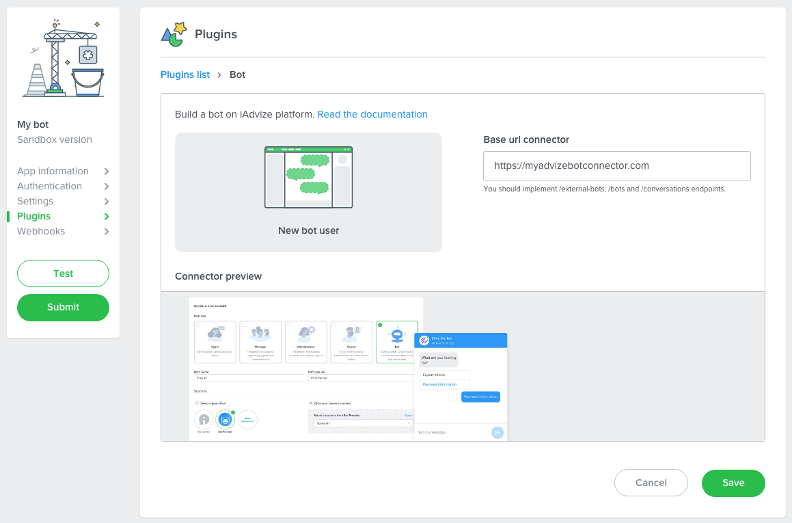

### In the admin
#### Install the bot connector
​​In the [admin](https://ha.iadvize.com/admin/login/), go to “Apps” and mind to select the project you want to install your connector on. In the list, find your connector, in our case the “My bot” section. Click on the card. You should land on an installation page such as:

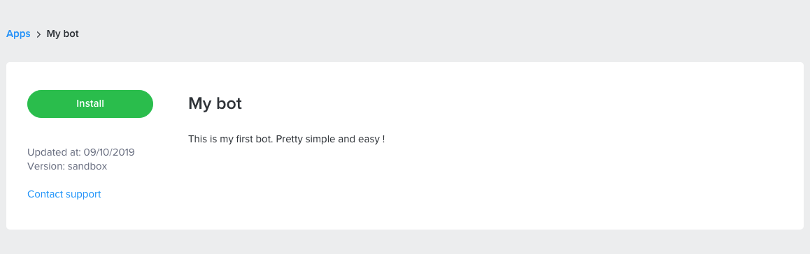

You just have to click on “Install” and go through the installation process. Finalise the installation by clicking on “Install” and you are done. You just enabled some bot capabilities on the project you selected. It means that from now on, you can create an operator of type Bot 🎉. 

#### Create a bot agent
Now, create a new routing group (a group of agents). Go to “Routing” then select “Routing groups”  in the upper left corner. Click on the “➕” and create a group “All bots”,  including all the agents of type “Bot” such as:

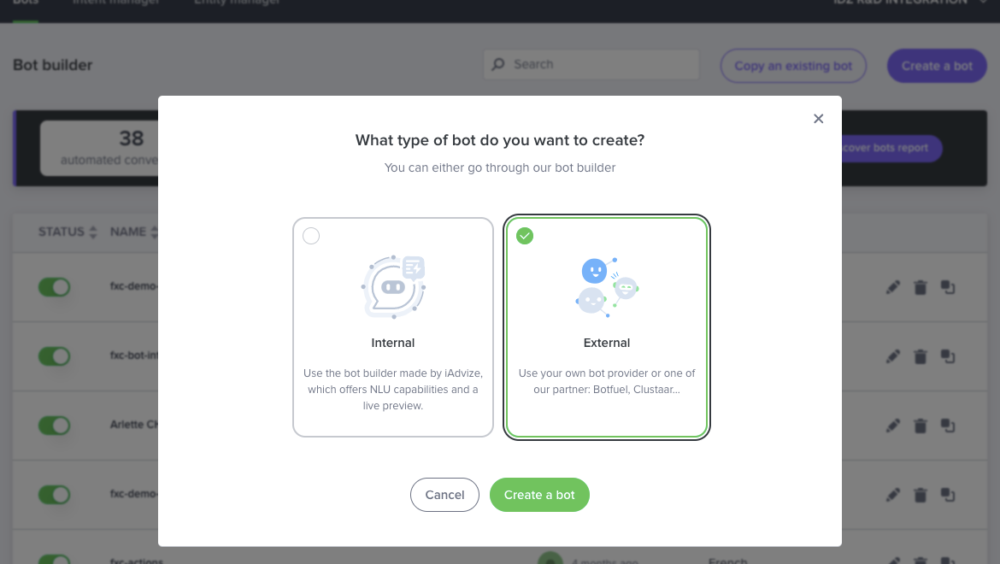

**Note:** a bot operator is associated to ONE and only ONE language. So if you want your bot to answer several languages, you have to create multiple bot operators.

## Chat with your bot
To be able to chat on iAdvize you need to take several steps:
* 1. Install the iAdvize tag on your website
* 2. Create a campaign
* 3. Create a targeting rule (when to show the chat notification to the visitor)
* 4. Create a distribution group (to distribute conversations to your bots)
* 5. Define a distribution rule (to route the conversations to your bots)

### Set up the iAdvize tag
In the admin, go to “Engagement”. Create a new campaign such as: 
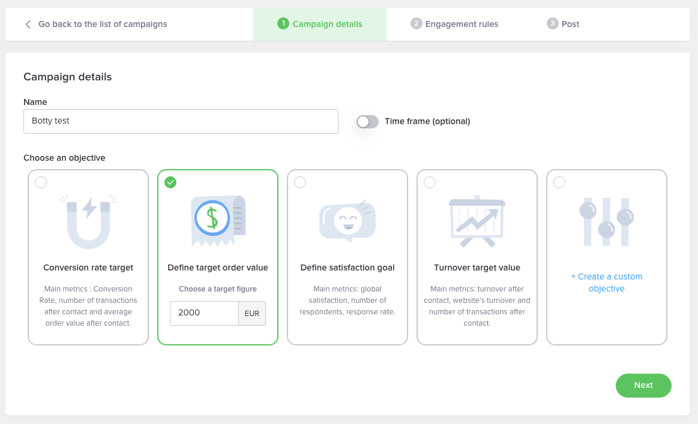

### Create a targeting rule
Now we need to define “engagement rules” i.e. how to target the visitor. Click on the “➕” and create a rule “Bot”. In our case, we will define that the button is being displayed when the current url contains the name “bot”. Which means you can add ?bot to any url and it will display the notification.
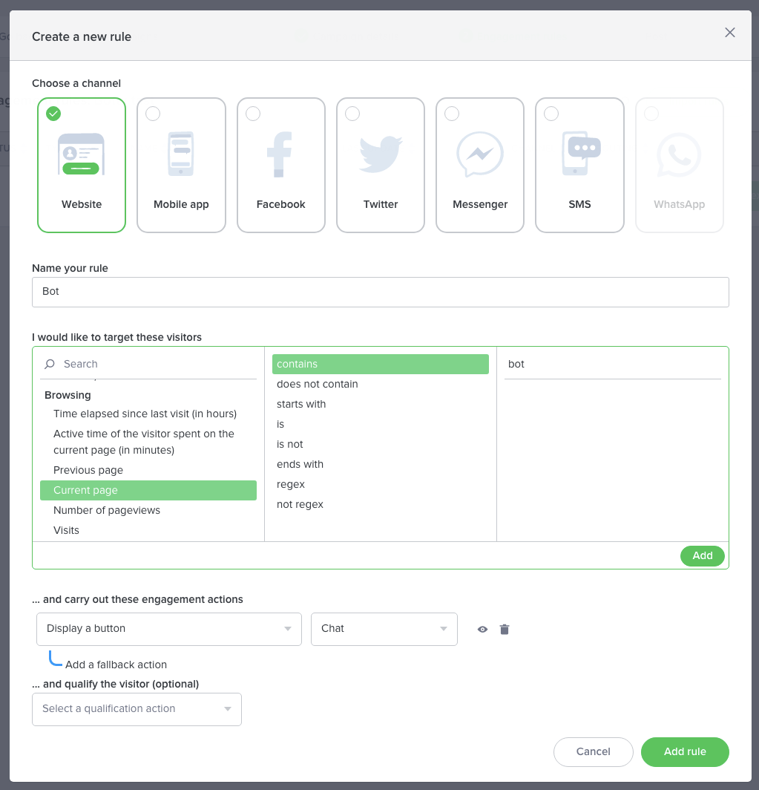
Add the rule, and publish your campaign. 

### Create a routing group
Now, create a new routing group (a group of agents). Go to “Routing” then select “Routing groups”  in the upper left corner. Click on the “➕” and create a group “All bots”, including all the agents of type “Bot” such as:
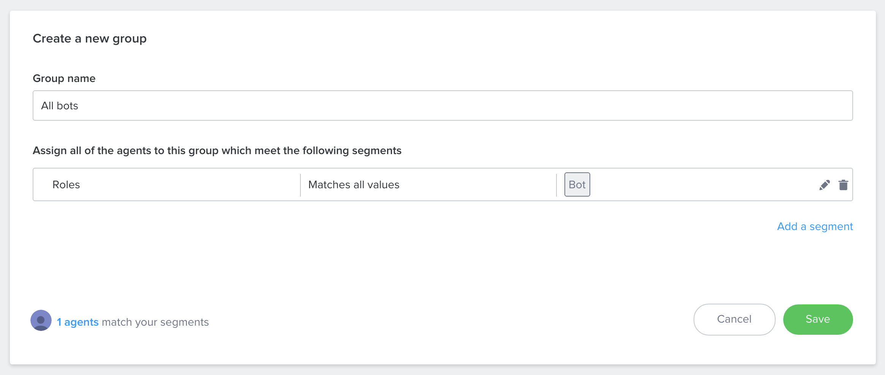
**Note:** if it is setup correctly, you should see “1 agent match in your segment”. If not, make sure that your bot is associated with the skill “Bot” we created during the bot creation process.

### Create a distribution rule
To finish, we need to create a targeting rule. Go to “Routing”, in the upper left select picker, select “Routing rules” and create a rule “Bot targeting”, for the “Bot” notification, that will handover the conversations to the agents of group “All bots”. Such as:
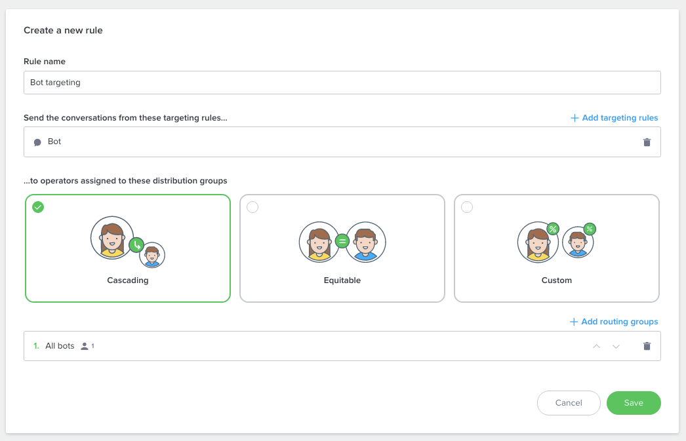

### Check that everything is correctly setup
​​Go to “Campaigns” and click on the “edit” button. If you did everything correctly you should see that your campaign is routed this way: 

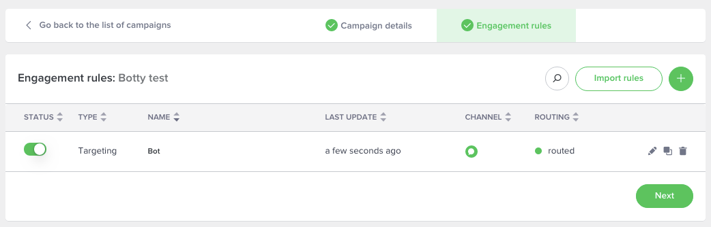

Last but not least, make sure that your bot is available. Go to “People”, look for “Botty” in the list and check the status: 
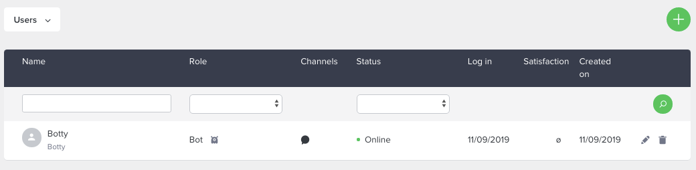

To sum up, you created a campaign that you associated some engagement rules (when the visitor will see the notification) with, some targeting rules (to which agents the conversations should be handed to). 

Last but not least let's trigger the chat. Go to the website you installed the iAdvize tag on. Just append `?bot` to the current url and reload the page. You should see the chat. You are ready to chat ! 🎉
 
## Implement a bot
To have a fully functional bot, you will be required to implement two distinct sets of endpoints:

* several endpoints to create and configure your bot from iAdvize UI
  * `GET /external-bots` to list available scenarios
  * `PUT /bots/operatorId` to create a bot
  * `GET /bots/operatorId` to retrieve a bot details
  * `GET /availability-strategies` to define when the bot is available
* two endpoints to handle a conversation flow
  * `POST /conversations/` to create a new conversation
  * `POST /conversations/conversationId/messageId`  to reply to a user
  
## Implement the bot creation flow
A bot gets created when an admin creates a new agent of type “Bot” under the “People” section. Several information are required to be able to create a bot:
* which scenario it can be associated to
* what is the availability strategy associated to the bot

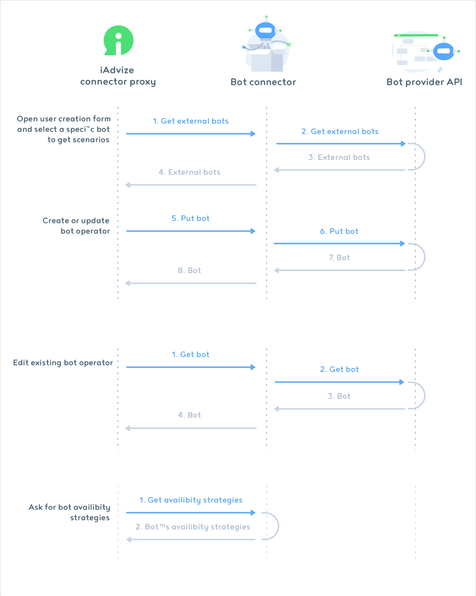

### List available scenarios
First, you need to implement the `GET /external-bots` endpoint to list all the scenarios a new bot can be associated to. This route is called by iAdvize during the bot creation process and the result will appear directly in the scenario select picker.

⚠️ A scenario can only be associated to only one bot agent, which means if you have two bot operators, you need to provide at least two scenarios. ⚠️

#### Request - GET /external-bots
| Query parameter    | In    | Description                                                | Type   | Example                              |
| ------------------ | ----- | ---------------------------------------------------------- | ------ | ------------------------------------ |
| idConnectorVersion | Query | Connector version identifier                               | Uuid   | c008849d-7cb1-40ca-9503-d6df2c5cddd8 |
| idWebsite          | Query | Project identifier on which your connector is installed on | String | ha-123                               |

#### Expected Response format
| Field       | In   | Description                                                                           | Type   | Required | Example                                                                       |
| ----------- | ---- | ------------------------------------------------------------------------------------- | ------ | -------- | ----------------------------------------------------------------------------- |
| idBot       | Body | Scenario identifier in integrator environment.                                        | String | ✓        | my_scenario_id_1                                                              |
| name        | Body | Name of the scenario                                                                  | String | ✓        | Scenario 1                                                                    |
| description | Body | Short description of the scenario                                                     | String |          | This scenario will ask your customers to provide some data about their orders |
| editorUrl   | Body | Url of integrator bot editor interface, useful if you have a UI for editing scenarios | String | ✓        | http://your-saas/editor/my_scenario_id_1                                      |

#### Expected response example
<pre class="prettyprint lang-js">
[
    {
        "idBot": "my_scenario_id_1", 
        "name": "Scenario 1",
        "description": "In this scenario, the bot will ask your customers to provide some data about their orders",
        "editorUrl": "http://your-saas/editor/my_scenario_id_1"
    },
    {
        "idBot": "my_scenario_id_2",
        "name": "In this scenario, the bot will ask your customers to provide some data about their orders",
        "editorUrl": "http://your-saas/editor/my_scenario_id_2"
    }
]
</pre>

**Note:** you can validate your response data format with the associated [json schema](/json-schemas/bot/external-bot.json).

It will look like this in the UI.

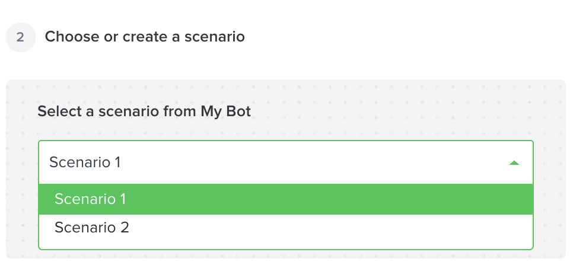

### Create and modify a bot
This endpoint is being called when a user finalises the bot creation or when bot information are being updated (such as name, scenario association…).

#### Request - PUT /bots/:idOperator:
| Parameters         | In    | Description                                                            | Type   | Example                              |
| ------------------ | ----- | ---------------------------------------------------------------------- | ------ | ------------------------------------ |
| idOperator         | Path  | iAdvize bot operator identifier that we associate to your bot scenario | String | ha-456678                            |
| idConnectorVersion | Query | Connector version identifier                                           | Uuid   | c008849d-7cb1-40ca-9503-d6df2c5cddd8 |
| idWebsite          | Query | Project identifier on which your connector is installed on             | String | ha-123                               |

| Field          | In   | Description                                       | Type                        | Example   |
| -------------- | ---- | ------------------------------------------------- | --------------------------- | --------- |
| name           | Body | Bot name on your platform                         | String                      | My bot    |
| pseudo         | Body | Bot pseudo used during the conversation           | String                      | Botty     |
| language       | Body | Language spoken by the bot                        | String - ISO 3166-1 alpha-2 | fr        |
| external.idBot | Body | Existing bot unique identifier for this connector | String                      | ha-456678 |

#### Request example
<pre class="prettyprint lang-js">
{
    "name": "My first bot !",
    "pseudo": "Botty",
    "language": "fr",
    "external": {
        "idBot": "ha-456678"
    }
}
</pre>

#### Response format
| Field                | In   | Description                        | Type              | Required | Example                                                                                   |
| -------------------- | ---- | ---------------------------------- | ----------------- | -------- | ----------------------------------------------------------------------------------------- |
| idOperator           | Body | iAdvize bot operator identifier    | String            | ✓        | ha-456678                                                                                 |
| external             | Body | Associated scenario                | External          | ✓        |                                                                                           |
| external.idBot       | Body | Bot identifier on your platform    | String            | ✓        | my_scenario_id_1                                                                          |
| external.name        | Body | Bot name on your platform          | String            |          | Scenario 1                                                                                |
| external.description | Body | Bot description on your platform   | String            |          | In this scenario, the bot will ask your customers to provide some data about their orders |
| external.editorUrl   | Body | Bot edition url on your platform   | String - URL      | ✓        | http://your-saas/editor/my_scenario_id_1                                                  |
| createdAt            | Body | Creation date of you bot           | String - ISO 8601 | ✓        | 2017-11-22T12:04:00Z                                                                      |
| updatedAt            | Body | Last modification date of your bot | String - ISO 8601 | ✓        | 2017-11-22T12:04:00Z                                                                      |

#### Response example
<pre class="prettyprint lang-js">
{
    "idOperator": "ha-456678",
    "external": {
        "idBot": "my_scenario_id_1", 
        "name": "Scenario 1",
        "description": "In this scenario, the bot will ask your customers to provide some data about their orders",
        "editorUrl": "http://your-saas/editor/my_scenario_id_1"
    },
    "createdAt": "2017-11-22T12:04:00Z",
    "updatedAt": "2017-11-22T12:04:00Z"
}
</pre>

**Note:** You can validate your response data format with the associated [json schema](/json-schemas/bot/bot.json).

### Get bot
When an admin wants to edit a bot user, we have to first load the existing information related to this bot. The GET endpoints allow you do give back those information.

#### Request - GET /bots/:idOperator:
| Parameters         | In    | Description                                                            | Type   | Example                              |
| ------------------ | ----- | ---------------------------------------------------------------------- | ------ | ------------------------------------ |
| idOperator         | Path  | iAdvize bot operator identifier that we associate to your bot scenario | String | ha-456678                            |
| idConnectorVersion | Query | Connector version identifier                                           | Uuid   | c008849d-7cb1-40ca-9503-d6df2c5cddd8 |
| idWebsite          | Query | Project identifier on which your connector is installed on             | String | ha-123                               |

#### Response format

| Field                | In   | Description                        | Type              | Required | Example                                                                                   |
| -------------------- | ---- | ---------------------------------- | ----------------- | -------- | ----------------------------------------------------------------------------------------- |
| idOperator           | Body | iAdvize bot operator identifier    | String            | ✓        | ha-456678                                                                                 |
| external             | Body | Associated scenario                | External          | ✓        |                                                                                           |
| external.idBot       | Body | Bot identifier on your platform    | String            | ✓        | my_scenario_id_1                                                                          |
| external.name        | Body | Bot name on your platform          | String            |          | Scenario 1                                                                                |
| external.description | Body | Bot description on your platform   | String            |          | In this scenario, the bot will ask your customers to provide some data about their orders |
| external.editorUrl   | Body | Bot edition url on your platform   | String - URL      | ✓        | http://your-saas/editor/my_scenario_id_1                                                  |
| createdAt            | Body | Creation date of you bot           | String - ISO 8601 | ✓        | 2017-11-22T12:04:00Z                                                                      |
| updatedAt            | Body | Last modification date of your bot | String - ISO 8601 | ✓        | 2017-11-22T12:04:00Z                                                                      |

#### Response example
<pre class="prettyprint lang-js">
{
    "idOperator": "ha-456678",
    "external": {
        "idBot": "my_scenario_id_1", 
        "name": "Scenario 1",
        "description": "In this scenario, the bot will ask your customers to provide some data about their orders",
        "editorUrl": "http://your-saas/editor/my_scenario_id_1"
    },
    "createdAt": "2017-11-22T12:04:00Z",
    "updatedAt": "2017-11-22T12:04:00Z"
}
</pre>

### Get availability
This endpoint will be called on a frequent basis (as of now, every second) and will indicate whether a bot agent is online or not, hence being its availability.

#### Request - GET /availability-strategies

| Parameters         | In    | Description                                                            | Type   | Example                              |
| ------------------ | ----- | ---------------------------------------------------------------------- | ------ | ------------------------------------ |
| idOperator         | Path  | iAdvize bot operator identifier that we associate to your bot scenario | String | ha-456678                            |
| idConnectorVersion | Query | Connector version identifier                                           | Uuid   | c008849d-7cb1-40ca-9503-d6df2c5cddd8 |
| idWebsite          | Query | Project identifier on which your connector is installed on             | String | ha-123                               |

#### Response format
| Field                    | In   | Description                                                                                                                    | Type                                                              | Required                                              | Example 1                                                                  | Example 2            |
| ------------------------ | ---- | ------------------------------------------------------------------------------------------------------------------------------ | ----------------------------------------------------------------- | ----------------------------------------------------- | -------------------------------------------------------------------------- | -------------------- |
| strategy                 | Body | How we should aggregate the availability if several distribution rules are provided                                            | One of: `atLeastOne`, `all`, `notAvailable`, `customAvailability` | ✓                                                     | `atLeastOne`                                                               | `customAvailability` |
| distributionRulesToCheck | Body | All distribution rules we should check for availability. This is subset of DistributionRules returned by the Get bot endpoint. | Array of Uuid                                                     | Required if strategy is equal to `atLeastOne`or `all` | ef4670c3-d715-4a21-8226-ed17f354fc44, fab46f63-a61b-4aec-930b-21a438863a6c |                      |
| availability             | Body | Allow the connector to handle the availability of the bot                                                                      | Boolean                                                           | Required if strategy is equal to `customAvailability` |                                                                            | true                 |

#### Response example 1: bot is available only if the distribution rule to check returns true
<pre class="prettyprint lang-js">
[
    {
        "strategy": "atLeastOne",
        "distributionRulesToCheck": [
            "ef4670c3-d715-4a21-8226-ed17f354fc44",
            "fab46f63-a61b-4aec-930b-21a438863a6c"
        ]
    }
]
</pre>

#### Response example 2: bot is always available
<pre class="prettyprint lang-js">
[
    {
        "strategy": "customAvailability",
        "availability": true
    }
]
</pre>
**Note:** You can validate your response data format with the associated [json schema](/json-schemas/bot/availability-strategies.json).

## Implement the conversation flow
A conversation is typically initiated by a user. The bot can only reply to user’s message which means that iAdvize will call your endpoints when a message is received in the conversation.

To fully handle a conversation you only need to implement 2 endpoints:
* `POST /conversations` to handle a new conversation creation
* `POST /conversations/:conversationId:/messages` to receive messages from the visitor and reply to the visitor. Mind that all the messages posted in a conversation will result into this API call (which means you will also receive your own replies).

 

Here is a full conversation example:

| Time  | Bot Agent                             | Visitor                                |             | Bot response                                                                                                                    | Calls to bot connector                                                                | Explanation                                                                                                                                                                 |
| ----- | ------------------------------------- | -------------------------------------- | ----------- | ------------------------------------------------------------------------------------------------------------------------------- | ------------------------------------------------------------------------------------- | --------------------------------------------------------------------------------------------------------------------------------------------------------------------------- |
| 00:00 |                                       | “Hi, are you there ? Shall we begin ?” | ⟹           |                                                                                                                                 | POST /conversations                                                                   | Create a conversation in the bot connector                                                                                                                                  |
|       |                                       |                                        | ⟸           | (empty replies)                                                                                                                 | Response                                                                              |                                                                                                                                                                             |
| 00:00 |                                       |                                        | ⟹           |                                                                                                                                 | POST /conversations/idConversation/messages “Hi, are you there ? Shall we begin ?” | Reply to the first user’s message                                                                                                                                           |
|       |                                       |                                        | ⟸ ⟸ ⟸ | Await 5s “How are you ?” “Fine” or “Bad” Await 3 minutes “Are you there ?”                                          | Response                                                                              |                                                                                                                                                                             |
| 00:05 | “How are you ? ”                      |                                        | ⟹           |                                                                                                                                 | POST /conversations/idConversation/messages “How are you ?”                        | Do not reply to your own scheduled message (filter on author operator)                                                                                                      |
|       |                                       |                                        | ⟸ ⟸      | (empty replies)                                                                                                                 | Response                                                                              |                                                                                                                                                                             |
| 🕐    |                                       |                                        |             |                                                                                                                                 |                                                                                       |                                                                                                                                                                             |
| 03:05 | “Are you there ?”                     |                                        | ⟹           |                                                                                                                                 | POST /conversations/idConversation/messages “Are you there ?”                      | Do not reply to your own scheduled message                                                                                                                                  |
|       |                                       |                                        | ⟸           | (empty replies)                                                                                                                 | Response                                                                              |                                                                                                                                                                             |
| 03:12 |                                       | “Yes I'm here, sorry"                  | ⟹           |                                                                                                                                 | POST /conversations/idConversation/messages “Yes I’m here, sorry ?”                | Reply to the user’s message by repeating the question                                                                                                                       |
|       |                                       |                                        | ⟸           | Await 1s “How are you ?” “Fine” or “Bad”                                                                                  | Response                                                                              |                                                                                                                                                                             |
| 03:13 | “How are you ?”                       |                                        | ⟹           |                                                                                                                                 | POST /conversations/idConversation/messages “How are you ?”                        | Do not reply to your own message                                                                                                                                            |
|       |                                       |                                        | ⟸           | (empty replies)                                                                                                                 | Response                                                                              |                                                                                                                                                                             |
| 03:42 |                                       | “Good”                                 | ⟹           |                                                                                                                                 | POST /conversations/idConversation/messages “Good”                                 | User received quick-reply  clicked on good, take action action accordingly                                                                                                  |
|       |                                       |                                        | ⟸ ⟸      | Await 1s Ok, i'm transferring you to a human" transfer Await 20s “Transfer failed, please try again later” close | Response                                                                              | Transfer the user, and notify the user about it.   Schedule a message in case the transfer fail. The message is not going to be sent if the transfer is successful |
| 03:43 | “Ok, i'm transferring you to a human” |                                        | ⟹           |                                                                                                                                 | POST /conversations/idConversation/messages “Ok, i'm transferring you to a human"  | Do not reply to your own message                                                                                                                                            |
|       |                                       |                                        | ⟸           | (empty replies)                                                                                                                 | Response                                                                              |                                                                                                                                                                             |

### Create a conversation
Everytime a conversation starts, this endpoint is called. It allows iAdvize to notify your bot a conversation starts.

⚠️Do not include any replies (leave the array empty) as another call to `POST /conversations/conversationId/messages` is triggered right after `POST /conversations`. It will be the right time to answer the visitor. ⚠️

#### Request - POST /conversations
| Parameters         | In    | Description                                                           | Type   | Example                              |
| ------------------ | ----- | --------------------------------------------------------------------- | ------ | ------------------------------------ |
| idConnectorVersion | Query | Connector version identifier                                          | String | c008849d-7cb1-40ca-9503-d6df2c5cddd8 |
| idWebsite          | Query | Unique identifier of the website on which your connector is installed | String | ha-123                               |

| Field               | In   | Description                                                                                                                        | Type                                                              | Example                              |
| ------------------- | ---- | ---------------------------------------------------------------------------------------------------------------------------------- | ----------------------------------------------------------------- | ------------------------------------ |
| idOperator          | Body | iAdvize bot operator identifier that we associate to your bot scenario                                                             | String                                                            | ha-456678                            |
| idConversation      | Body | Conversation unique identifier, you can use it or return your own internal id in the response body. We will make the join for you. | UUID                                                              | ce41ba2c-c25a-4351-b946-09527d8b940b |
| history             | Body | First messages of the conversations                                                                                                | Array of History                                                  |                                      |
| history.idMessage   | Body | Unique identifier of this message                                                                                                  | UUID                                                              | ba4e1f71-7012-4b1a-86c3-d2fce8883dc7 |
| history.author.role | Body | author of the message                                                                                                              | One of: `operator` or `visitor`                                   | `operator`                           |
| history.payload     | Body | Typed payload of the message                                                                                                       | One of Payload object  see Payload objects for more details |                                      |
| history.createdAt   | Body | Date the message was sent                                                                                                          | String - ISO 8601                                                 | 2018-07-16T13:53:57.961Z             |

#### Response format
| Field           | In   | Description                                                            | Type              | Required | Example                              |
| --------------- | ---- | ---------------------------------------------------------------------- | ----------------- | -------- | ------------------------------------ |
| idConversation  | Body | Conversation unique identifier                                         | UUID              | ✓        | ce41ba2c-c25a-4351-b946-09527d8b940b |
| idOperator      | Body | iAdvize bot operator identifier that we associate to your bot scenario | String            | ✓        | ha-456678                            |
| replies         | Body | Array of replies                                                       | Array of Reply   | ✓        | []                                   |
| variables       | Body | Collected variables                                                    | Array             |          |                                      |
| variables.key   | Body | Key of the variable collected                                          | String            |          | visitor_state_of_mind                |
| variables.value | Body | Value of the variable collected                                        | String            |          | Ok                                   |
| createdAt       | Body | Creation date of the conversation                                      | String - ISO 8601 | ✓        |                                      |
| updatedAt       | Body | Date of the last message received                                      | String - ISO 8601 | ✓        |                                      |

#### Response example
<pre class="prettyprint lang-js">
{
    "idConversation": "ce41ba2c-c25a-4351-b946-09527d8b940b",
    "idOperator": "ha-456678",
    "replies": [],
    "variables": [],
    "createdAt": "2017-11-22T12:04:00Z",
    "updatedAt": "2017-11-22T12:23:00Z"
}
</pre>

### Receive a message and reply to it
This endpoint is called when a new message is received in the conversation, whether the bot or the user sent it. 

#### Request - POST /conversations/:idConversation:/messages
| Parameters         | In    | Description                                                           | Type   | Example                              |
| ------------------ | ----- | --------------------------------------------------------------------- | ------ | ------------------------------------ |
| idConnectorVersion | Query | Connector version identifier                                          | String | c008849d-7cb1-40ca-9503-d6df2c5cddd8 |
| idWebsite          | Query | Unique identifier of the website on which your connector is installed | String | ha-123                               |
| idConversation     | Path  | Conversation unique identifier                                        | UUID   | a0c65ae0-4e04-4909-a5cc-80dd0f05de96 |

| Field               | In   | Description                                                            | Type                                                              | Example                              |
| ------------------- | ---- | ---------------------------------------------------------------------- | ----------------------------------------------------------------- | ------------------------------------ |
| idOperator          | Body | iAdvize bot operator identifier that we associate to your bot scenario | String                                                            | ha-456678                            |
| message             | Body | Message                                                                |                                                                   |                                      |
| message.idMessage   | Body | Unique identifier of this message                                      | UUID                                                              | ba4e1f71-7012-4b1a-86c3-d2fce8883dc7 |
| message.author.role | Body | author of the message                                                  | One of: `operator` or `visitor`                                   | `operator`                           |
| message.payload     | Body | Typed payload of the message                                           | One of Payload object  see Payload objects for more details |                                      |
| message.createdAt   | Body | Date the message was sent                                              | String                                                            | 2017-11-22T12:04:00.762Z[Etc/UTC]    |

#### Response format

| Field                               | In   | Description                                                            | Type                                                                                  | Required                                                        | Example                              |
| ----------------------------------- | ---- | ---------------------------------------------------------------------- | ------------------------------------------------------------------------------------- | --------------------------------------------------------------- | ------------------------------------ |
| idConversation                      | Body | Conversation unique identifier                                         | UUID                                                                                  | ✓                                                               | a0c65ae0-4e04-4909-a5cc-80dd0f05de96 |
| idOperator                          | Body | iAdvize bot operator identifier that we associate to your bot scenario | String                                                                                | ✓                                                               | ha-456678                            |
| replies                             | Body | Array of replies                                                       | Array or Reply                                                                        | ✓                                                               |                                      |
| reply.type                          | Body | Reply/action type                                                      | One of: `await` or `message` or `transfer` or `close`                                 | ✓                                                               |                                      |
| reply.duration.unit                 | Body | Awaiting unit of time                                                  | One of: `millis` or `seconds` or `minutes`                                            | Required if replies.type is equal to `await`                    |                                      |
| reply.duration.value                | Body | Awaiting value of time                                                 | Long                                                                                  | Required if replies.type is equal to `await`                    |                                      |
| reply.payload                       | Body | Typed payload of the message                                           | One of Payload object  see [Payload objects](#payload-objects) for more details | Only available and required if reply.type is equal to `message` |                                      |
| reply.quickReplies                  | Body | Quick replies proposed to the visitor                                  | Array of Quick Reply object  see [Quick reply object](#quick-reply-object) for more details |                                                     |                                      |
| reply.distributionRule              | Body | Distribution rules to transfer to                                      | UUID                                                                                  | Required if reply.type is equal to `transfer`                   |                                      |
| reply.transferOptions               | Body | Transfer options                                                       | Object                                                                                |                                                                 |                                      |
| reply.transferOptions.timeout       | Body | Configure how long must we wait until transfer cancel                  | Object                                                                                | Required                                                        |                                      |
| reply.transferOptions.timeout.value | Body | Transfer timeout value (**must** be between 5 and 60 seconds)                                                 | Long                                                                                  | Required                                                        |                                      |
| reply.transferOptions.timeout.unit  | Body | Transfer timeout unit                                                  | One of: `millis` or `seconds` or `minute                                              | Required                                                        |                                      |
| variables                           | Body | Collected variables                                                    | Array                                                                                 |                                                                 |                                      |
| variables.key                       | Body | Key of the variable collected                                          | String                                                                                |                                                                 | visitor_state_of_mind                |
| variables.value                     | Body | Value of the variable collected                                        | String                                                                                |                                                                 | Ok                                   |
| createdAt                           | Body | Creation date of the conversation                                      | String - ISO 8601                                                                     | ✓                                                               |                                      |
| updateAt                            | Body | Date of the last message received                                      | String - ISO 8601                                                                     | ✓                                                               |                                      |

#### Response example 
<pre class="prettyprint lang-js">
{
    "idConversation": "ce41ba2c-c25a-4351-b946-09527d8b940b",
    "idOperator": "ha-456678",
    "replies": [
        {
            "type": "await",
            "duration": {
                "unit": "millis",
                "value": 10
            }
        },
        {
            "type": "message",
            "payload": {
                "contentType": "text",
                "value": "All Right, my job is done here."
             },
            "quickReplies": []
        },
        {
            "type": "transfer",
            "distributionRule": "ef4670c3-d715-4a21-8226-ed17f354fc44",
            "transferOptions": {
              "timeout": {
                "value": 20,
                "unit": "seconds"
              }
            }
        },
        {
            "type": "close"
        }
    ],
    "variables": [
        {
            "key": "visitor_state_of_mind",
            "value": "Ok"
        }
    ],
    "createdAt": "2017-11-22T12:04:00Z",
    "updatedAt": "2017-11-22T12:23:00Z"
}
</pre>

### Conversation objects
#### Payload objects 
Several kinds of payloads can be used within your bot replies in order to enrich your responses. You will find in this section information about every type of content you can send with your iAdvize bot.

**Disclaimer:** The following features [Carousel](#card-bundle-payload), [Product offer](#product-offer-payload) and [Action](#actions) are only working with our **new chatbox**. Get in touch with us if you need such objects in your conversation flow.

##### Text payload
Sending a simple message

| Field       | Description                    | Type          | Required | Example                    |
| ----------- | ------------------------------ | ------------- | -------- | -------------------------- |
| contentType | Type of the message’s content  | String `text` | ✓        | `text`                     |
| value       | Textual content of the message | String        | ✓        | Hi, i am a simple message. |

<pre class="prettyprint lang-js">
{
    "contentType": "text",
    "value": "Hi, i am a simple message."
}
</pre>

##### Generic card payload
A generic card is a payload you can use to send a more structured message. It always contains at least one link and can be used to help a visitor to navigate on a website by redirecting him to specific pages. You can specify multiple links on a single generic card. Generic card can also include a title, a description and an image. This help give context to the visitor about the links you are sending

| Field       | Description                              | Type                                                                           | Required                              | Example                                                          |
| ----------- | ---------------------------------------- | ------------------------------------------------------------------------------ | ------------------------------------- | ---------------------------------------------------------------- |
| contentType | Type of the message’s content            | String                                                                         | ✓                                     | `card/content`                                                   |
| image       | Json describing attached picture         | Image object  see [Generic JSON object](#generic-json-object) section for more details           |                                       |                                                                  |
| title       | Title of the card                        | String                                                                         |                                       | Delivery & Pickup                                                |
| text        | Textual content of the message           | String                                                                         |                                       | Learn more about dispatch and delivery times, methods and costs. |
| actions     | List of actions to be sent with the card | Array of Action object  see [Generic JSON object](#generic-json-object) section for more details | Action must contains at least on link |                                                                  |

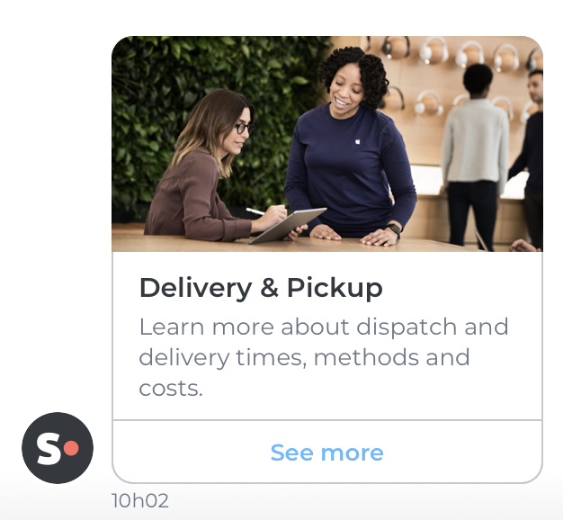

<pre class="prettyprint lang-js">
{
  "contentType": "card/content",
  "image": {
    "url": "http://image.net/delivery.jpg",
    "description": "delivery picture"
  },
  "title": "Delivery & Pickup",
  "text": "Learn more about dispatch and delivery times, methods and costs.",
  "actions": [
    {
      "type": "LINK",
      "name": "See more",
      "url": "http://mylink.com/delivery"
    }
  ]
}
</pre>

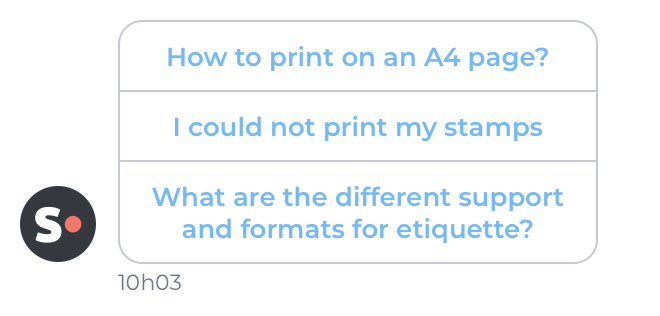

<pre class="prettyprint lang-js">
{
  "contentType": "card/content",
  "actions": [
    {
      "type": "LINK",
      "name": "How to print on an A4 page",
      "url": "http://mylink/a4page"
    },
    {
      "type": "LINK",
      "name": "I could not print my stamps",
      "url": "http://mylink/stamps"
    },
    {
      "type": "LINK",
      "name": "What are the different support and formats for etiquette?",
      "url": "http://mylink.com/etiquette"
    }
  ]
}
</pre>

##### Product Offer payload
A product offer payload lets you send a product offer to your visitor. Using the product offer you can showcase various attributes of your product such as the price, the photography of your product, the availability or a special offer. To show your visitors a carousel of product offers please see Product offer bundle

| Field               | Description                              | Type                                                                           | Required | Example                 |
| ------------------- | ---------------------------------------- | ------------------------------------------------------------------------------ | -------- | ----------------------- |
| contentType         | Type of the message’s content            | String: `product-offer`                                                        | ✓        | `product-offer`         |
| image               | Json describing attached picture         | Image object  see [Generic JSON object](#generic-json-object) section for more details           |          |                         |
| name                | Name of the product                      | String                                                                         | ✓        | Samsung Frame 4K UHD TV |
| price               | Price of the product without offer       | String                                                                         | ✓        | 1,499,99 €              |
| offerPrice          | Price of the product with offer          | String                                                                         |          | 1,299,99 €              |
| description         | Description of the product               | String                                                                         |          |                         |
| availability.status | Status of availability                   | One of: `AVAILABLE` or `UNAVAILABLE`                                           |          | `AVAILABLE`             |
| action              | List of actions to be sent with the card | Array of Action object  see [Generic JSON object](#generic-json-object) section for more details | ✓        |                         |

<pre class="prettyprint lang-js">
{
  "contentType": "product-offer",
  "image": {
    "url": "http://image.net/tvsamsumg.jpg",
    "description": "picture of a TV"
  },
  "name": "Samsung Frame 4K UHD TC",
  "price": "€1,499.99",
  "offerPrice": "€1,299.99",
  "availability": {
    "status": "AVAILABLE"
  },
  "actions": [
    {
      "type": "LINK",
      "name": "See more",
      "url": "http://mylink/TvSamsung"
    }
  ]
}
</pre>

##### File payload
An attachment lets you send files directly in the chatbox. If you send an image it will be directly shown to the visitors if it is in a supported format by the visitor's browser. For a non-picture file it will offer the possibility to download it.

| Field       | Description                      | Type                                                                | Required | Example                                    |
| ----------- | -------------------------------- | ------------------------------------------------------------------- | -------- | ------------------------------------------ |
| contentType | Type of the message’s content    | String `file`                                                       | ✓        | `file`                                     |
| fileName    | Name of the file to be displayed | String                                                              | ✓        | Can I add more information about my order? |
| mimeType    | Mime type of the file            | One of: `image/gif`, `application/pdf`, `image/png` or `image/jpeg` | ✓        | `image/gif`                                |
| url         | Textual content of the message   | String                                                              | ✓        | http://my-website/order.pdf                |

<pre class="prettyprint lang-js">
{
    "contentType": "file",
    "fileName": "Can I add more information about my order?",
    "mimeType": "application/pdf",
    "url": "http://my-website.com/order.pdf"
}
</pre>

<pre class="prettyprint lang-js">
{
    "contentType": "file",
    "fileName": "My picture name",
    "mimeType": "image/png",
    "url": "http://my-website.com/image.png"
}
</pre>

##### Card bundle payload
With the generic card bundle you can create a carousel for the visitor. Sliders are an efficient tool to present multiple services, offers or products to your visitors.

| Field       | Description                   | Types                                                                  | Required | Example       |
| ----------- | ----------------------------- | ---------------------------------------------------------------------- | -------- | ------------- |
| contentType | Type of the message’s content | String `bundle/card`                                                   | ✓        | `bundle/card` |
| cards       | List of cards to send         | Array of Generic Card  See [Generic Card payload](#generic-card-payload) for more details | ✓        |               |

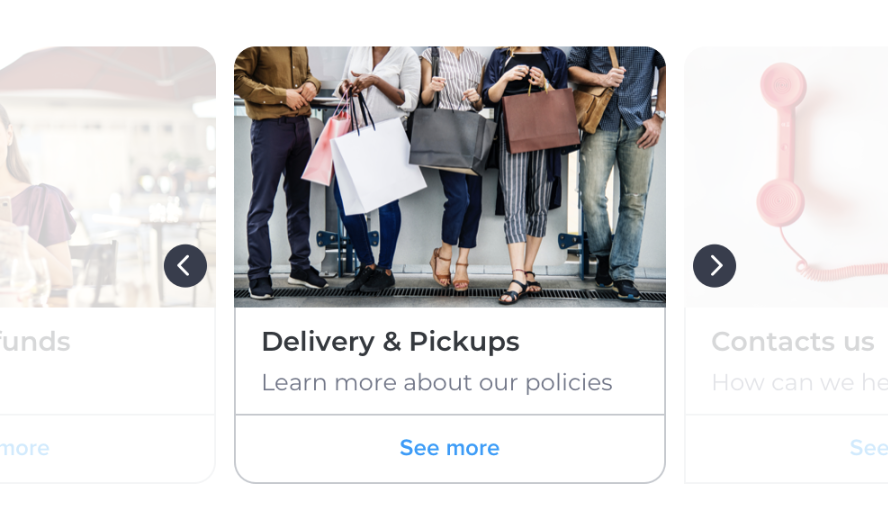

<pre class="prettyprint lang-js">
{
    "contentType": "bundle/card",
    "cards": [
        { ... },
        {
            "contentType": "card/content",
            "image": {
                "url": "http://image.net/delivery.jpg",
                "description": "delivery picture"
            },
            "title": "Delivery & Pickup",
            "text": "Learn more about our policies",
            "actions": [{
                "type": "LINK",
                "name": "See more",
                "url": "http://mylink/delivery"
            }]
        },
        { ... }
    ]
}
</pre>

##### Product Offer bundle payload 
A product offer bundle is an efficient tool to showcase multiple products at one to your visitor. The visitor can navigate among the offers you sent using a slider.

| Field       | Description                       | Type                                                                             | Required | Example                 |
| ----------- | --------------------------------- | -------------------------------------------------------------------------------- | -------- | ----------------------- |
| contentType | Type of the message’s content     | String `bundle/product-offers`                                                   | ✓        | `bundle/product-offers` |
| offers      | List of product offers to display | Array of Product Offer payload  See [Product offer payload](#product-offer-payload) for more details | ✓        |                         |

<pre class="prettyprint lang-js">
{
    "contentType": "bundle/product-offer",
    "offers": [
        { ... },
        {
            "contentType": "product-offer",
            "image": {
                "url": "http://image.net/tvpanasonic.jpg",
                "description": "picture of a TV"
            },
            "name": "Panasonic Smart TV 4K",
            "price": "€1,499.99",
            "offerPrice": "€1,299.99",
            "description": "Enhance your everyday space with The Frame TV that reflects your style and fits your space",
            "availability": {
                "status": "AVAILABLE"
            },
            "actions": [{
                "type": "LINK",
                "name": "See more",
                "url": "http://mylink/TvPanasonic"
            }]
        },
        { ... }
    ]
}
</pre>

#### Generic JSON object

##### Image 
An Image object can be used to display one image. The picture linked need to be of dimension 240x120(px) and should be displayable on browsers.

| Field       | Description                                    | Type   | Required | Example                    |
| ----------- | ---------------------------------------------- | ------ | -------- | -------------------------- |
| url         | Url pointing at a picture                      | String | ✓        | http://image.net/image.jpg |
| description | Textual description of the picture (alt field) | String | ✓        | picture of an image        |

<pre class="prettyprint lang-js">
{
    "url": "http://image.net/image.jpg",
    "description": "picture of an image"
}
</pre>

##### Actions
Actions can be used to offers options to one visitor. Today, only link actions can be used. A link action is one action that can redirect one user to a given url link.

| Field | Description               | Type          | Required | Example       |
| ----- | ------------------------- | ------------- | -------- | ------------- |
| type  | Type of the action        | String `LINK` | ✓        | `LINK`        |
| name  | name to display link      | String        | ✓        | My link       |
| url   | Link to be used in action | String        | ✓        | http://mylink |

<pre class="prettyprint lang-js">
{
    "type": "LINK",
    "name": "My link",
    "url": "http://mylink"
}
</pre>

#### Quick reply object

A quick reply is used for offering several choices to a visitor. Each choice needs to be specified in the "quickReplies" field of a reply. The answer sent by the visitor to the multiple choice question can only contain text. There is no maximum number of quick replies you can display. However we recommend not to use more than 3 quick replies for a single question.

| Field        | Description                        | Type               | Required | Example                              |
| ------------ | ---------------------------------- | ------------------ | -------- | ------------------------------------ |
| contentType  | Type of the message’s content      | `text/quick-reply` | ✓        | `text/quick-reply`                   |
| value        | Textual content of the quick-reply | String             | ✓        | Yes                                  |
| idQuickReply | Quick reply identifier             | UUID               | ✓        | 1ef5145b-a9b6-4e86-8743-b6e3b4026b2c |

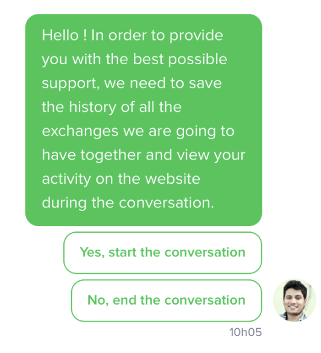

<pre class="prettyprint lang-js">
{
    "contentType": "text/quick-reply",
    "value": "Yes",
    "idQuickReply": "1ef5145b-a9b6-4e86-8743-b6e3b4026b2c"
}
</pre>

## Bots and conversational experience
In order to provide a great conversational experience here are some of the best practices we advise every integrator to follow. 

⚠️ Please note that these guidelines are important for your app to pass the [iAdvize review process](/documentation/getting-started#app-reviewing-process). ⚠️

#### Awaits on Bot Transfers
As of now our bot transfer process allows you to set any `await`s time you might like. Please be advised that you should not set an await time inferior to 15 seconds. Under that delay our system will not have a sufficient amount of time to verify availability. This delay if perfectly acceptable in term of conversational experience and is required for the transfer to operate correctly.

#### Delay your answers
We strongly advise to put an `await` between each answer your bot is going to send to the visitor  to enhance the conversational experience with your bot. You can use an await of a few seconds for each message you send to the visitor. Answering directly would be too unnatural otherwise.

#### Do not disguise your bot as a human
We will refuse any integration that masks the fact that a bot is a human. According to our experience, we know that it results in important satisfaction drop. You should state at the beginning of the conversation that the operator is not human. Also provide a specific avatar that makes it clear that the agent is a bot.

#### Be careful about the length of your messages
You should never send a message over 450 characters long (technical limitation). We even advise not to send more than 250 characters per message (optimal Ux). To offer a great conversational experience try to write short and concise answers. If you really need to send a long answer we recommend splitting your entire message in smaller ones of max. 250 characters that are semantically coherent.

#### Do not say hello twice
A preconfigured welcome message is available for all of our clients. If your bot says hello at the start of every new conversation it will results in the visitor receiving a similar message two times in a few seconds. 

To deliver a better conversational experience, your bot can skip any notion of welcoming message and just present itself as a bot.

#### Diversify your answers
Try and offer multiple versions of your common answers. It will help you deliver a better experience instead of a repetitive robotic one.

## FAQ

#### How to Transfer a conversation
Transferring a conversation is quite straightforward. You can send the following messages:

<pre class="prettyprint lang-js">
{
    "idConversation": "ce41ba2c-c25a-4351-b946-09527d8b940b",
    "idOperator": "ha-456678",
    "replies": [
        {
            "type": "transfer",
            "distributionRule": "ef4670c3-d715-4a21-8226-ed17f354fc44"
        },
        {
            "type": "await",
            "duration": {
                "unit": "seconds",
                "value": 20
            }
        },
        {
            "type": "message",
            "payload": {
                "contentType": "text",
                "value": "Transfer failed, please try again later"
             },
            "quickReplies": []
        },
        {
            "type": "close"
        }
    ],
    "variables": [],
    "createdAt": "2017-11-22T12:04:00Z",
    "updatedAt": "2017-11-22T12:23:00Z"
}
</pre>

**Explanation:** we send a transfer message and schedule a failed transfer message afterward. If the transfer is successful, the message for failed transfer is not published in the conversation. If the transfer happens to fail, the message is sent to the conversation. This way you can notify your user about it and continue the conversation.

#### How to end a conversation
A conversations is automatically closed after 5 minutes if nothing happens in the conversation. You can send a close conversation message such as: 

<pre class="prettyprint lang-js">
{
    "idConversation": "ce41ba2c-c25a-4351-b946-09527d8b940b",
    "idOperator": "ha-456678",
    "replies": [
        {
            "type": "message",
            "payload": {
                "contentType": "text",
                "value": "Have a nice day ! Bye !"
             },
            "quickReplies": []
        },
        {
            "type": "close"
        }
    ],
    "variables": [],
    "createdAt": "2017-11-22T12:04:00Z",
    "updatedAt": "2017-11-22T12:23:00Z"
}
</pre>

#### My visitor is being inactive in the conversation, how can I send him/her a message ?
You can schedule a message to be sent after a while such as:

<pre class="prettyprint lang-js">
{
    "idConversation": "ce41ba2c-c25a-4351-b946-09527d8b940b",
    "idOperator": "ha-456678",
    "replies": [
        {
            "type": "await",
            "duration": {
                "unit": "seconds",
                "value": 120
            }
        },
        {
            "type": "message",
            "payload": {
                "contentType": "text",
                "value": "Can I still help you ?"
             },
            "quickReplies": []
        }
    ],
    "variables": [],
    "createdAt": "2017-11-22T12:04:00Z",
    "updatedAt": "2017-11-22T12:23:00Z"
}
</pre>

**Explanation:** After 2 minutes, the message `Can I still help you ?` will be sent to the visitor. If the visitor sends a message before the 2 minutes timer, this message is not sent to the conversation.

#### How can I check availability of a rule before a transfer
Currently it is not possible to do this.

## Bot troubleshooting
**Q:** My chat does not display, even if I went through all the bot creation process and campaign creation process

**A1:** Is your browser main language is the language the bot is configured to chat in ? If not, make sure they match

**A2:** Is your bot available to chat ? Make sure that your bot is available to chat i.e. the availability endpoint is reachable and returns true. See the availability-strategy endpoint here (link).

---

**Q:** My bot is stuck in an infinite loop, it keeps replying to itself.

**A:** Mind that all the messages sent in the conversation (whether your bot is the author or not) trigger a call to the `POST /conversations/conversationId/messages`. To avoid to reply to yourself, you have to filter on the author. If the author equals `visitor` then you can reply otherwise, just ignore the message.

---

**Q:** My bot always appears to be offline, how can I change that ?

**A:** Did you implement the [`GET /availability-strategies`](#request---get-/availability-strategies) correctly ?
