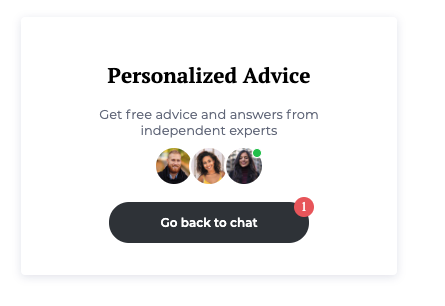
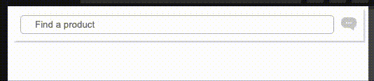

# Custom buttons

## Overview custom buttons
Custom buttons are a way to deeply integrate iAdvize into your web app, customizing entirely their style.
You can learn more about it by reading the dedicated [iAdvize Knowledge Base article](https://help.iadvize.com/hc/en-gb/articles/205165908).

## Custom buttons rules
The following rules must be followed when integrating a custom button : 
- The CSS selector provided in the admin page must exactly match the CSS selector in the DOM. The selectors are case-sensitive.
- The parent block containing the HTML button must be set as visible, or the engagement rule won't be triggered.
- the Online and Busy states should be hidden by default with a `display: none` style attribute. Only the Offline state should be visible by default.

The following examples assume that you have set these selectors, but you can use any selector you like : 
- Online state: `.idz-online`
- Offline state: `.idz-offline`
- Busy state: `.idz-busy`

## Guides custom buttons

### Custom button with one state

In this example, a custom button is shown when an agent is availble to answer. The button is otherwise hidden.
Note that a `style="display: none"` must be added to the Online element, so that it is hidden by default (see the [Rules](/documentation/custom-buttons#custom-buttons-rules) section).

<pre class="prettyprint lang-html">
&lt;div class=&quot;idz-btn_fix&quot;&gt;
	&lt;div class=&quot;idz-online&quot; style=&quot;display: none&quot;&gt;ONLINE CHAT BUTTON&lt;/div&gt;
&lt;/div&gt;
</pre>

### Custom button with three states
In this example, a custom button is always shown : 
- the button is in an Offline state by default, while the targeting engine fetches the availaibility of agents,
- if an agent is available to answer, the button will switch to its Online state,
- if an agent is online but unavailable to answer, the button will switch to its Busy state,
- otherwise, the button will stay in its Offline state.

In this example, a `display: none;` style attribute must be added to the Online and Busy elements, so that only the Offline element is visible by default (see the [Rules](/documentation/custom-buttons#custom-buttons-rules) section).

<pre class="prettyprint lang-html">
&lt;div class=&quot;idz_btn_fix&quot;&gt;
	&lt;div class=&quot;idz-online&quot; style=&quot;display: none&quot;&gt;ONLINE CHAT BUTTON&lt;/div&gt;
	&lt;div class=&quot;idz-busy&quot; style=&quot;display: none&quot;&gt;BUSY CHAT BUTTON&lt;/div&gt;
	&lt;div class=&quot;idz-offline&quot;&gt;OFFLINE CHAT BUTTON&lt;/div&gt;
&lt;/div&gt;
</pre>

### Multiple channels
Any number of custom buttons can be used at the same time. For instance, assuming that a fixed button is linked to a call channel with the selector `.idz-call_online` as its Online state, we can have both a "Chat" button and a "Call" button :

<pre class="prettyprint lang-html">
&lt;div class=&quot;idz-btn_fix_all&quot;&gt;
	&lt;!-- START IADVIZE HTML CHAT CALLBACK --&gt;
	&lt;div id=&quot;idz-online&quot; style=&quot;display: none;&quot;&gt;
		ONLINE CHAT BUTTON
	&lt;/div&gt;
	&lt;!-- END IADVIZE HTML CHAT CALLBACK --&gt;

	&lt;!-- START IADVIZE HTML CALL BUTTON --&gt;
	&lt;div id=&quot;idz-call_online&quot; style=&quot;display: none;&quot;&gt;
		ONLINE CALL BUTTON
	&lt;/div&gt;
	&lt;!-- END IADVIZE HTML CALL BUTTON --&gt;
&lt;/div&gt;
</pre>

### Custom button with avatars

 

The avatar(s) that will be displayed in the chatbox header are also available on fixed buttons. They will be automatically added in the document if an element with the `data-idz-displayed-avatar` data attribute is found inside one of the three selectors (online, offline, busy).

<pre class="prettyprint lang-html">
&lt;div class=&quot;idz_btn_fix&quot;&gt;
	&lt;div class=&quot;idz-online&quot; style=&quot;display: none&quot;&gt;
		&lt;div data-idz-displayed-avatar&gt;&lt;/div&gt;
		&lt;div&gt; ONLINE CHAT BUTTON&lt;/div&gt;
	&lt;/div&gt;
&lt;/div&gt;
</pre>

If you need to display an avatar before the iAdvize tag is loaded, we also provide the following images : 

| Image                                                                                                             | URL                                                                                                    |
|-------------------------------------------------------------------------------------------------------------------|--------------------------------------------------------------------------------------------------------|
|  | https://static.iadvize.com/uploads/engagement/notification/avatar/88ac160a-da21-42ec-b803-b3dfa0648979 |
|  | https://static.iadvize.com/uploads/engagement/notification/avatar/75418395-1ca8-4ed4-bf7b-5cbd25a099c1 |
|  | https://static.iadvize.com/uploads/engagement/notification/avatar/d79335f2-701f-4f98-80c8-abe99c0ee5b7 |
|  | https://static.iadvize.com/uploads/engagement/notification/avatar/db825d36-e1f2-4048-a030-652126744c57 |
|  | https://static.iadvize.com/uploads/engagement/notification/avatar/6208576f-b18b-4d3e-b81f-7b6659ad65ea |
|  | https://static.iadvize.com/uploads/engagement/notification/avatar/f23ec373-8059-42ce-8282-1b5b62cd67a3 |
|  | https://static.iadvize.com/uploads/engagement/notification/avatar/d5ebe601-40ce-4be6-bdcc-13a9cc2c130e |
|  | https://static.iadvize.com/uploads/engagement/notification/avatar/b4727507-c59b-4d17-a28c-f273215b4664 |
|  | https://static.iadvize.com/uploads/engagement/notification/avatar/bbf42d3f-0bf8-4c45-84ba-074e874167ef |
|  | https://static.iadvize.com/uploads/engagement/notification/avatar/89725342-78c7-4291-820d-b676e4a588fa |
|  | https://static.iadvize.com/uploads/engagement/notification/avatar/06309ba9-e7b2-48a0-a022-40505a1cdbdf |
|  | https://static.iadvize.com/uploads/engagement/notification/avatar/90161a0a-3436-4bb4-8c01-a9f6105bd8af |
|  | https://static.iadvize.com/uploads/engagement/notification/avatar/245288b2-67b5-481f-8cca-100d58cafbd1 |
|  | https://static.iadvize.com/uploads/engagement/notification/avatar/51e7fa1e-4929-418b-b1cc-a1be4805f6b9 |
|  | https://static.iadvize.com/uploads/engagement/notification/avatar/76a0fe84-8b3c-4f2c-954b-8f4f768a247d |
|  | https://static.iadvize.com/uploads/engagement/notification/avatar/3355a45c-4a13-4e1a-a730-5da27be2a4c3 |
|  | https://static.iadvize.com/uploads/engagement/notification/avatar/e9202db2-ce30-4c8d-b6cb-b1a9d918060f |
|  | https://static.iadvize.com/uploads/engagement/notification/avatar/e7d059e4-8963-4d7c-aca1-fddb7a1d8f7f |
|  | https://static.iadvize.com/uploads/engagement/notification/avatar/c30929ff-f9a6-46a1-b61e-aaf57996e3a2 |
|  | https://static.iadvize.com/uploads/engagement/notification/avatar/a8bb86c6-cdee-475b-99b1-541f4a7f3693 |
|  | https://static.iadvize.com/uploads/engagement/notification/avatar/48fb13cd-7f74-4dbc-966f-a2f7aeafcebd |
|  | https://static.iadvize.com/uploads/engagement/notification/avatar/3eb0e70c-71af-4ca5-9898-99e11b8cffcb |
|  | https://static.iadvize.com/uploads/engagement/notification/avatar/dd41f94b-7380-4bfa-8d05-bf29c2bdb717 |
|  | https://static.iadvize.com/uploads/engagement/notification/avatar/025519bd-7567-4a3e-8e51-40368eb9aef8 |
|  | https://static.iadvize.com/uploads/engagement/notification/avatar/dd41f94b-7380-4bfa-8d05-bf29c2bdb717 |
|  | https://static.iadvize.com/uploads/engagement/notification/avatar/75418395-1ca8-4ed4-bf7b-5cbd25a099c1 |

### Complex custom buttons

Advanced integrations are enabled via data attributes. They allow access to information such as the unread message count, the chatbox status, the conversation status or the displayed avatars.

| Data-attribute                  | Value type                                              | Selectors             |
|---------------------------------|---------------------------------------------------------|-----------------------|
| `data-idz-unread-message-count` | `number`(stringified)                                   | Online                |
| `data-idz-chatbox-status`       | `“OPEN”` or `“REDUCED”`                                 | Online, Busy, Offline |
| `data-idz-conversation-status`  | `“NOT_ONGOING”` or `“ONGOING”`                          | Online                |
| `data-idz-displayed-avatar`     | Injects the `#` HTML elements in the targeted container | Online, Busy, Offline |

Here is an example of what can be built, using these selectors :
 

You can edit and see this example live in this sandbox :  https://codesandbox.io/s/interesting-nova-edcyfz?file=/index.html. 

### Complex custom buttons with multiple channels

Here is an example of a custom button with two channels : 
 

You can edit and see this example live in this sandbox :  https://codesandbox.io/s/determined-rubin-tclhu0?file=/index.html.

### Custom button with an animation
Here is an example of a custom button with a CSS animation : 
 

You can edit and see this example live in this sandbox : https://codesandbox.io/s/purple-water-mxfmg6?file=/style.css.
