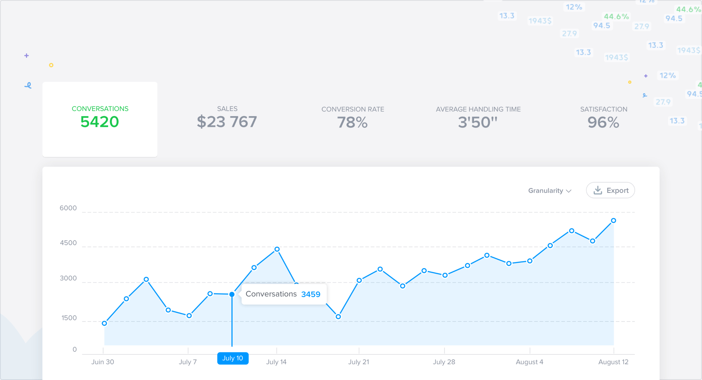
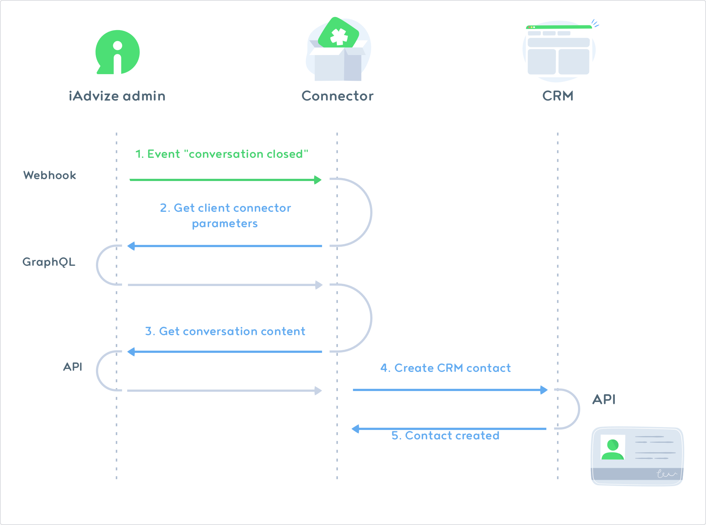

# General information
Welcome to iAdvize’s developer documentation!
If you want to use our API, create integrations for your own personal use or to share with the rest of the world, you are in the right place.

Early November 2017, iAdvize will provide you with a Developer platform for you to easily publish your apps on our marketplace so that our users can install them directly from their administration interface.

Whether you are a developer, an integrator, a customer or just curious, here, you will find an overview of how to get started, our Developer Guidelines, our API with practical examples and a guide to build and publish your future integrations.

## What is iAdvize?
[iAdvize](https://iadvize.com) is a conversational marketing platform that enables businesses to engage their customers and prospects whether they’re on the website or on social media from one single messaging solution (chat, voice, video). Visitors can get real-time advice from customer service but also from advocates, members of the brand community via [ibbü](https://www.ibbu.com/en/) - our on-demand pool of experts.

Implementing iAdvize is child's play. You just have to insert a tag on each page of your website. Once the solution is deployed, your customer service and marketing teams are completely independent and can set up the solution as they wish.

The iAdvize platform has 2 interfaces:

* The administration: administrators and managers of the solution can configure the platform's settings and monitor the agent's activity.

* The agent's console panel: it gives superpowers to your agents. That's the place where professional agents or experts can respond intuitively to all the messages they receive.

## What is the Developer Platform?

The iAdvize Developer Platform allows developers to build apps and use our public APIs.
Do you want to develop an app? We are providing you with documentation and a private testing environment.

## Why build apps on iAdvize?

There are three main reasons for building an app with the iAdvize Developer Platform:

* You build apps and publish them for our customer community. (We've got more than 500 customers to amaze!)
* You build apps in private mode and make them available only for one or more specific customers

Here is the example of a potential protocol between iAdvize and a CRM software thanks to a connector:
