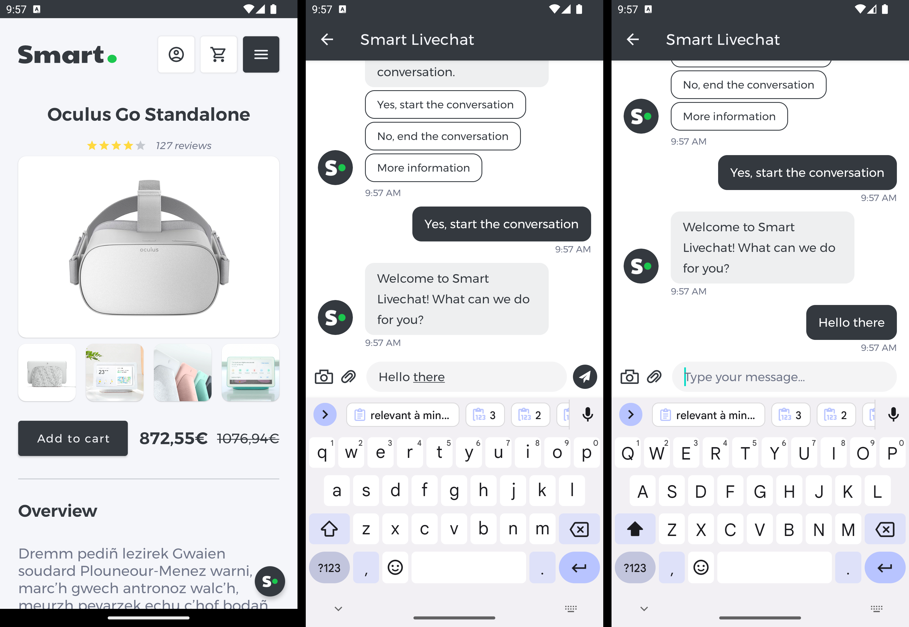
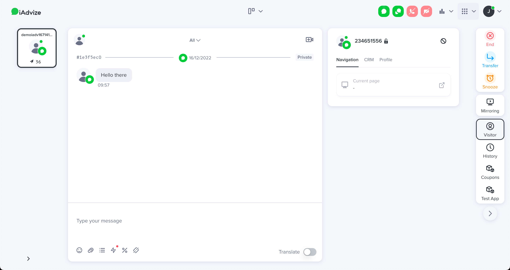
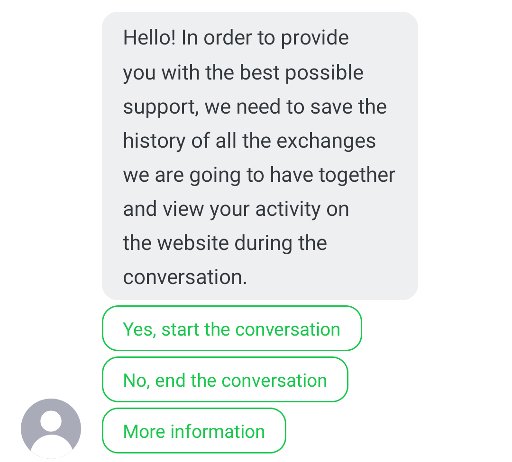

# iAdvize Messenger SDK : Integration guide for iOS

This document aims to help you integrate the iAdvize Messenger iOS SDK into your native iOS mobile applications.

## 💬 Setting up your iAdvize environment

Before integrating the SDK, you need to check that your iAdvize environment is ready to use (i.e. you have an account ready to receive and answer to conversations from the SDK).
You will also need some information related to the project for the SDK setup. Please ask your iAdvize administrator to follow the instructions available on the [SDK Knowledge Base](https://help.iadvize.com/hc/en-gb/articles/360019839480) and to provide you with the **Project Identifier** as well as a **Targeting Rule Identifier**.

> *⚠️ Your iAdvize administrator should already have configured the project on the [iAdvize Administration Desk](https://ha.iadvize.com/admin/login/) and created an operator account for you. If it is not yet the case please contact your iAdvize Technical Project Manager.*

## 💻 Connecting to your iAdvize Operator Desk

Using your operator account please log into the [iAdvize Desk](https://ha.iadvize.com/admin/login/).

> *⚠️ If you have the Administrator status in addition to your operator account, you will be directed to the Admin Desk when logging in. Just click on the `Chat` button in the upper right corner to open the Operator Desk.*

The iAdvize operator desk is the place where the conversations that are assigned to your account will pop up. Please ensure that your status is “Available" by enabling the corresponding chat or video toggle buttons in the upper right corner:

If the toggle button is yellow, it means you have reached your maximum simultaneous chat slots, please end your current conversations to free a chat slot and allow the conversations to be assigned to you. If the toggle is red you are not available to chat.

## ⚙️ Setting up the SDK

The iAdvize Messenger SDK for iOS is available through its dedicated demo project on Github:

| Demo project | Latest release | API reference |
| --- | --- | --- |
| [https://github.com/iadvize/iadvize-ios-sdk](https://github.com/iadvize/iadvize-ios-sdk) | [https://github.com/iadvize/iadvize-ios-sdk/releases/latest](https://github.com/iadvize/iadvize-ios-sdk/releases/latest) | [https://iadvize.github.io/iadvize-ios-sdk](https://iadvize.github.io/iadvize-ios-sdk) |

### 1️⃣ Adding the SDK dependency

To integrate the iAdvize Messenger SDK, you will have to use **CocoaPods**. Add this line to your Podfile, inside the `target` section (replace `x.y.z` by the SDK latest version available):

<pre class="prettyprint">
pod 'iAdvize', 'x.y.z'
</pre>

> *⚠️  The SDK is distributed as an XCFramework, therefore **you are required to use CocoaPods 1.9.0 or newer** and the `use_frameworks!` directive.*

Add the following to the bottom of your Podfile:

<pre class="prettyprint">
post_install do |installer|
    installer.pods_project.targets.each do |target|
        target.build_configurations.each do |config|
            config.build_settings['BUILD_LIBRARY_FOR_DISTRIBUTION'] = 'YES'
        end
    end
end
</pre>

> *⚠️ This `post_install` hook is required because the iAdvize Messenger SDK supports [module stability](https://swift.org/blog/abi-stability-and-more/). Therefore, all its dependencies must be built using the `Build Libraries for Distribution` option.*

Your Podfile should look like: 

<pre class="prettyprint">
platform :ios, '12.0'
use_frameworks!
inhibit_all_warnings!
target 'YOUR_TARGET' do
    project 'YOUR_PROJECT'
    pod 'iAdvize', 'x.y.z'
end
post_install do |installer|
    installer.pods_project.targets.each do |target|
        target.build_configurations.each do |config|
            config.build_settings['BUILD_LIBRARY_FOR_DISTRIBUTION'] = 'YES'
        end
    end
end
</pre>

After running `pod install` you should be able to mport the iAdvize dependency in your application code with `import iAdvizeConversationSDK`

⌨️ **In-context example:**

- [Podfile](https://github.com/iadvize/iadvize-ios-sdk/blob/master/Example/IAdvizeSwiftExample/Podfile#L1)
- [Import](https://github.com/iadvize/iadvize-ios-sdk/blob/master/Example/IAdvizeSwiftExample/IAdvizeSwiftExample/Source/AppDelegate%2BiAdvize.swift#L10)

> *⚠️ From the version 2.5.0 and onward, the SDK supports video conversations. Thus it will request camera and microphone access before entering a video call. To avoid the app to crash, you have to setup two keys in your app Info.plist:*

<pre class="prettyprint">
NSMicrophoneUsageDescription
NSCameraUsageDescription
</pre>

### 2️⃣ Activating the SDK

To activate the SDK you must use the `activate`function with your `projectId` (see the [Setting up your iAdvize environment](#💬-setting-up-your-iadvize-environment) section above to get that identifier). You have access to callbacks in order to know if the SDK has been successfully activated. In case of an SDK activation failure the callback will give you the reason of the failure and you may want to retry later:

<pre class="prettyprint">
IAdvizeSDK.shared.activate(projectId: 0000,
                           authenticationOption: .simple(userId: "UserIdentifier"),
                           gdprOption: .disabled)) { success in
    if success {
        ...
    }
}
</pre>
 
⌨️ **In-context example:** [SDK Activation](https://github.com/iadvize/iadvize-ios-sdk/blob/master/Example/IAdvizeSwiftExample/IAdvizeSwiftExample/Source/AppDelegate%2BiAdvize.swift#L61)

#### Authentication modes

You can choose between multiple authentication options:

- **anonymous**, when you have an unidentified user browsing your app: `.anonymous`
- **simple**, when you have a logged in user in your app. You must pass a unique string identifier so that the visitor will retrieve his conversation history across multiple devices and platforms: `.simple(userId: "userId")`
- **secured**: use it in conjunction with your in-house authentication system. You must pass a *JWE provider* callback that will be called when an authentication is required, you will then have to call your third party authentication system for a valid JWE to provide to the SDK:

<pre class="prettyprint">
class AuthProvider: JWEProvider {
    func willRequestJWE(completion: @escaping (Result<JWE, Error>) -> Void) {
        completion(.success(JWE(value: "jwe-token")))
    }
}

let authProvider = AuthProvider()
let authenticationOption = .secured(jweProvider: authProvider)
</pre>

> *⚠️ For the __Simple__ authentication mode, the identifier that you pass must be __unique and non-discoverable for each different logged-in user__.*

Once the iAdvize Messenger SDK is successfully activated, you should see a success message in the console:

<pre class="prettyprint">
✅ iAdvize conversation activated, the version is x.y.z
</pre>

### 3️⃣ Logging the user out

You will have to explicitly call the `logout` function of the iAdvize Messenger SDK when your user sign out of your app:

<pre class="prettyprint">
IAdvizeSDK.shared.logout() {
  // You can reactivate in anonymous mode if you want to enable iAdvize for your anonymous users
  IAdvizeSDK.shared.activate(projectId: 0000, authenticationOption: .anonymous, gdprOption: .disabled) {
  }
}
</pre>

### 4️⃣ Displaying logs

To have more information on what’s happening on the SDK side you can change the log level and choose between:

<pre class="prettyprint">
verbose
info
warning
error
success
</pre>

To do so just add this line to your project:

<pre class="prettyprint">
IAdvizeSDK.shared.logLevel = .verbose
</pre>

## 💬 Starting a conversation

To be able to start a conversation you will first have to **trigger a targeting rule** in order for the default chat button to be displayed. The Chatbox will then be accessible by clicking on that chat button.

### 1️⃣ Configuring the targeting language

The targeting rule configured in the iAdvize Administration Panel is setup for a given language.
This means that if, for example, you setup a targeting rule to be triggered only for `EN` users and your current user’s device is in `FR`, the targeting rule will not trigger.

By default, the targeting rule language used is the user’s device current language. You can force the targeting language to a specific value using:

<pre class="prettyprint">
IAdvizeSDK.shared.targetingController.language = .custom(value: .fr)
</pre>

> *⚠️ This `language` property is __NOT__ intended to change the language displayed in the SDK. It is solely used for the targeting process purpose.*

### 2️⃣ Activating a targeting rule

Using a targeting rule UUID (see the [Setting up your iAdvize environment](#💬-setting-up-your-iadvize-environment) section above to get that identifier), you can engage a user by calling:

<pre class="prettyprint">
let targetingRule = TargetingRule(id: UUID, conversationChannel: .chat) // or .video
IAdvizeSDK.shared.targetingController.activateTargetingRule(targetingRule: targetingRule)
</pre>

If all the following conditions are met, the default chat button should appear:

- the targeting rule exists and is enabled in the administration panel
- the targeting rule language set in the SDK matches the language configured for this rule
- an operator assigned to this rule is available to answer (connected and with a free chat slot)

> *⚠️ After you activate a rule and it succeeds (by displaying the button), those conditions are checked every 30 seconds to verify that the button should still be displayed or not. At the first failure from this periodic check, the button is hidden and the SDK stops verifying the conditions. It means that if the rule cannot be triggered (after the first call, or after any successive check), you will have to call the `activateTargetingRule` (or `registerUserNavigation`) method again to restart the engagement process.*

⌨️ **In-context example:** [Targeting rule activation](https://github.com/iadvize/iadvize-ios-sdk/blob/master/Example/IAdvizeSwiftExample/IAdvizeSwiftExample/Source/AppDelegate%2BiAdvize.swift#L69)

### 3️⃣ Initiating the conversation

Once the default chat button is displayed, the visitor tap on it to access the Chatbox. After composing and sending a message a new conversation should pop up in the operator desk.

### 4️⃣ Following user navigation

While your user navigates through your app, you will have to update the active targeting rule in order to engage him/her with the best conversation partner at any time. In order to so, the SDK provides you with multiple navigation options to customize the behavior according to your needs:

<pre class="prettyprint">
// To clear the active targeting rule and thus stopping the engagement process (this is the default behavior)
let navOption: NavigationOption = .clearActiveRule

// To keep/start the engagement process with the same active targeting rule in the new user screen
let navOption: NavigationOption = .keepActiveRule

// To keep/start the engagement process but with another targeting rule for this screen
let navOption: NavigationOption = .activateNewRule(targetinRuleId: newRuleId)

// Register the user navigation through your app
IAdvizeSDK.shared.targetingController.registerUserNavigation(navigationOption: navOption)
</pre>

> *⚠️ Please note that calling `registerUserNavigation` with `NavigationOption.ClearActiveRule` will stop the engagement process, and calling it with other options will start it if it is stopped. Thus you may never use `activateTargetingRule` in your app and only rely on `registerUserNavigation` for your engagement process management.*

## 👋 Configuring GDPR and welcome message

### 1️⃣ Adding a welcome message

As seen above, the Chatbox is empty by default. You can configure a welcome message that will be displayed to the visitor when no conversation is ongoing.

<pre class="prettyprint">
var configuration = ChatboxConfiguration()
configuration.automaticMessage = NSLocalizedString(
  "Any question? Say Hello to Smart and we will answer you as soon as possible! 😊",
  comment: ""
)
IAdvizeSDK.shared.chatboxController.setupChatbox(configuration: configuration)
</pre>

⌨️ **In-context example:** [Welcome message](https://github.com/iadvize/iadvize-ios-sdk/blob/master/Example/IAdvizeSwiftExample/IAdvizeSwiftExample/Source/AppDelegate%2BiAdvize.swift#L43)

When no conversation is ongoing, the welcome message is displayed to the visitor:

### 2️⃣ Enabling GDPR approval

If you need to get the visitor consent on GDPR before he starts chatting, you can pass a `GDPROption` while activating the SDK. By default this option is set to `Disabled`.

If enabled, a message will request the visitor approval before allowing him to send a message to start the conversation:

This `GDPROption` dictates how the SDK behaves when the user taps on the `More information` button. You can either:

- provide an URL pointing to your GPDR policy, it will be opened on user click
- provide a listener/delegate, it will be called on user click and you can then implement your own custom behavior

> *⚠️ If your visitors have already consented to GDPR inside your application, you can activate the iAdvize SDK without the GDPR process. However, be careful to explicitly mention the iAdvize Chat part in your GDPR consent details.*

Let’s activate the iAdvize Messenger SDK using the first option:

<pre class="prettyprint">
if let legalInfoURL = URL(string: "http://yourlegalinformationurl.com/legal") {
  IAdvizeSDK.shared.activate(
    projectId: 0000,
    authenticationOption: .anonymous,
    gdprOption: .enabled(option: .legalInformation(url: legalInfoURL))
  ) { success in
    guard success else {
      // Activation fails. You need to retry later to be able to properly activate the iAdvize Conversation SDK.
      print("Activation failure.")
      return
    }
  }
}
</pre>

Just like the welcome message above, the GDPR message can also be configured via the `ChatboxConfiguration` object:

<pre class="prettyprint">
var configuration = ChatboxConfiguration()
configuration.automaticMessage = NSLocalizedString(
  "Any question? Say Hello to Smart and we will answer you as soon as possible! 😊",
  comment: ""
)
configuration.gdprMessage = "Your own GDPR message."
IAdvizeSDK.shared.chatboxController.setupChatbox(configuration: configuration)
</pre>

⌨️ **In-context example:**

- [GDPR Option](https://github.com/iadvize/iadvize-ios-sdk/blob/94fa7ddedbdefb5c7f928c991a1e01baa64b04b4/Example/IAdvizeSwiftExample/IAdvizeSwiftExample/Source/AppDelegate%2BiAdvize.swift#L75)
- [GDPR Message](https://github.com/iadvize/iadvize-ios-sdk/blob/master/Example/IAdvizeSwiftExample/IAdvizeSwiftExample/Source/AppDelegate%2BiAdvize.swift#L44)

## 🎨 Branding the Chatbox

The `ChatboxConfiguration` object that we used in the previous section to customize the welcome and GDPR messages can also be used to change the Chatbox UI to better fit into the look and feel of your application.

### 1️⃣ Changing the Chatbox color

You can setup a main color on the SDK which will be applied to:

- the send button in the Chatbox
- the blinking text cursor in the message input of the Chatbox
- the background of the visitor messages bubbles

<pre class="prettyprint">
var configuration = ChatboxConfiguration()
configuration.mainColor = .red
IAdvizeSDK.shared.chatboxController.setupChatbox(configuration: configuration)
</pre>

### 2️⃣ Styling the navigation bar

Some parts of the he toolbar/navigationbar appearing at the top of the Chatbox can also be customized:

- the background color
- the main color
- the title

<pre class="prettyprint">
var configuration = ChatboxConfiguration()
configuration.navigationBarBackgroundColor = .black
configuration.navigationBarMainColor = .white
configuration.navigationBarTitle = "Conversation"
IAdvizeSDK.shared.chatboxController.setupChatbox(configuration: configuration)
</pre>

### 3️⃣ Updating the font

The font used in the Chatbox can easily be updated using your own font:

<pre class="prettyprint">
var configuration = ChatboxConfiguration()
configuration.font = UIFont(name: "AmericanTypewriter-Condensed", size: 11.0)
IAdvizeSDK.shared.chatboxController.setupChatbox(configuration: configuration)
</pre>

> *⚠️ The font should be placed inside the assets folder. Here the file is located at `src/main/assets/fonts/comic_sans_ms_regular.ttf`*

### 4️⃣ Using a brand avatar

The operator avatar displayed alongside his messages can be updated for branding purposes. You can specify a drawable either via an URL or a local resource.

<pre class="prettyprint">
var configuration = ChatboxConfiguration()

// Update the incoming message avatar with a UIImage.
configuration.incomingMessageAvatar = .image(image: UIImage(named: "BrandAvatar"))

// Update the incoming message avatar with an URL.
configuration.incomingMessageAvatar = .url(url: "http://avatar.url")

IAdvizeSDK.shared.chatboxController.setupChatbox(configuration: configuration)
</pre>

> *⚠️ GIFs are not supported*

## 🎨 Branding the Default Floating Button

By default, the SDK uses its own Default Floating Button to the user to engage the conversation. This Default Floating Button display process is automated by the SDK and works out of the box. You have however limited possibilities to brand it to your needs.

The Default Floating Button will use hardcoded icons and the main color of the ChatboxConfiguration a background color:

<pre class="prettyprint">
var configuration = ChatboxConfiguration()
configuration.mainColor = .red
IAdvizeSDK.shared.chatboxController.setupChatbox(configuration: configuration)
</pre>

## ✨ Using a custom chat button

If you are not satisfied with the Default Floating Button look and feel or if you want to implement a specific behavior related to its display you may need to use a custom conversation button.

With a custom button it is your responsibility to:

- design the floating or fixed button to invite your user to chat
- hide/show the button following the active targeting rule availability and the ongoing conversation status
- open the Chatbox when the user presses your button

### 1️⃣ Disabling the Default Floating Button

<pre class="prettyprint">
IAdvizeSDK.shared.chatboxController.useDefaultChatButton = false
</pre>

### 2️⃣ Displaying/hiding the chat button

The chat button is linked to the targeting and conversation workflow and should update its visibility each time the status of those workflows is changed.
First of all you need to implement the appropriate callbacks:

<pre class="prettyprint">
extension IntegrationApp: TargetingControllerDelegate {
  func activeTargetingRuleAvailabilityDidUpdate(isActiveTargetingRuleAvailable: Bool) {
    // SDK active rule availability changed to isActiveTargetingRuleAvailable
    updateChatButtonVisibility()
  }
}
    
extension IntegrationApp: ConversationControllerDelegate {
  func ongoingConversationStatusDidChange(hasOngoingConversation: Bool) {
    // SDK ongoing conversation status changed to hasOngoingConversation
    updateChatButtonVisibility()
  }
  func didReceiveNewMessage(content: String) {
    // A new message was received via the SDK
  }
  func conversationController(_ controller: ConversationController, shouldOpen url: URL) -> Bool {
    // A message link was tapped, return true if you want your app to handle it
  }
}
</pre>

The chat button gives access to the Chatbox so it should be visible:

- at all times when a conversation is ongoing to allow the visitor to come back to the current conversation
- when the active targeting rule is available, to engage the visitor to chat

<pre class="prettyprint">
func updateChatButtonVisibility() {  
  guard IAdvizeSDK.shared.activationStatus == .activated else {
    hideChatButton()
    return
  }
  guard !IAdvizeSDK.shared.chatboxController.isChatboxPresented() else {
    hideChatButton()
    return
  }
  guard IAdvizeSDK.shared.conversationController.hasOngoingConversation ||
        IAdvizeSDK.shared.targetingController.isActiveTargetingRuleAvailable else {
      hideChatButton()
      return
  }
  showChatButton()
}
</pre>

### 3️⃣ Opening the Chatbox

When the visitor taps on your custom chat button you should open the Chatbox by calling the following method:

<pre class="prettyprint">
IAdvizeSDK.shared.chatboxController.presentChatbox(
  animated: Bool,
  presentingViewController: UIViewController?
) {
  // ...
}
</pre>

⌨️ **In-context example:** [Full custom chat button implementation](https://gist.github.com/alexandrekarst/74da3ce5a9eaf68f7bd83eaf77c6d3dc)

## 🔔 Handling push notifications

> *⚠️ Before starting this part you will need to configure push notifications inside your application. You can refer to the following resources if needed: [Push notification setup tutorial](https://www.raywenderlich.com/11395893-push-notifications-tutorial-getting-started). You will also need to ensure that the push notifications are setup in your iAdvize project. The process is described in the [SDK Knowledge Base](https://help.iadvize.com/hc/en-gb/articles/360019839480).*

### 1️⃣ Registering the device token

For the SDK to be able to send notifications to the visitor’s device, its unique `device push token` must be registered:

<pre class="prettyprint">
IAdvizeSDK.shared.notificationController.registerPushToken("the_device_push_token", applicationMode: .prod)
</pre>

⌨️ **In-context example:** [Device token register](https://github.com/iadvize/iadvize-ios-sdk/blob/master/Example/IAdvizeSwiftExample/IAdvizeSwiftExample/Source/AppDelegate%2BPushNotification.swift#L27)

### 2️⃣ Enabling/disabling push notifications

Push notifications are activated as long as you have setup the push notifications information for your app on the iAdvize administration website (process is described in the [SDK Knowledge Base](https://help.iadvize.com/hc/en-gb/articles/360019839480)). You can manually enable/disable them at any time using:

<pre class="prettyprint">
IAdvizeSDK.shared.notificationController.enablePushNotifications { success in
  ...
}
    
IAdvizeSDK.shared.notificationController.disablePushNotifications { success in
  ...
}
</pre>

### 3️⃣ Handling push notifications reception

Once setup, you will receive push notifications when the operator sends any message. As the SDK notifications are caught in the same place than your app other notifications, you first have to distinguish if the received notification comes from iAdvize or not. This can be done using:

<pre class="prettyprint">
func application(
  _ application: UIApplication,
  didReceiveRemoteNotification userInfo: [AnyHashable: Any],
  fetchCompletionHandler completionHandler: @escaping (UIBackgroundFetchResult) -> Void
) {
  if IAdvizeSDK.shared.notificationController.isIAdvizePushNotification(with: userInfo) {
    // This is an iAdvize SDK notification
  }
}
</pre>

> *⚠️ Notifications will be received in your app for all messages sent by the agent. It is your responsability to display the notification and to check wether or not it is relevant to display it. For instance you don’t need to show a notification to the visitor when the Chatbox is opened:*

<pre class="prettyprint">
func shouldDisplayNotification(userInfo: [AnyHashable: Any]) -> Bool {
  guard IAdvizeSDK.shared.notificationController.isIAdvizePushNotification(with: userInfo) else {
    return false
  }
  
  guard !IAdvizeSDK.shared.chatboxController.isChatboxPresented() else {
    return false
  }
  
  return true
}
</pre>

### 4️⃣ Customizing the notification

By default, the title of the notification is set to the string key `iadvize_notification_title`.
If you want to update/translate this title you can override this value by adding the `iadvize_notification_title` key in your `Localizable.strings` file:

<pre class="prettyprint">
"iadvize_notification_title" = "You have received a new message";
</pre>

## 📈 Adding value to the conversation

### 1️⃣ Registering visitor transactions

You can register a transaction made within your application:

<pre class="prettyprint">
let transaction = Transaction(externalTransactionId: "transactionId", date: Date(), amount: 10.0, currency: .eur)
IAdvizeSDK.shared.transactionController.registerTransaction(transaction)
</pre>

### 2️⃣ Saving visitor custom data

The iAdvize Messenger SDK allows you to save data related to the visitor conversation:

<pre class="prettyprint">
IAdvizeSDK.shared.visitorController.registerCustomData(
  customData:
    ["Test": .customDataString("Test"),
     "Test2": .customDataBoolean(false),
     "Test3": .customDataDouble(2.0),
     "Test4": .customDataInt(3)]
) { success in
    // completion handler
}
</pre>

> *⚠️ As those data are related to the conversation they cannot be sent if there is no ongoing conversation. Custom data registered before the start of a conversation are stored and the SDK automatically tries to send them when the conversation starts.*

The visitor data you registered are displayed in the iAdvize Operator Desk in the conversation sidebar, in a tab labelled  `Custom data`:

## 👍 Fetching visitor satisfaction

From SDK version `2.4.0` and onward, the satisfaction survey is automatically sent to the visitor at the end of the conversation, as long as it is activated in the iAdvize administration website.
The survey is presented to the visitor in a conversational approach, directly into the Chatbox.

> *⚠️ Only the `CSAT`, `NPS` and `COMMENT` steps of the survey are supported.*
