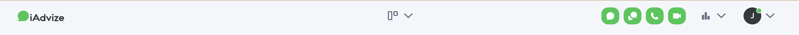
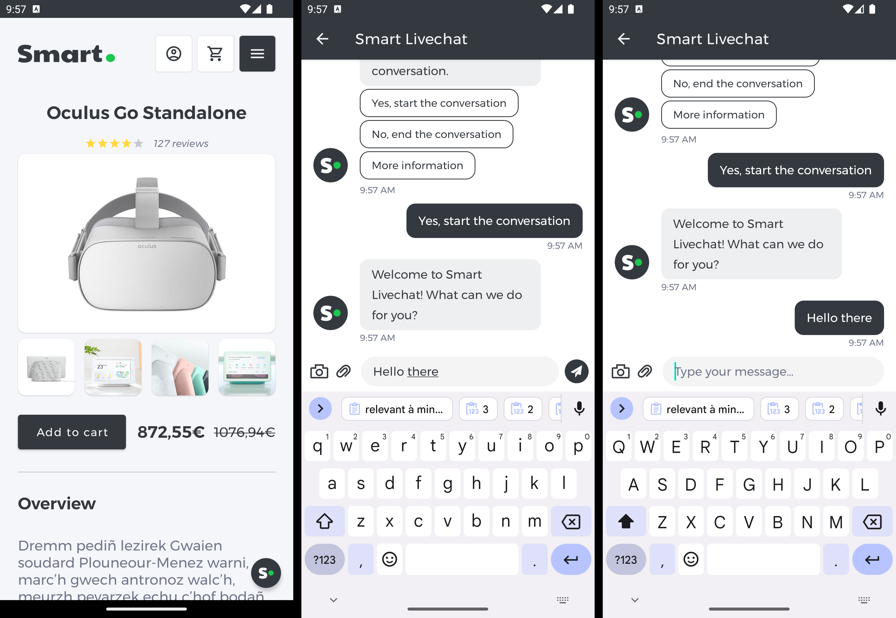
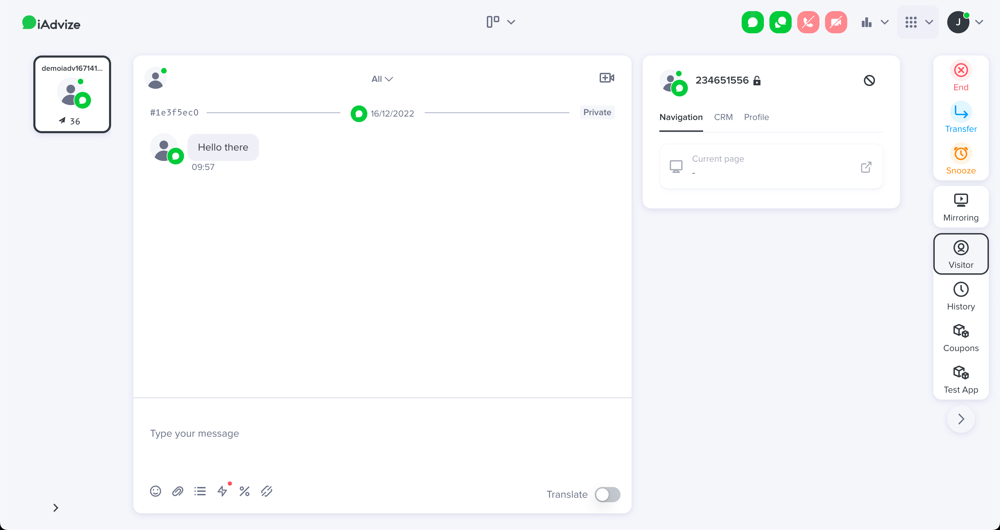
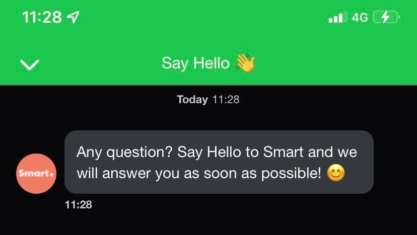
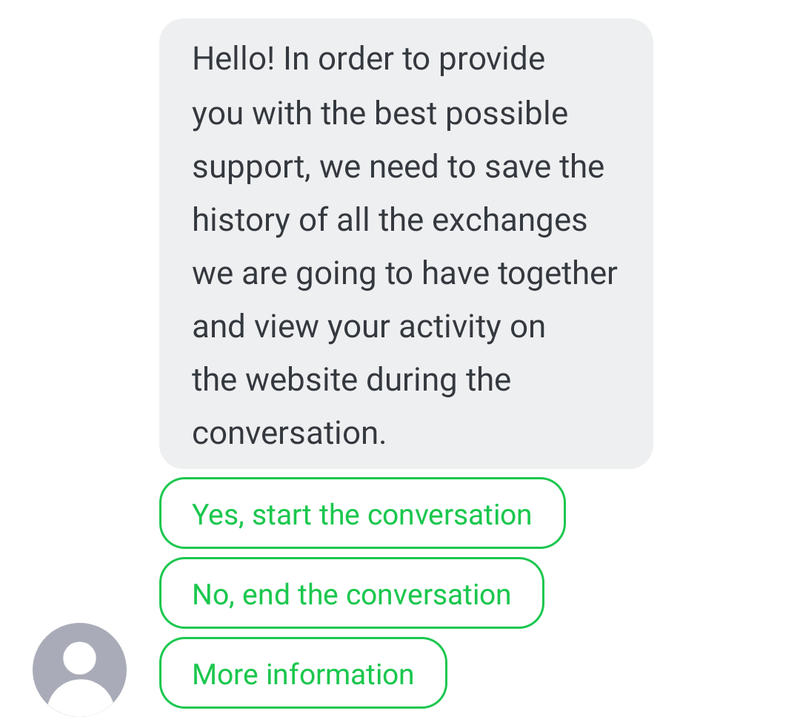
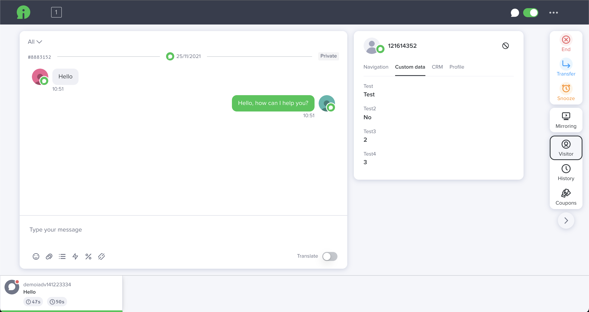

# 📱 iAdvize Messenger SDK integration guide

This document aims to help you integrate the iAdvize Messenger SDK into your mobile application.

## ⚙️ Prerequisites

There are a few steps required before you start integrating the iAdvize Messenger SDK.

### 💬 Setting up your iAdvize environment

Before integrating the SDK, you need to check that your iAdvize environment is ready to use (i.e. you have an account ready to receive and answer to conversations from the SDK).
You will also need some information related to the project for the SDK setup. Please ask your iAdvize administrator to follow the instructions available on the [SDK Knowledge Base](https://help.iadvize.com/hc/en-gb/articles/360019839480) and to provide you with the **Project Identifier** as well as a **Targeting Rule Identifier**.

> *⚠️ Your iAdvize administrator should already have configured the project on the [iAdvize Administration Desk](https://ha.iadvize.com/admin/login/) and created an operator account for you. If it is not yet the case please contact your iAdvize Technical Project Manager.*

### 💻 Connecting to your iAdvize Operator Desk

Using your operator account please log into the [iAdvize Desk](https://ha.iadvize.com/admin/login/).

> *⚠️ If you have the Administrator status in addition to your operator account, you will be directed to the Admin Desk when logging in. Just click on the `Chat` button in the upper right corner to open the Operator Desk.*

The iAdvize operator desk is the place where the conversations that are assigned to your account will pop up. Please ensure that your status is “Available" by enabling the corresponding chat or video toggle buttons in the upper right corner:

If the toggle button is yellow, it means you have reached your maximum simultaneous chat slots, please end your current conversations to free a chat slot and allow the conversations to be assigned to you. If the toggle is red you are not available to chat.

### ⚛️ Finding the SDK for your mobile platform

The iAdvize Messenger SDK is available through its dedicated demo project on Github.

| Platform | Latest release | Demo project | API Reference | Documentation |
| --- | --- | --- | --- | --- |
| Android | [GitHub](https://github.com/iadvize/iadvize-android-sdk/releases/latest) | [GitHub](https://github.com/iadvize/iadvize-android-sdk) | [Dokka](https://iadvize.github.io/iadvize-android-sdk/) | [Integration guide](#android-integration-guide) |
| iOS | [GitHub](https://github.com/iadvize/iadvize-ios-sdk/releases/latest) | [GitHub](https://github.com/iadvize/iadvize-ios-sdk) | [Jazzy](https://iadvize.github.io/iadvize-ios-sdk) | [Integration guide](#ios-integration-guide) |
| ReactNative | [NPM](https://www.npmjs.com/package/@iadvize-oss/iadvize-react-native-sdk?activeTab=versions) | [GitHub](https://github.com/iadvize/iadvize-react-native-sdk) | | [Integration guide](#reactnative-integration-guide) |
| Flutter | [Pub.dev](https://pub.dev/packages/iadvize_flutter_sdk/versions) | [GitHub](https://github.com/iadvize/iadvize-flutter-sdk) | | [Integration guide](#flutter-integration-guide) |

## Android integration guide

The iAdvize Messenger SDK for Android is available through its dedicated demo project on `Github`:

| Demo project | Latest release | API reference |
| --- | --- | --- |
| [https://github.com/iadvize/iadvize-android-sdk](https://github.com/iadvize/iadvize-android-sdk) | [https://github.com/iadvize/iadvize-android-sdk/releases/latest](https://github.com/iadvize/iadvize-android-sdk/releases/latest) | [https://iadvize.github.io/iadvize-android-sdk](https://iadvize.github.io/iadvize-android-sdk) |

### ⚙️ Setting up the SDK android

#### 1️⃣ Adding the SDK dependency android

Add the iAdvize repository to your project repositories inside your top-level Gradle build file:

<pre class="prettyprint">
// Project-level build.gradle.kts

allprojects {
  repositories {
    maven(url = uri("https://raw.github.com/iadvize/iadvize-android-sdk/master"))
    maven(url = uri("https://jitpack.io"))
  }
}
</pre>

Add the iAdvize Messenger SDK dependency inside your module-level Gradle build file (replace `x.y.z` by the latest SDK version available):

<pre class="prettyprint">
// Module-level build.gradle.kts

configurations {
  all {
    exclude(group = "xpp3", module = "xpp3")
  }
}

dependencies {
  implementation("com.iadvize:iadvize-sdk:x.y.z")
}
</pre>

> *⚠️ The `exclude` configuration is required because the iAdvize Messenger SDK uses [Smack](https://github.com/igniterealtime/Smack), an XMPP library that is built upon `xpp3`, which is bundled by default in the Android framework. This exclude ensures that your app does not also bundle `xpp3` to avoid classes duplication errors.*

In that same file, you also need to ensure that you are using the right Android target to build (iAdvize Messenger SDK is built with Android target 33):

<pre class="prettyprint">
// Module-level build.gradle.kts

android {
  buildToolsVersion "33.0.1"

  defaultConfig {
    minSdk = 21
    targetSdk = 33
    compileSdk = 33
  }
}
</pre>

After syncing your project you should be able to import the iAdvize dependency in your application code with `import com.iadvize.conversation.sdk.IAdvizeSDK`

⌨️ **In-context example:**

- [Project-level Gradle file](https://github.com/iadvize/iadvize-android-sdk/blob/master/build.gradle.kts)
- [Module-level Gradle file](https://github.com/iadvize/iadvize-android-sdk/blob/master/mobile/build.gradle.kts)
- [Import](https://github.com/iadvize/iadvize-android-sdk/blob/master/mobile/src/main/java/com/iadvize/conversation/sdk/demo/feature/App.kt#L5)

> *⚠️ From the version 2.5 and onward, the SDK supports video conversations using a third party native (C++) binaries. If you are delivering your app using an APK you will note a size increase as the default behavior of the build system is to include the binaries for each ABI in a single APK. We strongly recommended that you take advantage of either [App Bundles](https://developer.android.com/guide/app-bundle) or [APK Splits](https://developer.android.com/studio/build/configure-apk-splits) to reduce the size of your APKs while still maintaining maximum device compatibility.*

#### 2️⃣ Activating the SDK android

Before activating the SDK, you will need to provide a reference to your application object and initialize the SDK with it.

In your `AndroidManifest.xml` declare your application class:

<pre class="prettyprint">
&lt;application android:name=&quot;my.app.package.App&quot;&gt;
  &lt;!-- your activities etc... --&gt;
&lt;/application&gt;
</pre>

This class should then initialize the SDK:

<pre class="prettyprint">
package my.app.package.App

class App : Application() {
  override fun onCreate() {
    super.onCreate()
    IAdvizeSDK.initiate(this)
  }
}
</pre>

Afterwards you can activate the SDK using the `activate` function with your `projectId` (see the [Prerequisites](#⚙️-prerequisites) section above to get that identifier). You have access to callbacks in order to know if the SDK has been successfully activated. In the case of a SDK activation failure the callback will give you the reason of the failure and you may want to retry later:

<pre class="prettyprint">
IAdvizeSDK.activate(
  projectId = 0000,
  authenticationOption = AuthenticationOption.Simple("UserIdentifier"),
  gdprOption = GDPROption.Disabled,
  callback = object : IAdvizeSDK.Callback {
    override fun onSuccess() {
      Log.d("iAdvize SDK", "The SDK has been activated.")
    }
    override fun onFailure(t: Throwable) {
      Log.e("iAdvize SDK", "The SDK activation failed with:", t)
    }
  }
)
</pre>

⌨️ **In-context example:**

- [SDK Initiation](https://github.com/iadvize/iadvize-android-sdk/blob/master/mobile/src/main/java/com/iadvize/conversation/sdk/demo/feature/App.kt#L15)
- [SDK Activation](https://github.com/iadvize/iadvize-android-sdk/blob/master/mobile/src/main/java/com/iadvize/conversation/sdk/demo/feature/App.kt#L32)

##### Authentication modes android

You can choose between multiple authentication options:

- **Anonymous**, when you have an unidentified user browsing your app: `AuthenticationOption.Anonymous`
- **Simple**, when you have a logged in user in your app. You must pass a unique string identifier so that the visitor will retrieve his conversation history across multiple devices and platforms: `AuthenticationOption.Simple("userId")`
- **Secured**: use it in conjunction with your in-house authentication system. You must pass a *JWE provider* callback that will be called when an authentication is required, you will then have to call your third party authentication system for a valid JWE to provide to the SDK:

<pre class="prettyprint">
AuthenticationOption.Secured(object : AuthenticationOption.JWEProvider {
  override fun onJWERequested(callback: AuthenticationOption.JWECallback) {
    // Fetch JWE from your own secure auth process
    callback.onJWERetrieved(jwe)
    // or callback.onJWEFailure(exception)
  }
})
</pre>

> *⚠️ For the __Simple__ authentication mode, the identifier that you pass must be __unique and non-discoverable for each different logged-in user__.*

> *⚠️ For a full understanding of how the secured authentication works in the iAdvize platform you can refer to this [Knowledge Base article](https://help.iadvize.com/hc/fr/articles/6043078724626-Messagerie-authentifi%C3%A9e-iAdvize-impl%C3%A9mentation-c%C3%B4t%C3%A9-client-web).*

Once the iAdvize Messenger SDK is successfully activated, you should see a success message in the console:

<pre class="prettyprint">
✅ iAdvize conversation activated, the version is x.y.z
</pre>

#### 3️⃣ Logging the user out android

You will have to explicitly call the `logout` function of the iAdvize Messenger SDK when your user sign out of your app:

<pre class="prettyprint">
IAdvizeSDK.logout()
</pre>

#### 4️⃣ Displaying logs android

To have more information on what’s happening on the SDK side you can change the log level and choose between:

<pre class="prettyprint">
VERBOSE
INFO
WARNING // This is the default
ERROR
</pre>

To do so just add this line to your project:

<pre class="prettyprint">
IAdvizeSDK.logLevel = Logger.Level.VERBOSE
</pre>

### 💬 Starting a conversation android

To be able to start a conversation you will first have to **trigger a targeting rule** in order for the default chat button to be displayed. The Chatbox will then be accessible by clicking on that chat button.

#### 1️⃣ Configuring the targeting language android

The targeting rule configured in the iAdvize Administration Panel is setup for a given language.
This means that if, for example, you setup a targeting rule to be triggered only for `EN` users and your current user’s device is in `FR`, the targeting rule will not trigger.

By default, the targeting rule language used is the user’s device current language. You can force the targeting language to a specific value using:

<pre class="prettyprint">
IAdvizeSDK.targetingController.language = LanguageOption.Custom(Language.FR)
</pre>

> *⚠️ This `language` property is __NOT__ intended to change the language displayed in the SDK. It is solely used for the targeting process purpose.*

#### 2️⃣ Activating a targeting rule android

Using a targeting rule UUID (see the [Prerequisites](#⚙️-prerequisites) section above to get that identifier), you can engage a user by calling:

<pre class="prettyprint">
IAdvizeSDK.targetingController.activateTargetingRule(
  TargetingRule(
    targetingRuleUUID,
    ConversationChannel.CHAT // or ConversationChannel.VIDEO
  )
)
</pre>

If all the following conditions are met, the default chat button should appear:

- the targeting rule exists and is enabled in the administration panel
- the targeting rule language set in the SDK matches the language configured for this rule
- an operator assigned to this rule is available to answer (connected and with a free chat slot)

> *⚠️ After you activate a rule and it succeeds (by displaying the button), those conditions are checked every 30 seconds to verify that the button should still be displayed or not. Upon the first encountered failure from this periodic check, the button is hidden and the SDK stops verifying the conditions. It means that if the rule cannot be triggered (after the first call, or after any successive check), you will have to call the `activateTargetingRule` (or `registerUserNavigation`) method again in order to restart the engagement process.*

#### 3️⃣ Initiating the conversation android

Once the default chat button is displayed, the visitor tap on it to access the Chatbox. After composing and sending a message a new conversation should pop up in the operator desk.

#### 4️⃣ Following user navigation android

While your user navigates through your app, you will have to update the active targeting rule in order to engage him/her with the best conversation partner at any time. In order to so, the SDK provides you with multiple navigation options to customize the behavior according to your needs:

<pre class="prettyprint">
// To clear the active targeting rule and thus stopping the engagement process (this is the default behavior)
val navOption = NavigationOption.ClearActiveRule

// To keep/start the engagement process with the same active targeting rule in the new user screen
val navOption = NavigationOption.KeepActiveRule

// To keep/start the engagement process but with another targeting rule for this screen
val navOption = NavigationOption.ActivateNewRule(newRule)

// Register the user navigation through your app
IAdvizeSDK.targetingController.registerUserNavigation(navOption)
</pre>

> *⚠️ Please note that calling `registerUserNavigation` with `NavigationOption.ClearActiveRule` will stop the engagement process, and calling it with other options will start it if it is stopped. Thus you may never use `activateTargetingRule` in your app and only rely on `registerUserNavigation` for your engagement process management.*

⌨️ **In-context example:** [Registering User Navigation](https://github.com/iadvize/iadvize-android-sdk/blob/master/mobile/src/main/java/com/iadvize/conversation/sdk/demo/feature/product/ProductDetailFragment.kt#L42)

### 👋 Configuring GDPR and welcome message android

#### 1️⃣ Adding a welcome message android

As seen above, the Chatbox is empty by default. You can configure a welcome message that will be displayed to the visitor when no conversation is ongoing.

<pre class="prettyprint">
val configuration = ChatboxConfiguration()
configuration.automaticMessage = "Any question? Say Hello to Smart and we will answer you as soon as possible! 😊"
IAdvizeSDK.chatboxController.setupChatbox(configuration)
</pre>

⌨️ **In-context example:** [Welcome message](https://github.com/iadvize/iadvize-android-sdk/blob/master/mobile/src/main/java/com/iadvize/conversation/sdk/demo/feature/IAdvizeSDKConfig.kt#L58)

When no conversation is ongoing, the welcome message is displayed to the visitor:

#### 2️⃣ Enabling GDPR approval android

If you need to get the visitor consent on GDPR before he starts chatting, you can pass a `GDPROption` while activating the SDK. By default this option is set to `Disabled`.

If enabled, a message will request the visitor approval before allowing him to send a message to start the conversation:

This `GDPROption` dictates how the SDK behaves when the user taps on the `More information` button. You can either:

- provide an URL pointing to your GPDR policy, it will be opened on user click
- provide a listener/delegate, it will be called on user click and you can then implement your own custom behavior

> *⚠️ If your visitors have already consented to GDPR inside your application, you can activate the iAdvize SDK without the GDPR process. However, be careful to explicitly mention the iAdvize Chat part in your GDPR consent details.*

<pre class="prettyprint">
// Disabled
val gdprOption = GDPROption.Disabled

// URL
val gdprOption = GDPROption.Enabled(GDPREnabledOption.LegalUrl(URI.create("http://my.gdpr.rules.com")))

// Listener
val gdprOption = GDPROption.Enabled(GDPREnabledOption.Listener(object : GDPRListener {
  override fun didTapMoreInformation() {
    // Implement your own logic
  }
}))
</pre>

Just like the welcome message above, the GDPR message can also be configured via the `ChatboxConfiguration` object:

<pre class="prettyprint">
val configuration = ChatboxConfiguration()
configuration.automaticMessage = "Any question? Say Hello to Smart and we will answer you as soon as possible! 😊"
configuration.gdprMessage = "Your own GDPR message."
IAdvizeSDK.chatboxController.setupChatbox(configuration)
</pre>

⌨️ **In-context example:**

- [GDPR Option](https://github.com/iadvize/iadvize-android-sdk/blob/master/mobile/src/main/java/com/iadvize/conversation/sdk/demo/feature/IAdvizeSDKConfig.kt#L38)
- [GDPR Message](https://github.com/iadvize/iadvize-android-sdk/blob/master/mobile/src/main/java/com/iadvize/conversation/sdk/demo/feature/IAdvizeSDKConfig.kt#L60)

### 🎨 Branding the Chatbox android

The `ChatboxConfiguration` object that we used in the previous section to customize the welcome and GDPR messages can also be used to change the Chatbox UI to better fit into the look and feel of your application.

#### 1️⃣ Changing the Chatbox color android

You can setup a main color on the SDK which will be applied to:

- the send button in the Chatbox
- the blinking text cursor in the message input of the Chatbox
- the background of the visitor messages bubbles

<pre class="prettyprint">
val configuration = ChatboxConfiguration()
configuration.mainColor = Color.RED
IAdvizeSDK.chatboxController.setupChatbox(configuration)
</pre>

#### 2️⃣ Styling the navigation bar android

Some parts of the he toolbar/navigationbar appearing at the top of the Chatbox can also be customized:

- the background color
- the main color
- the title

<pre class="prettyprint">
val configuration = ChatboxConfiguration()
configuration.toolbarBackgroundColor = Color.BLACK,
configuration.toolbarMainColor = COLOR.WHITE,
configuration.toolbarTitle = "Conversation"
IAdvizeSDK.chatboxController.setupChatbox(configuration)
</pre>

#### 3️⃣ Updating the font android

The font used in the Chatbox can easily be updated using your own font:

<pre class="prettyprint">
val configuration = ChatboxConfiguration()
configuration.fontPath = "fonts/comic_sans_ms_regular.ttf"
IAdvizeSDK.chatboxController.setupChatbox(configuration)
</pre>

> *⚠️ The font should be placed inside the assets folder. Here the file is located at `src/main/assets/fonts/comic_sans_ms_regular.ttf`*

#### 4️⃣ Using a brand avatar android

The operator avatar displayed alongside his messages can be updated for branding purposes. You can specify a drawable either via an URL or a local resource.

<pre class="prettyprint">
val configuration = ChatboxConfiguration()

// Update the incoming message avatar with a Drawable resource.
configuration.incomingMessageAvatar = IncomingMessageAvatar.Image(
  ContextCompat.getDrawable(context, R.drawable.ic_brand_avatar)
)

// Update the incoming message avatar with an URL.
configuration.incomingMessageAvatar = IncomingMessageAvatar.Url(URL("http://avatar.url"))

IAdvizeSDK.chatboxController.setupChatbox(configuration)
</pre>

> *⚠️ GIFs are not supported.*

### 🎨 Branding the Default Floating Button android

By default, the SDK uses its own Default Floating Button to the user to engage the conversation. This Default Floating Button display process is automated by the SDK and works out of the box. You have however limited possibilities to brand it to your needs.

The Default Floating Button can be parametrized, both in its look (colors / icon) and position (anchor / margins) using the appropriate configuration:

<pre class="prettyprint">
val configuration = DefaultFloatingButtonConfiguration(
  anchor = Gravity.START or Gravity.BOTTOM,
  margins = DefaultFloatingButtonMargins(),
  backgroundTint = ContextCompat.getColor(this, R.color.colorPrimary),
  iconResIds = mapOf(
    ConversationChannel.CHAT to R.drawable.chat_icon,
    ConversationChannel.VIDEO to R.drawable.video_icon
  )
  iconTint = Color.WHITE
)
val option = DefaultFloatingButtonOption.Enabled(configuration)
IAdvizeSDK.defaultFloatingButtonController.setupDefaultFloatingButton(option)
</pre>

⌨️ **In-context example:** [Default Floating Button Configuration](https://github.com/iadvize/iadvize-android-sdk/blob/master/mobile/src/main/java/com/iadvize/conversation/sdk/demo/feature/IAdvizeSDKConfig.kt#L43)

### ✨ Using a custom chat button android

If you are not satisfied with the Default Floating Button look and feel or if you want to implement a specific behavior related to its display you may need to use a custom conversation button.

With a custom button it is your responsibility to:

- design the floating or fixed button to invite your user to chat
- hide/show the button following the active targeting rule availability and the ongoing conversation status
- open the Chatbox when the user presses your button

#### 1️⃣ Disabling the Default Floating Button android

<pre class="prettyprint">
IAdvizeSDK.defaultFloatingButtonController.setupDefaultFloatingButton(DefaultFloatingButtonOption.Disabled)
</pre>

#### 2️⃣ Displaying/hiding the chat button android

The chat button is linked to the targeting and conversation workflow and should update its visibility each time the status of those workflows is changed.
First of all you need to implement the appropriate callbacks:

<pre class="prettyprint">
IAdvizeSDK.targetingController.listeners.add(object : TargetingListener {
  override fun onActiveTargetingRuleAvailabilityUpdated(isActiveTargetingRuleAvailable: Boolean) {
    // SDK active rule availability changed to isActiveTargetingRuleAvailable
    updateChatButtonVisibility()
  }
})

IAdvizeSDK.conversationController.listeners.add(object : ConversationListener {
  override fun onOngoingConversationUpdated(ongoingConversation: OngoingConversation?) {
    // SDK ongoing conversation has updated
    updateChatButtonVisibility()
  }
  override fun onNewMessageReceived(content: String) {
    // A new message was received via the SDK
  }
  override fun handleClickedUrl(uri: Uri): Boolean {
    // A message link was tapped, return true if you want your app to handle it
    return false
  }
})
</pre>

The chat button gives access to the Chatbox so it should be visible:

- at all times when a conversation is ongoing to allow the visitor to come back to the current conversation
- when the active targeting rule is available, to engage the visitor to chat

<pre class="prettyprint">
fun updateChatButtonVisibility() {
  val sdkActivated = IAdvizeSDK.activationStatus == IAdvizeSDK.ActivationStatus.ACTIVATED
  val chatboxOpened = IAdvizeSDK.chatboxController.isChatboxPresented()
  val ruleAvailable = IAdvizeSDK.targetingController.isActiveTargetingRuleAvailable()
  val hasOngoingConv = IAdvizeSDK.conversationController.ongoingConversation() != null

  if (sdkActivated && !chatboxOpened && (hasOngoingConv || ruleAvailable)) {
    showChatButton()
  } else {
    hideChatButton()
  }
}
</pre>

#### 3️⃣ Opening the Chatbox android

When the visitor taps on your custom chat button you should open the Chatbox by calling the following method:

<pre class="prettyprint">
IAdvizeSDK.chatboxController.presentChatbox(context)
</pre>

⌨️ **In-context example:** [Full custom chat button implementation](https://gist.github.com/Judas/d0a34a50f1b6b8d542d77af5db9d9787)

### 🔔 Handling push notifications android

> *⚠️ Before starting this part you will need to configure push notifications inside your application. You can refer to the following resources if needed: [Firebase Cloud Messaging documentation](https://firebase.google.com/docs/cloud-messaging/android/client). You will also need to ensure that the push notifications are setup in your iAdvize project. The process is described in the [SDK Knowledge Base](https://help.iadvize.com/hc/en-gb/articles/360019839480).*

#### 1️⃣ Registering the device token android

For the SDK to be able to send notifications to the visitor’s device, its unique `device push token` must be registered:

<pre class="prettyprint">
class NotificationService : FirebaseMessagingService() {
  override fun onNewToken(token: String) {
    super.onNewToken(token)
    IAdvizeSDK.notificationController.registerPushToken(token)
  }
}
</pre>

⌨️ **In-context example:** [Device token register](https://github.com/iadvize/iadvize-android-sdk/blob/master/mobile/src/main/java/com/iadvize/conversation/sdk/demo/feature/notifications/NotificationService.kt#L55)

#### 2️⃣ Enabling/disabling push notifications android

Push notifications are activated as long as you have setup the push notifications information for your app on the iAdvize administration website (process is described in the [SDK Knowledge Base](https://help.iadvize.com/hc/en-gb/articles/360019839480)). You can manually enable/disable them at any time using:

<pre class="prettyprint">
IAdvizeSDK.notificationController.enablePushNotifications(object : IAdvizeSDK.Callback {
  override fun onSuccess() {
    // Enable succeded
  }
  override fun onFailure(t: Throwable) {
    // Enable failed
  }
})

IAdvizeSDK.notificationController.disablePushNotifications(object : IAdvizeSDK.Callback {
  override fun onSuccess() {
    // Disable succeded
  }
  override fun onFailure(t: Throwable) {
    // Disable failed
  }
})
</pre>

#### 3️⃣ Handling push notifications reception android

Once setup, you will receive push notifications when the operator sends any message. As the SDK notifications are caught in the same place than your app other notifications, you first have to distinguish if the received notification comes from iAdvize or not. This can be done using:

<pre class="prettyprint">
class NotificationService : FirebaseMessagingService() {
  override fun onMessageReceived(remoteMessage: RemoteMessage) {
    if (IAdvizeSDK.notificationController.isIAdvizePushNotification(remoteMessage.data)) {
      // This is an iAdvize SDK notification
    }
  }
}
</pre>

> *⚠️ Notifications will be received in your app for all messages sent by the agent. It is your responsability to display the notification and to check wether or not it is relevant to display it. For instance you don’t need to show a notification to the visitor when the Chatbox is opened:*

<pre class="prettyprint">
fun shouldDisplayNotification(remoteMessage: RemoteMessage) =
  IAdvizeSDK.notificationController.isIAdvizePushNotification(remoteMessage.data) 
  && !IAdvizeSDK.chatboxController.isChatboxPresented()
</pre>

#### 4️⃣ Customizing the notification android

You are responsible for displaying the notification so you can use any title / text / icon you want.
The text sent by the agent is available in the `content` part of the notification data received.

<pre class="prettyprint">
override fun onMessageReceived(remoteMessage: RemoteMessage) {
  if (IAdvizeSDK.notificationController.isIAdvizePushNotification(remoteMessage.data)) {
    val agentMessageReceived = remoteMessage.data["content"] ?: "Default text"
  }
}
</pre>

⌨️ **In-context example:** [Handling received notification](https://github.com/iadvize/iadvize-android-sdk/blob/master/mobile/src/main/java/com/iadvize/conversation/sdk/demo/feature/notifications/NotificationService.kt#L68)

### 📈 Adding value to the conversation android

#### 1️⃣ Registering visitor transactions android

You can register a transaction made within your application:

<pre class="prettyprint">
IAdvizeSDK.transactionController.register(
  Transaction(
    "transactionId",
    Date(),
    10.00,
    Currency.EUR
  )
)
</pre>

#### 2️⃣ Saving visitor custom data android

The iAdvize Messenger SDK allows you to save data related to the visitor conversation:

<pre class="prettyprint">
IAdvizeSDK.visitorController.registerCustomData(listOf(
  CustomData.fromString("Test", "Test"),
  CustomData.fromBoolean("Test2", false),
  CustomData.fromDouble("Test3", 2.0),
  CustomData.fromInt("Test4", 3)
),
object : IAdvizeSDK.Callback {
  override fun onSuccess() {
    // Success
  }
  override fun onFailure(t: Throwable) {
    // Failure
  }
})
</pre>

> *⚠️ As those data are related to the conversation they cannot be sent if there is no ongoing conversation. Custom data registered before the start of a conversation are stored and the SDK automatically tries to send them when the conversation starts.*

The visitor data you registered are displayed in the iAdvize Operator Desk in the conversation sidebar, in a tab labelled  `Custom data`:

### 👍 Fetching visitor satisfaction android

From SDK version `2.4.0` and onward, the satisfaction survey is automatically sent to the visitor at the end of the conversation, as long as it is activated in the iAdvize administration website.
The survey is presented to the visitor in a conversational approach, directly into the Chatbox.

> *⚠️ Only the `CSAT`, `NPS` and `COMMENT` steps of the survey are supported.*

### 🚦 Testing the SDK android

If you are running unit tests that implies the SDK, some additional steps may be needed.

The Android SDK uses two device system constants that are not instantiated inside unit test flow, you will have to register them inside your unit tests initiation:

<pre class="prettyprint">
ReflectionHelpers.setStaticField(android.os.Build::class.java, "MODEL", "whatever")
ReflectionHelpers.setStaticField(android.os.Build::class.java, "MANUFACTURER", "whatever")
</pre>

Please also be sure to initalize the SDK during the unit tests setup (see the [Setting up the SDK](#⚙️-setting-up-the-sdk-android) section above).

## iOS integration guide

The iAdvize Messenger SDK for iOS is available through its dedicated demo project on `Github`:

| Demo project | Latest release | API reference |
| --- | --- | --- |
| [https://github.com/iadvize/iadvize-ios-sdk](https://github.com/iadvize/iadvize-ios-sdk) | [https://github.com/iadvize/iadvize-ios-sdk/releases/latest](https://github.com/iadvize/iadvize-ios-sdk/releases/latest) | [https://iadvize.github.io/iadvize-ios-sdk](https://iadvize.github.io/iadvize-ios-sdk) |

### ⚙️ Setting up the SDK ios

#### 1️⃣ Adding the SDK dependency ios

To integrate the iAdvize Messenger SDK, you will have to use **CocoaPods**. Add this line to your Podfile, inside the `target` section (replace `x.y.z` by the latest SDK version available):

<pre class="prettyprint">
pod 'iAdvize', 'x.y.z'
</pre>

> *⚠️  The SDK is distributed as an XCFramework, therefore **you are required to use CocoaPods 1.9.0 or newer** and the `use_frameworks!` directive.*

Add the following to the bottom of your Podfile:

<pre class="prettyprint">
post_install do |installer|
  installer.pods_project.targets.each do |target|
    target.build_configurations.each do |config|
      config.build_settings['BUILD_LIBRARY_FOR_DISTRIBUTION'] = 'YES'
    end
  end
end
</pre>

> *⚠️ This `post_install` hook is required because the iAdvize Messenger SDK supports [module stability](https://swift.org/blog/abi-stability-and-more/). Therefore, all its dependencies must be built using the `Build Libraries for Distribution` option.*

Your Podfile should look like:

<pre class="prettyprint">
platform :ios, '12.0'
use_frameworks!
inhibit_all_warnings!
target 'YOUR_TARGET' do
  project 'YOUR_PROJECT'
  pod 'iAdvize', 'x.y.z'
end
post_install do |installer|
  installer.pods_project.targets.each do |target|
    target.build_configurations.each do |config|
      config.build_settings['BUILD_LIBRARY_FOR_DISTRIBUTION'] = 'YES'
    end
  end
end
</pre>

After running `pod install` you should be able to mport the iAdvize dependency in your application code with `import iAdvizeConversationSDK`

⌨️ **In-context example:**

- [Podfile](https://github.com/iadvize/iadvize-ios-sdk/blob/master/Example/IAdvizeSwiftExample/Podfile#L1)
- [Import](https://github.com/iadvize/iadvize-ios-sdk/blob/master/Example/IAdvizeSwiftExample/IAdvizeSwiftExample/Source/AppDelegate%2BiAdvize.swift#L10)

> *⚠️ From the version 2.5.0 and onward, the SDK supports video conversations. Thus it will request camera and microphone access before entering a video call. To avoid the app to crash, you have to setup two keys in your app Info.plist:*

<pre class="prettyprint">
&lt;key&gt;NSCameraUsageDescription&lt;/key&gt;
&lt;string&gt;This application will use the camera to share photos and during video calls.&lt;/string&gt;
&lt;key&gt;NSMicrophoneUsageDescription&lt;/key&gt;
&lt;string&gt;This application will use the microphone during video calls.&lt;/string&gt;
</pre>

#### 2️⃣ Activating the SDK ios

To activate the SDK you must use the `activate`function with your `projectId` (see the [Prerequisites](#⚙️-prerequisites)section above to get that identifier). You have access to callbacks in order to know if the SDK has been successfully activated. In case of an SDK activation failure the callback will give you the reason of the failure and you may want to retry later:

<pre class="prettyprint">
IAdvizeSDK.shared.activate(projectId: 0000,
                           authenticationOption: .simple(userId: "UserIdentifier"),
                           gdprOption: .disabled)) { success in
    if success {
        ...
    }
}
</pre>
 
⌨️ **In-context example:** [SDK Activation](https://github.com/iadvize/iadvize-ios-sdk/blob/master/Example/IAdvizeSwiftExample/IAdvizeSwiftExample/Source/AppDelegate%2BiAdvize.swift#L61)

##### Authentication modes ios

You can choose between multiple authentication options:

- **anonymous**, when you have an unidentified user browsing your app: `.anonymous`
- **simple**, when you have a logged in user in your app. You must pass a unique string identifier so that the visitor will retrieve his conversation history across multiple devices and platforms: `.simple(userId: "userId")`
- **secured**: use it in conjunction with your in-house authentication system. You must pass a *JWE provider* callback that will be called when an authentication is required, you will then have to call your third party authentication system for a valid JWE to provide to the SDK:

<pre class="prettyprint">
class AuthProvider: JWEProvider {
  func willRequestJWE(completion: @escaping (Result<JWE, Error>) -> Void) {
    // Fetch JWE from your own secure auth process
    completion(.success(JWE(value: "jwe-token")))
  }
}

let authProvider = AuthProvider()
let authenticationOption = .secured(jweProvider: authProvider)
</pre>

> *⚠️ For the __Simple__ authentication mode, the identifier that you pass must be __unique and non-discoverable for each different logged-in user__.*

> *⚠️ For a full understanding of how the secured authentication works in the iAdvize platform you can refer to this [Knowledge Base article](https://help.iadvize.com/hc/fr/articles/6043078724626-Messagerie-authentifi%C3%A9e-iAdvize-impl%C3%A9mentation-c%C3%B4t%C3%A9-client-web).*

Once the iAdvize Messenger SDK is successfully activated, you should see a success message in the console:

<pre class="prettyprint">
✅ iAdvize conversation activated, the version is x.y.z
</pre>

#### 3️⃣ Logging the user out ios

You will have to explicitly call the `logout` function of the iAdvize Messenger SDK when your user sign out of your app:

<pre class="prettyprint">
IAdvizeSDK.shared.logout() {
  // You can reactivate in anonymous mode if you want to enable iAdvize for your anonymous users
  IAdvizeSDK.shared.activate(projectId: 0000, authenticationOption: .anonymous, gdprOption: .disabled) {
  }
}
</pre>

#### 4️⃣ Displaying logs ios

To have more information on what’s happening on the SDK side you can change the log level and choose between:

<pre class="prettyprint">
verbose
info
warning // This is the default
error
success
</pre>

To do so just add this line to your project:

<pre class="prettyprint">
IAdvizeSDK.shared.logLevel = .verbose
</pre>

### 💬 Starting a conversation ios

To be able to start a conversation you will first have to **trigger a targeting rule** in order for the default chat button to be displayed. The Chatbox will then be accessible by clicking on that chat button.

#### 1️⃣ Configuring the targeting language ios

The targeting rule configured in the iAdvize Administration Panel is setup for a given language.
This means that if, for example, you setup a targeting rule to be triggered only for `EN` users and your current user’s device is in `FR`, the targeting rule will not trigger.

By default, the targeting rule language used is the user’s device current language. You can force the targeting language to a specific value using:

<pre class="prettyprint">
IAdvizeSDK.shared.targetingController.language = .custom(value: .fr)
</pre>

> *⚠️ This `language` property is __NOT__ intended to change the language displayed in the SDK. It is solely used for the targeting process purpose.*

#### 2️⃣ Activating a targeting rule ios

Using a targeting rule UUID (see the [Prerequisites](#⚙️-prerequisites) section above to get that identifier), you can engage a user by calling:

<pre class="prettyprint">
let targetingRule = TargetingRule(id: UUID, conversationChannel: .chat) // or .video
IAdvizeSDK.shared.targetingController.activateTargetingRule(targetingRule: targetingRule)
</pre>

If all the following conditions are met, the default chat button should appear:

- the targeting rule exists and is enabled in the administration panel
- the targeting rule language set in the SDK matches the language configured for this rule
- an operator assigned to this rule is available to answer (connected and with a free chat slot)

> *⚠️ After you activate a rule and it succeeds (by displaying the button), those conditions are checked every 30 seconds to verify that the button should still be displayed or not. Upon the first encountered failure from this periodic check, the button is hidden and the SDK stops verifying the conditions. It means that if the rule cannot be triggered (after the first call, or after any successive check), you will have to call the `activateTargetingRule` (or `registerUserNavigation`) method again in order to restart the engagement process.*

⌨️ **In-context example:** [Targeting rule activation](https://github.com/iadvize/iadvize-ios-sdk/blob/master/Example/IAdvizeSwiftExample/IAdvizeSwiftExample/Source/AppDelegate%2BiAdvize.swift#L69)

#### 3️⃣ Initiating the conversation ios

Once the default chat button is displayed, the visitor tap on it to access the Chatbox. After composing and sending a message a new conversation should pop up in the operator desk.

#### 4️⃣ Following user navigation ios

While your user navigates through your app, you will have to update the active targeting rule in order to engage him/her with the best conversation partner at any time. In order to so, the SDK provides you with multiple navigation options to customize the behavior according to your needs:

<pre class="prettyprint">
// To clear the active targeting rule and thus stopping the engagement process (this is the default behavior)
let navOption: NavigationOption = .clearActiveRule

// To keep/start the engagement process with the same active targeting rule in the new user screen
let navOption: NavigationOption = .keepActiveRule

// To keep/start the engagement process but with another targeting rule for this screen
let navOption: NavigationOption = .activateNewRule(targetinRuleId: newRuleId)

// Register the user navigation through your app
IAdvizeSDK.shared.targetingController.registerUserNavigation(navigationOption: navOption)
</pre>

> *⚠️ Please note that calling `registerUserNavigation` with `.clearActiveRule` will stop the engagement process, and calling it with other options will start it if it is stopped. Thus you may never use `activateTargetingRule` in your app and only rely on `registerUserNavigation` for your engagement process management.*

### 👋 Configuring GDPR and welcome message ios

#### 1️⃣ Adding a welcome message ios

As seen above, the Chatbox is empty by default. You can configure a welcome message that will be displayed to the visitor when no conversation is ongoing.

<pre class="prettyprint">
var configuration = ChatboxConfiguration()
configuration.automaticMessage = NSLocalizedString(
  "Any question? Say Hello to Smart and we will answer you as soon as possible! 😊",
  comment: ""
)
IAdvizeSDK.shared.chatboxController.setupChatbox(configuration: configuration)
</pre>

⌨️ **In-context example:** [Welcome message](https://github.com/iadvize/iadvize-ios-sdk/blob/master/Example/IAdvizeSwiftExample/IAdvizeSwiftExample/Source/AppDelegate%2BiAdvize.swift#L43)

When no conversation is ongoing, the welcome message is displayed to the visitor:

#### 2️⃣ Enabling GDPR approval ios

If you need to get the visitor consent on GDPR before he starts chatting, you can pass a `GDPROption` while activating the SDK. By default this option is set to `Disabled`.

If enabled, a message will request the visitor approval before allowing him to send a message to start the conversation:

This `GDPROption` dictates how the SDK behaves when the user taps on the `More information` button. You can either:

- provide an URL pointing to your GPDR policy, it will be opened on user click
- provide a listener/delegate, it will be called on user click and you can then implement your own custom behavior

> *⚠️ If your visitors have already consented to GDPR inside your application, you can activate the iAdvize SDK without the GDPR process. However, be careful to explicitly mention the iAdvize Chat part in your GDPR consent details.*

<pre class="prettyprint">
// Disabled
let gdprOption = .disabled

// URL
if let legalInfoURL = URL(string: "http://my.gdpr.rules.com") {
  let gdprOption = .enabled(option: .legalInformation(url: legalInfoURL))
}

// Listener
class GDPRMoreInfoListener: GDPRDelegate {
  func didTapMoreInformation() {
    // Implement your own logid
  }
}
let gdprListener = GDPRMoreInfoListener()
let gdprOption = .enabled(option: .delegate(delegate: gdprListener))
</pre>

Just like the welcome message above, the GDPR message can also be configured via the `ChatboxConfiguration` object:

<pre class="prettyprint">
var configuration = ChatboxConfiguration()
configuration.automaticMessage = NSLocalizedString(
  "Any question? Say Hello to Smart and we will answer you as soon as possible! 😊",
  comment: ""
)
configuration.gdprMessage = "Your own GDPR message."
IAdvizeSDK.shared.chatboxController.setupChatbox(configuration: configuration)
</pre>

⌨️ **In-context example:**

- [GDPR Option](https://github.com/iadvize/iadvize-ios-sdk/blob/94fa7ddedbdefb5c7f928c991a1e01baa64b04b4/Example/IAdvizeSwiftExample/IAdvizeSwiftExample/Source/AppDelegate%2BiAdvize.swift#L75)
- [GDPR Message](https://github.com/iadvize/iadvize-ios-sdk/blob/master/Example/IAdvizeSwiftExample/IAdvizeSwiftExample/Source/AppDelegate%2BiAdvize.swift#L44)

### 🎨 Branding the Chatbox ios

The `ChatboxConfiguration` object that we used in the previous section to customize the welcome and GDPR messages can also be used to change the Chatbox UI to better fit into the look and feel of your application.

#### 1️⃣ Changing the Chatbox color ios

You can setup a main color on the SDK which will be applied to:

- the send button in the Chatbox
- the blinking text cursor in the message input of the Chatbox
- the background of the visitor messages bubbles

<pre class="prettyprint">
var configuration = ChatboxConfiguration()
configuration.mainColor = .red
IAdvizeSDK.shared.chatboxController.setupChatbox(configuration: configuration)
</pre>

#### 2️⃣ Styling the navigation bar ios

Some parts of the he toolbar/navigationbar appearing at the top of the Chatbox can also be customized:

- the background color
- the main color
- the title

<pre class="prettyprint">
var configuration = ChatboxConfiguration()
configuration.navigationBarBackgroundColor = .black
configuration.navigationBarMainColor = .white
configuration.navigationBarTitle = "Conversation"
IAdvizeSDK.shared.chatboxController.setupChatbox(configuration: configuration)
</pre>

#### 3️⃣ Updating the font ios

The font used in the Chatbox can easily be updated using your own font:

<pre class="prettyprint">
var configuration = ChatboxConfiguration()
configuration.font = UIFont(name: "AmericanTypewriter-Condensed", size: 11.0)
IAdvizeSDK.shared.chatboxController.setupChatbox(configuration: configuration)
</pre>

> *⚠️ The font should either be a system font, or be a font embedded into the app, with a font file inside the bundle and its corresponding declaration into the `Info.plist` file.*

#### 4️⃣ Using a brand avatar ios

The operator avatar displayed alongside his messages can be updated for branding purposes. You can specify a drawable either via an URL or a local resource.

<pre class="prettyprint">
var configuration = ChatboxConfiguration()

// Update the incoming message avatar with a UIImage.
configuration.incomingMessageAvatar = .image(image: UIImage(named: "BrandAvatar"))

// Update the incoming message avatar with an URL.
configuration.incomingMessageAvatar = .url(url: "http://avatar.url")

IAdvizeSDK.shared.chatboxController.setupChatbox(configuration: configuration)
</pre>

> *⚠️ GIFs are not supported.*

### 🎨 Branding the Default Floating Button ios

By default, the SDK uses its own Default Floating Button to the user to engage the conversation. This Default Floating Button display process is automated by the SDK and works out of the box. You have however limited possibilities to brand it to your needs.

The Default Floating Button will use hardcoded icons and the main color of the ChatboxConfiguration a background color:

<pre class="prettyprint">
var configuration = ChatboxConfiguration()
configuration.mainColor = .red
IAdvizeSDK.shared.chatboxController.setupChatbox(configuration: configuration)
</pre>

The Default Floating Button is anchored to the bottom left side of the screen. You can modify its placement by specifying the button margins:

<pre class="prettyprint">
IAdvizeSDK.shared.chatboxController.setFloatingButtonPosition(leftMargin: 20.0, bottomMargin: 20.0)
</pre>

### ✨ Using a custom chat button ios

If you are not satisfied with the Default Floating Button look and feel or if you want to implement a specific behavior related to its display you may need to use a custom conversation button.

With a custom button it is your responsibility to:

- design the floating or fixed button to invite your user to chat
- hide/show the button following the active targeting rule availability and the ongoing conversation status
- open the Chatbox when the user presses your button

#### 1️⃣ Disabling the Default Floating Button ios

<pre class="prettyprint">
IAdvizeSDK.shared.chatboxController.useDefaultChatButton = false
</pre>

#### 2️⃣ Displaying/hiding the chat button ios

The chat button is linked to the targeting and conversation workflow and should update its visibility each time the status of those workflows is changed.
First of all you need to implement the appropriate callbacks:

<pre class="prettyprint">
extension IntegrationApp: TargetingControllerDelegate {
  func activeTargetingRuleAvailabilityDidUpdate(isActiveTargetingRuleAvailable: Bool) {
    // SDK active rule availability changed to isActiveTargetingRuleAvailable
    updateChatButtonVisibility()
  }
}
    
extension IntegrationApp: ConversationControllerDelegate {
  func ongoingConversationStatusDidChange(hasOngoingConversation: Bool) {
    // SDK ongoing conversation status changed to hasOngoingConversation
    updateChatButtonVisibility()
  }
  func didReceiveNewMessage(content: String) {
    // A new message was received via the SDK
  }
  func conversationController(_ controller: ConversationController, shouldOpen url: URL) -> Bool {
    // A message link was tapped, return true if you want your app to handle it
  }
}
</pre>

The chat button gives access to the Chatbox so it should be visible:

- at all times when a conversation is ongoing to allow the visitor to come back to the current conversation
- when the active targeting rule is available, to engage the visitor to chat

<pre class="prettyprint">
func updateChatButtonVisibility() {  
  guard IAdvizeSDK.shared.activationStatus == .activated else {
    hideChatButton()
    return
  }
  guard !IAdvizeSDK.shared.chatboxController.isChatboxPresented() else {
    hideChatButton()
    return
  }
  guard IAdvizeSDK.shared.conversationController.hasOngoingConversation ||
        IAdvizeSDK.shared.targetingController.isActiveTargetingRuleAvailable else {
      hideChatButton()
      return
  }
  showChatButton()
}
</pre>

#### 3️⃣ Opening the Chatbox ios

When the visitor taps on your custom chat button you should open the Chatbox by calling the following method:

<pre class="prettyprint">
IAdvizeSDK.shared.chatboxController.presentChatbox(
  animated: Bool,
  presentingViewController: UIViewController?
) {
  // ...
}
</pre>

⌨️ **In-context example:** [Full custom chat button implementation](https://gist.github.com/alexandrekarst/74da3ce5a9eaf68f7bd83eaf77c6d3dc)

### 🔔 Handling push notifications ios

> *⚠️ Before starting this part you will need to configure push notifications inside your application. You can refer to the following resources if needed: [Push notification setup tutorial](https://www.kodeco.com/11395893-push-notifications-tutorial-getting-started). You will also need to ensure that the push notifications are setup in your iAdvize project. The process is described in the [SDK Knowledge Base](https://help.iadvize.com/hc/en-gb/articles/360019839480).*

#### 1️⃣ Registering the device token ios

For the SDK to be able to send notifications to the visitor’s device, its unique `device push token` must be registered:

<pre class="prettyprint">
IAdvizeSDK.shared.notificationController.registerPushToken("the_device_push_token", applicationMode: .prod)
</pre>

⌨️ **In-context example:** [Device token register](https://github.com/iadvize/iadvize-ios-sdk/blob/master/Example/IAdvizeSwiftExample/IAdvizeSwiftExample/Source/AppDelegate%2BPushNotification.swift#L27)

#### 2️⃣ Enabling/disabling push notifications ios

Push notifications are activated as long as you have setup the push notifications information for your app on the iAdvize administration website (process is described in the [SDK Knowledge Base](https://help.iadvize.com/hc/en-gb/articles/360019839480)). You can manually enable/disable them at any time using:

<pre class="prettyprint">
IAdvizeSDK.shared.notificationController.enablePushNotifications { success in
  ...
}
    
IAdvizeSDK.shared.notificationController.disablePushNotifications { success in
  ...
}
</pre>

#### 3️⃣ Handling push notifications reception ios

Once setup, you will receive push notifications when the operator sends any message. As the SDK notifications are caught in the same place than your app other notifications, you first have to distinguish if the received notification comes from iAdvize or not. This can be done using:

<pre class="prettyprint">
func application(
  _ application: UIApplication,
  didReceiveRemoteNotification userInfo: [AnyHashable: Any],
  fetchCompletionHandler completionHandler: @escaping (UIBackgroundFetchResult) -> Void
) {
  if IAdvizeSDK.shared.notificationController.isIAdvizePushNotification(with: userInfo) {
    // This is an iAdvize SDK notification
  }
}
</pre>

> *⚠️ Notifications will be received in your app for all messages sent by the agent. It is your responsability to display the notification and to check wether or not it is relevant to display it. For instance you don’t need to show a notification to the visitor when the Chatbox is opened:*

<pre class="prettyprint">
func shouldDisplayNotification(userInfo: [AnyHashable: Any]) -> Bool {
  guard IAdvizeSDK.shared.notificationController.isIAdvizePushNotification(with: userInfo) else {
    return false
  }
  
  guard !IAdvizeSDK.shared.chatboxController.isChatboxPresented() else {
    return false
  }
  
  return true
}
</pre>

#### 4️⃣ Customizing the notification ios

By default, the title of the notification is set to the string key `iadvize_notification_title`.
If you want to update/translate this title you can override this value by adding the `iadvize_notification_title` key in your `Localizable.strings` file:

<pre class="prettyprint">
"iadvize_notification_title" = "You have received a new message";
</pre>

### 📈 Adding value to the conversation ios

#### 1️⃣ Registering visitor transactions ios

You can register a transaction made within your application:

<pre class="prettyprint">
let transaction = Transaction(externalTransactionId: "transactionId", date: Date(), amount: 10.0, currency: .eur)
IAdvizeSDK.shared.transactionController.registerTransaction(transaction)
</pre>

#### 2️⃣ Saving visitor custom data ios

The iAdvize Messenger SDK allows you to save data related to the visitor conversation:

<pre class="prettyprint">
IAdvizeSDK.shared.visitorController.registerCustomData(
  customData:
    ["Test": .customDataString("Test"),
     "Test2": .customDataBoolean(false),
     "Test3": .customDataDouble(2.0),
     "Test4": .customDataInt(3)]
) { success in
    // completion handler
}
</pre>

> *⚠️ As those data are related to the conversation they cannot be sent if there is no ongoing conversation. Custom data registered before the start of a conversation are stored and the SDK automatically tries to send them when the conversation starts.*

The visitor data you registered are displayed in the iAdvize Operator Desk in the conversation sidebar, in a tab labelled  `Custom data`:

### 👍 Fetching visitor satisfaction ios

From SDK version `2.4.0` and onward, the satisfaction survey is automatically sent to the visitor at the end of the conversation, as long as it is activated in the iAdvize administration website.
The survey is presented to the visitor in a conversational approach, directly into the Chatbox.

> *⚠️ Only the `CSAT`, `NPS` and `COMMENT` steps of the survey are supported.*

## ReactNative integration guide

The iAdvize Messenger SDK Plugin for ReactNative is available on `NPM`:

| Demo project | Latest release |
| --- | --- |
| [https://github.com/iadvize/iadvize-react-native-sdk](https://github.com/iadvize/iadvize-react-native-sdk) | [NPM](https://www.npmjs.com/package/@iadvize-oss/iadvize-react-native-sdk?activeTab=versions) |

### ⚙️ Setting up the SDK reactnative

#### 1️⃣ Adding the SDK dependency reactnative

Download the library from `NPM` using the following command:

<pre class="prettyprint">
npm install @iadvize-oss/iadvize-react-native-sdk
</pre>

Alternatively, you can use `Yarn`:

<pre class="prettyprint">
yarn add @iadvize-oss/iadvize-react-native-sdk
</pre>

The SDK API is then available via the following import:

<pre class="prettyprint">
import IAdvizeSDK from '@iadvize-oss/iadvize-react-native-sdk';
</pre>

##### Android Setup

In your `android/build.gradle` file, and add the iAdvize SDK repository. You also need to ensure that you are using the right Android framework to build (iAdvize Messenger SDK is built with Android target 33):

<pre class="prettyprint">
// android/build.gradle

buildscript {
  ext {
    buildToolsVersion = "33.0.1"
    minSdkVersion = 21
    compileSdkVersion = 33
    targetSdkVersion = 33
  }
}

allprojects {
  repositories {
    maven { url "https://raw.github.com/iadvize/iadvize-android-sdk/master" }
    maven { url "https://jitpack.io" }
  }
}
</pre>

> *⚠️ iAdvize Messenger SDK requires a minSdkVersion >= 21.*

On Android, the iAdvize Messenger SDK needs to be initialized before use to allow several functionnalities to work. For instance, the default floating button use an ActivityLifecycleController that must be started before the main ReactNative activity is created, otherwise the controller won't be able to trigger the button display. Thus you need to add those lines in the `android/src/main/java/yourpackage/MainApplication.java` to initialize the SDK properly:

<pre class="prettyprint">
// android/src/main/java/yourpackage/MainApplication.java

import com.iadvize.conversation.sdk.IAdvizeSDK;

public class MainApplication extends Application implements ReactApplication {
   @Override
   public void onCreate() {
     super.onCreate();
     IAdvizeSDK.initiate(this);
   }
}
</pre>

##### iOS Setup

Our iOS SDK is delivered as a binary framework (in an XCFramework bundle), which is a standard way of distributing closed-source binaries. The SDK relies on external dependencies to provide several rich features. These dependencies are not directly integrated into our SDK. They are installed in your app at the same time the SDK is installed (when executing the pod install command). Thus, our SDK and its dependencies must be linked dynamically. For this reason, the `use_frameworks!` option is required in the Podfile, to ensure CocoaPods use dynamic frameworks instead of static libraries. For the same reason, the `use_frameworks! :linkage => :static` will not work.

The ReactNative applications integrating our SDK through our ReactNative wrapper module should also use this `use_frameworks!` option in the iOS app configuration `Podfile` in order for it to compile and run.

Add the `use_frameworks!` in your Podfile.

> The SDK is distributed as an XCFramework, therefore **you are required to use CocoaPods 1.9.0 or newer**.

Some ReactNative base libraries like `Flipper` or `Hermes` do not work well with this `use_frameworks!` directive. ReactNative documentation recommends to disable `Flipper` when applying the `use_frameworks!` option.

<pre class="prettyprint">
use_react_native!(
  ...
  :hermes_enabled => false,
  :flipper_configuration => FlipperConfiguration.disabled,
  ...
)
</pre>

Add the iOS SDK pod dependency to your `ios/Podfile` file:

<pre class="prettyprint">
pod 'iadvize-reactnative-sdk', :path => '../node_modules/@iadvize-oss/iadvize-react-native-sdk/ios/'
</pre>

You will then need to install the pod via the following command:

<pre class="prettyprint">
cd ios
pod install
pod update
cd -
</pre>

Add the following to the bottom of your Podfile:

<pre class="prettyprint">
post_install do |installer|
  installer.pods_project.targets.each do |target|
    target.build_configurations.each do |config|
      config.build_settings['BUILD_LIBRARY_FOR_DISTRIBUTION'] = 'YES'
    end
  end
end
</pre>

> This post_install hook is required because the iAdvize SDK supports [module stability](https://swift.org/blog/abi-stability-and-more/). Therefore, all its dependencies must be built using the "Build Libraries for Distribution" option.

For iOS app make sure to go to `ios` folder and install Cocoapods dependencies:

<pre class="prettyprint">
cd ios && pod install
</pre>

> *⚠️ From the version 2.5.0 and onward, the SDK supports video conversations. Thus it will request camera and microphone access before entering a video call. To avoid the app to crash, you have to setup two keys in your app Info.plist:*

<pre class="prettyprint">
&lt;key&gt;NSCameraUsageDescription&lt;/key&gt;
&lt;string&gt;This application will use the camera to share photos and during video calls.&lt;/string&gt;
&lt;key&gt;NSMicrophoneUsageDescription&lt;/key&gt;
&lt;string&gt;This application will use the microphone during video calls.&lt;/string&gt;
</pre>

#### 2️⃣ Activating the SDK reactnative

To activate the SDK you must use the `activate`function with your `projectId` (see the [Prerequisites](#⚙️-prerequisites) section above to get that identifier). You have access to callbacks in order to know if the SDK has been successfully activated. In case of an SDK activation failure the callback will give you the reason of the failure and you may want to retry later:

<pre class="prettyprint">
try {
  await IAdvizeSDK.activate(projectId, ...);
  // SDK is activated
} catch (e) {
  // SDK failed to activate
}
</pre>

##### Authentication modes reactnative

You can choose between multiple authentication options:

- **Anonymous**, when you have an unidentified user browsing your app
- **Simple**, when you have a logged in user in your app. You must pass a unique string identifier so that the visitor will retrieve his conversation history across multiple devices and platforms
- **Secured**: use it in conjunction with your in-house authentication system. You must pass a *JWE provider* callback that will be called when an authentication is required, you will then have to call your third party authentication system for a valid JWE to provide to the SDK

<pre class="prettyprint">
// Anonymous Auth => Do not set the onJWERequested listener & set an empty userId
await IAdvizeSDK.activate(projectId, '', ...);

// Simple Auth => Do not set the onJWERequested listener & set a non-empty userId
await IAdvizeSDK.activate(projectId, "my-user-unique-id", ...);

// Secured Auth => Set the onJWERequested listener
IAdvizeSDKListeners.onJWERequested(function (eventData: any) {
  console.log('onJWERequested' + ' ' + eventData);
  var jwe = ... ;// Fetch JWE from your 3rd-party auth system
  return jwe;
});
await IAdvizeSDK.activate(projectId, '', ...);
</pre>

> *⚠️ If you set both the listener and an user id, the listener will take the priority.*

> *⚠️ For the __Simple__ authentication mode, the identifier that you pass must be __unique and non-discoverable for each different logged-in user__.*

> *⚠️ For a full understanding of how the secured authentication works in the iAdvize platform you can refer to this [Knowledge Base article](https://help.iadvize.com/hc/fr/articles/6043078724626-Messagerie-authentifi%C3%A9e-iAdvize-impl%C3%A9mentation-c%C3%B4t%C3%A9-client-web).*

Once the iAdvize Messenger SDK is successfully activated, you should see a success message in the console:

<pre class="prettyprint">
✅ iAdvize conversation activated, the version is x.y.z
</pre>

#### 3️⃣ Logging the user out reactnative

You will have to explicitly call the `logout` function of the iAdvize Messenger SDK when your user sign out of your app:

<pre class="prettyprint">
IAdvizeSDK.logout()
</pre>

#### 4️⃣ Displaying logs reactnative

To have more information on what’s happening on the SDK side you can change the log level and choose between:

<pre class="prettyprint">
export enum LogLevel {
  VERBOSE = 0,
  INFO,
  WARNING, // This is the default
  ERROR,
  SUCCESS,
}
</pre>

To do so just add this line to your project:

<pre class="prettyprint">
IAdvizeSDK.setLogLevel(LogLevel.VERBOSE);
</pre>

### 💬 Starting a conversation reactnative

To be able to start a conversation you will first have to **trigger a targeting rule** in order for the default chat button to be displayed. The Chatbox will then be accessible by clicking on that chat button.

#### 1️⃣ Configuring the targeting language reactnative

The targeting rule configured in the iAdvize Administration Panel is setup for a given language.
This means that if, for example, you setup a targeting rule to be triggered only for `EN` users and your current user’s device is in `FR`, the targeting rule will not trigger.

By default, the targeting rule language used is the user’s device current language. You can force the targeting language to a specific value using:

<pre class="prettyprint">
IAdvizeSDK.setLanguage('fr');
</pre>

> *⚠️ This `language` property is __NOT__ intended to change the language displayed in the SDK. It is solely used for the targeting process purpose. The language string should respect [ISO 639-1](https://en.wikipedia.org/wiki/ISO_639-1).*

#### 2️⃣ Activating a targeting rule reactnative

Using a targeting rule UUID (see the [Prerequisites](#⚙️-prerequisites) section above to get that identifier), you can engage a user by calling:

<pre class="prettyprint">
IAdvizeSDK.activateTargetingRule(targetingRuleUUIDString, ConversationChannel.CHAT); // OR ConversationChannel.VIDEO
</pre>

If all the following conditions are met, the default chat button should appear:

- the targeting rule exists and is enabled in the administration panel
- the targeting rule language set in the SDK matches the language configured for this rule
- an operator assigned to this rule is available to answer (connected and with a free chat slot)

> *⚠️ After you activate a rule and it succeeds (by displaying the button), those conditions are checked every 30 seconds to verify that the button should still be displayed or not. Upon the first encountered failure from this periodic check, the button is hidden and the SDK stops verifying the conditions. It means that if the rule cannot be triggered (after the first call, or after any successive check), you will have to call the `activateTargetingRule` (or `registerUserNavigation`) method again in order to restart the engagement process.*

#### 3️⃣ Initiating the conversation reactnative

Once the default chat button is displayed, the visitor tap on it to access the Chatbox. After composing and sending a message a new conversation should pop up in the operator desk.

#### 4️⃣ Following user navigation reactnative

While your user navigates through your app, you will have to update the active targeting rule in order to engage him/her with the best conversation partner at any time. In order to so, the SDK provides you with multiple navigation options to customize the behavior according to your needs:

<pre class="prettyprint">
// To clear the active targeting rule and thus stopping the engagement process (this is the default behavior)
IAdvizeSDK.registerUserNavigation(NavigationOption.CLEAR, "", "");

// To keep/start the engagement process with the same active targeting rule in the new user screen
IAdvizeSDK.registerUserNavigation(NavigationOption.KEEP, "", "");

// To keep/start the engagement process but with another targeting rule for this screen
IAdvizeSDK.registerUserNavigation(NavigationOption.NEW, targetingRuleUUIDString, channel);
</pre>

> *⚠️ Please note that calling `registerUserNavigation` with `NavigationOption.clear` will stop the engagement process, and calling it with other options will start it if it is stopped. Thus you may never use `activateTargetingRule` in your app and only rely on `registerUserNavigation` for your engagement process management.*

### 👋 Configuring GDPR and welcome message reactnative

#### 1️⃣ Adding a welcome message reactnative

As seen above, the Chatbox is empty by default. You can configure a welcome message that will be displayed to the visitor when no conversation is ongoing.

<pre class="prettyprint">
const configuration: ChatboxConfiguration = {
  automaticMessage: "Any question? Say Hello to Smart and we will answer you as soon as possible! 😊",
};
IAdvizeSDK.setChatboxConfiguration(configuration);
</pre>

When no conversation is ongoing, the welcome message is displayed to the visitor:

#### 2️⃣ Enabling GDPR approval reactnative

If you need to get the visitor consent on GDPR before he starts chatting, you will have to enable this option while activating the SDK.

If enabled, a message will request the visitor approval before allowing him to send a message to start the conversation:

You can also configure how the SDK behaves when the user taps on the `More information` button by either:

- providing an URL pointing to your GPDR policy, it will be opened on user click
- providing a listener/delegate, it will be called on user click and you can then implement your own custom behavior

> *⚠️ If your visitors have already consented to GDPR inside your application, you can activate the iAdvize SDK without the GDPR process. However, be careful to explicitly mention the iAdvize Chat part in your GDPR consent details.*

<pre class="prettyprint">
// No listener set + null URL => GDPR is disabled
await IAdvizeSDK.activate(projectId, userId, null);

// No listener set + non-null URL => GDPR is enabled, the webpage opens when user click on more info button
await IAdvizeSDK.activate(projectId, userId, "http://my.gdpr.rules.com");

// Listener set => GDPR is enabled, the listener is called when user click on more info button
IAdvizeSDKListeners.onGDPRMoreInfoClicked(function (eventData: any) {
  // Implement your own behavior
});
await IAdvizeSDK.activate(projectId, userId, null);
</pre>

> *⚠️ If you set both the listener and an URL, the listener will take the priority.*

Just like the welcome message above, the GDPR message can also be configured via the `ChatboxConfiguration` object:

<pre class="prettyprint">
var configuration = ChatboxConfiguration()
configuration.automaticMessage = NSLocalizedString(
  "Any question? Say Hello to Smart and we will answer you as soon as possible! 😊",
  comment: ""
)
configuration.gdprMessage = "Your own GDPR message."
IAdvizeSDK.shared.chatboxController.setupChatbox(configuration: configuration)
</pre>

### 🎨 Branding the Chatbox reactnative

The `ChatboxConfiguration` object that we used in the previous section to customize the welcome and GDPR messages can also be used to change the Chatbox UI to better fit into the look and feel of your application.

#### 1️⃣ Changing the Chatbox color reactnative

You can setup a main color on the SDK which will be applied to:

- the send button in the Chatbox
- the blinking text cursor in the message input of the Chatbox
- the background of the visitor messages bubbles

<pre class="prettyprint">
var configuration = ChatboxConfiguration()
configuration.mainColor = .red
IAdvizeSDK.shared.chatboxController.setupChatbox(configuration: configuration)
</pre>

#### 2️⃣ Styling the navigation bar reactnative

Some parts of the he toolbar/navigationbar appearing at the top of the Chatbox can also be customized:

- the background color
- the main color
- the title

<pre class="prettyprint">
const configuration: ChatboxConfiguration = {
  navigationBarBackgroundColor: '#000000',
  navigationBarMainColor: '#FFFFFF',
  navigationBarTitle: 'Conversation'
};
IAdvizeSDK.setChatboxConfiguration(configuration);
</pre>

#### 3️⃣ Updating the font reactnative

The font used in the Chatbox can easily be updated using your own font:

<pre class="prettyprint">
const configuration: ChatboxConfiguration = {
  // For iOS devices
  fontName: 'AmericanTypewriter-Condensed',
  fontSize: 11, // iOS only

  // For Android devices
  fontPath: 'fonts/comic_sans_ms_regular.ttf',
};
</pre>

> *⚠️ On iOS, the font should either be a system font, or be a font embedded into the app, with a font file inside the bundle and its corresponding declaration into the `Info.plist` file.*

> *⚠️ On Android, the font should be placed inside the assets folder. Here the file is located at `src/main/assets/fonts/comic_sans_ms_regular.ttf`.*

#### 4️⃣ Using a brand avatar reactnative

The operator avatar displayed alongside his messages can be updated for branding purposes. You can specify a drawable either via an URL or a local resource.

<pre class="prettyprint">
const configuration: ChatboxConfiguration = {
  incomingMessageAvatarImageName: Image.resolveAssetSource(require('./test.jpeg')).uri,
  incomingMessageAvatarURL: 'https://picsum.photos/200/200',
};
</pre>

> *⚠️ If you fill both fields, `incomingMessageAvatarImageName` will take priority.*

> *⚠️ GIFs are not supported.*

### 🎨 Branding the Default Floating Button reactnative

By default, the SDK uses its own Default Floating Button to the user to engage the conversation. This Default Floating Button display process is automated by the SDK and works out of the box. You have however limited possibilities to brand it to your needs.

The Default Floating Button will use hardcoded icons and the main color of the ChatboxConfiguration a background color:

<pre class="prettyprint">
const configuration: ChatboxConfiguration = {
  mainColor: '#000000',
};
</pre>

The Default Floating Button is anchored to the bottom left side of the screen. You can modify its placement by specifying the button margins:

<pre class="prettyprint">
IAdvizeSDK.setFloatingButtonPosition(20, 20);
</pre>

### ✨ Using a custom chat button reactnative

If you are not satisfied with the Default Floating Button look and feel or if you want to implement a specific behavior related to its display you may need to use a custom conversation button.

With a custom button it is your responsibility to:

- design the floating or fixed button to invite your user to chat
- hide/show the button following the active targeting rule availability and the ongoing conversation status
- open the Chatbox when the user presses your button

#### 1️⃣ Disabling the Default Floating Button reactnative

<pre class="prettyprint">
IAdvizeSDK.setDefaultFloatingButton(false);
</pre>

#### 2️⃣ Displaying/hiding the chat button reactnative

The chat button is linked to the targeting and conversation workflow and should update its visibility each time the status of those workflows is changed.
First of all you need to implement the appropriate callbacks:

<pre class="prettyprint">
IAdvizeSDKListeners.onActiveTargetingRuleAvailabilityUpdated(function (eventData: any) {
  // SDK active rule availability changed
  updateChatButtonVisibility()
});

IAdvizeSDKListeners.onOngoingConversationStatusChanged(function (eventData: any) {
  // SDK ongoing conversation status changed
  updateChatButtonVisibility()
});
</pre>

The chat button gives access to the Chatbox so it should be visible:

- at all times when a conversation is ongoing to allow the visitor to come back to the current conversation
- when the active targeting rule is available, to engage the visitor to chat

<pre class="prettyprint">
const updateChatButtonVisibility = async () => {
  const ruleAvailable = IAdvizeSDK.isActiveTargetingRuleAvailable()
  const hasOngoingConv = IAdvizeSDK.ongoingConversationId().trim().length !== 0
  const chatboxOpened = IAdvizeSDK.chatboxController.isChatboxPresented()

  if (!chatboxOpened && (hasOngoingConv || ruleAvailable)) {
    showChatButton()
  } else {
    hideChatButton()
  }
};
</pre>

#### 3️⃣ Opening the Chatbox reactnative

When the visitor taps on your custom chat button you should open the Chatbox by calling the following method:

<pre class="prettyprint">
IAdvizeSDK.presentChatbox()
</pre>

### 🔔 Handling push notifications reactnative

> *⚠️ Before starting this part you will need to configure push notifications inside your application. You can refer to the following resources if needed: [React Native Firebase Setup](https://rnfirebase.io) & [React Native Firebase Messaging Setup](https://rnfirebase.io/messaging/usage). You will also need to ensure that the push notifications are setup in your iAdvize project. The process is described in the [SDK Knowledge Base](https://help.iadvize.com/hc/en-gb/articles/360019839480).*

#### 1️⃣ Registering the device token reactnative

For the SDK to be able to send notifications to the visitor’s device, its unique `device push token` must be registered:

<pre class="prettyprint">
import messaging from '@react-native-firebase/messaging';

const registerPushToken = async () => {
  try {
    const token = await messaging().getToken();
    IAdvizeSDK.registerPushToken(token, ApplicationMode.DEV);
    console.log('iAdvize SDK registerPushToken success');
  } catch (e) {
    console.error(e);
  }
};</pre>

> *⚠️ The `ApplicationMode` is used only for the iOS application.*

#### 2️⃣ Enabling/disabling push notifications reactnative

Push notifications are activated as long as you have setup the push notifications information for your app on the iAdvize administration website (process is described in the [SDK Knowledge Base](https://help.iadvize.com/hc/en-gb/articles/360019839480)). You can manually enable/disable them at any time using:

<pre class="prettyprint">
try {
  await IAdvizeSDK.enablePushNotifications();
  // Push notifications enabled
} catch (e) {
  // Error enabling push notifications
}

try {
  await IAdvizeSDK.disablePushNotifications();
  // Push notifications disabled
} catch (e) {
  // Error disabling push notifications
}
</pre>

#### 3️⃣ Handling push notifications reception reactnative

In order to receive the push notifications sent to the user's device, you will have to register the Firebase message listeners:

<pre class="prettyprint">
// Firebase Messaging notification handlers

messaging().onMessage(async remoteMessage => {
  console.log('Received a foreground notification message');
  handleNotification(remoteMessage)
});

messaging().setBackgroundMessageHandler(async remoteMessage => {
  console.log('Received a background notification message');
  handleNotification(remoteMessage)
});
</pre>

Once setup, you will receive push notifications when the operator sends any message. As the SDK notifications are caught in the same place than your app other notifications, you first have to distinguish if the received notification comes from iAdvize or not. This can be done using:

<pre class="prettyprint">
function handleNotification(remoteMessage: any) {
  console.log('handling notification', JSON.stringify(remoteMessage));
  var isIAdvizeSDKNotification = IAdvizeSDK.isIAdvizePushNotification(remoteMessage.data)
}
</pre>

> *⚠️ Notifications will be received in your app for all messages sent by the agent. It is your responsability to display the notification and to check wether or not it is relevant to display it. For instance you don’t need to show a notification to the visitor when the Chatbox is opened:*

<pre class="prettyprint">
function handleNotification(remoteMessage: any) {
  console.log('handling notification', JSON.stringify(remoteMessage));

  var chatboxOpened = IAdvizeSDK.isChatboxPresented()
  var isIAdvizeSDKNotification = IAdvizeSDK.isIAdvizePushNotification(remoteMessage.data)
  var shouldDisplay = chatboxOpened == false && isIAdvizeSDKNotification

  console.log("chatboxOpened:", chatboxOpened, "isIAdvizeSDKNotification", isIAdvizeSDKNotification, "shouldDisplay=>", shouldDisplay);
}
</pre>

#### 4️⃣ Customizing the notification reactnative

You are responsible for displaying the notification so you can use any title / text / icon you want.
The text sent by the agent is available in the `content` part of the notification data received.

<pre class="prettyprint">
function handleNotification(remoteMessage: any) {
  console.log('handling notification', JSON.stringify(remoteMessage));
  var messageContent = remoteMessage.data.content
}
</pre>

### 📈 Adding value to the conversation reactnative

#### 1️⃣ Registering visitor transactions reactnative

You can register a transaction made within your application:

<pre class="prettyprint">
const transaction: Transaction = {
  transactionId: 'transactionId',
  currency: 'EUR',
  amount: 10
};
IAdvizeSDK.registerTransaction(transaction);
</pre>

> *⚠️ The currency value should respect [ISO 4217](https://en.wikipedia.org/wiki/ISO_4217).*

#### 2️⃣ Saving visitor custom data reactnative

The iAdvize Messenger SDK allows you to save data related to the visitor conversation:

<pre class="prettyprint">
var customData = {
  "Test": "Test",
  "Test2": false,
  "Test3": 2.5,
  "Test4": 3
};
IAdvizeSDK.registerCustomData(customData);
</pre>

> *⚠️ As those data are related to the conversation they cannot be sent if there is no ongoing conversation. Custom data registered before the start of a conversation are stored and the SDK automatically tries to send them when the conversation starts.*

The visitor data you registered are displayed in the iAdvize Operator Desk in the conversation sidebar, in a tab labelled  `Custom data`:

### 👍 Fetching visitor satisfaction reactnative

From SDK version `2.4.0` and onward, the satisfaction survey is automatically sent to the visitor at the end of the conversation, as long as it is activated in the iAdvize administration website.
The survey is presented to the visitor in a conversational approach, directly into the Chatbox.

> *⚠️ Only the `CSAT`, `NPS` and `COMMENT` steps of the survey are supported.*

## Flutter integration guide

The iAdvize Messenger SDK Plugin for Flutter is available on `pub.dev`:

| Demo project | Latest release |
| --- | --- |
| [https://github.com/iadvize/iadvize-flutter-sdk](https://github.com/iadvize/iadvize-flutter-sdk) | [Pub.dev](https://pub.dev/packages/iadvize_flutter_sdk/versions) |

### ⚙️ Setting up the SDK flutter

#### 1️⃣ Adding the SDK dependency flutter

Download the library from `pub.dev` using the following command:

<pre class="prettyprint">
flutter pub add iadvize_flutter_sdk
</pre>

The SDK API is then available via the following import:

<pre class="prettyprint">
import 'package:iadvize_flutter_sdk/iadvize_sdk.dart';
</pre>

##### Android Setup

In your `android/build.gradle` file, and add the iAdvize SDK repository:

<pre class="prettyprint">
// android/build.gradle

allprojects {
  repositories {
    maven { url "https://raw.github.com/iadvize/iadvize-android-sdk/master" }
    maven { url "https://jitpack.io" }
  }
}
</pre>

You also need to ensure that you are using the right Android framework to build (iAdvize Messenger SDK is built with Android target 33), as a good practice, also check that you are using the latest Kotlin version in `android/build.gradle` (you can find the version used in the plugin through its README file)

<pre class="prettyprint">
// android/build.gradle

buildscript {
  ext.kotlin_version = '1.7.20'
}
</pre>

<pre class="prettyprint">
// android/app/build.gradle

defaultConfig {
  minSdkVersion 21
  targetSdkVersion 33
}
</pre>

> *⚠️ iAdvize Messenger SDK requires a minSdkVersion >= 21.*

##### iOS Setup

First of all define the minimum iOS platform at the top of your `ios/Podfile` file:

<pre class="prettyprint">
platform :ios, '12.4'
</pre>

> *⚠️ iAdvize Messenger SDK requires a minimum iOS platform of 12.0.*

Our iOS SDK is delivered as a binary framework (in an XCFramework bundle), which is a standard way of distributing closed-source binaries. The SDK relies on external dependencies to provide several rich features. These dependencies are not directly integrated into our SDK. They are installed in your app at the same time the SDK is installed (when executing the pod install command). Thus, our SDK and its dependencies must be linked dynamically. For this reason, the `use_frameworks!` option is required in the Podfile, to ensure CocoaPods use dynamic frameworks instead of static libraries. For the same reason, the `use_frameworks! :linkage => :static` will not work.

The Flutter applications integrating our SDK through our Flutter wrapper module should also use this `use_frameworks!` option in the iOS app configuration `Podfile` in order for it to compile and run.

Add the `use_frameworks!` in your Podfile.

> The SDK is distributed as an XCFramework, therefore **you are required to use CocoaPods 1.9.0 or newer**.

Add the following to the bottom of your Podfile:

<pre class="prettyprint">
post_install do |installer|
  installer.pods_project.targets.each do |target|
    target.build_configurations.each do |config|
      config.build_settings['BUILD_LIBRARY_FOR_DISTRIBUTION'] = 'YES'
    end
  end
end
</pre>

> This post_install hook is required because the iAdvize SDK supports [module stability](https://swift.org/blog/abi-stability-and-more/). Therefore, all its dependencies must be built using the "Build Libraries for Distribution" option.

You can then install the Cocoapods dependencies via this command:

<pre class="prettyprint">
cd ios
pod install
pod update
cd -
</pre>

> *⚠️ From the version 2.5.0 and onward, the SDK supports video conversations. Thus it will request camera and microphone access before entering a video call. To avoid the app to crash, you have to setup two keys in your app Info.plist:*

<pre class="prettyprint">
&lt;key&gt;NSCameraUsageDescription&lt;/key&gt;
&lt;string&gt;This application will use the camera to share photos and during video calls.&lt;/string&gt;
&lt;key&gt;NSMicrophoneUsageDescription&lt;/key&gt;
&lt;string&gt;This application will use the microphone during video calls.&lt;/string&gt;
</pre>

#### 2️⃣ Activating the SDK flutter

To activate the SDK you must use the `activate`function with your `projectId` (see the [Prerequisites](#⚙️-prerequisites) section above to get that identifier). You have access to callbacks in order to know if the SDK has been successfully activated. In case of an SDK activation failure the callback will give you the reason of the failure and you may want to retry later:

<pre class="prettyprint">
IAdvizeSdk.activate(
  projectId: 'projectId',
  authenticationOption: authOption
  gdprOption: gdprOption,
  ).then((bool activated) => activated
      ? log('iAdvize Example : SDK activated')
      : log('iAdvize Example : SDK not activated'));
</pre>

##### Authentication modes flutter

You can choose between multiple authentication options:

- **Anonymous**, when you have an unidentified user browsing your app: `AuthenticationOption.anonymous()`
- **Simple**, when you have a logged in user in your app. You must pass a unique string identifier so that the visitor will retrieve his conversation history across multiple devices and platforms: `AuthenticationOption.simple(userId: 'userId')`
- **Secured**: use it in conjunction with your in-house authentication system. You must pass a *JWE provider* callback that will be called when an authentication is required, you will then have to call your third party authentication system for a valid JWE to provide to the SDK:

<pre class="prettyprint">
AuthenticationOption.secured(onJweRequested: () {
  return Future.value('your_jwe_token');
})
</pre>

> *⚠️ For the __Simple__ authentication mode, the identifier that you pass must be __unique and non-discoverable for each different logged-in user__.*

> *⚠️ For a full understanding of how the secured authentication works in the iAdvize platform you can refer to this [Knowledge Base article](https://help.iadvize.com/hc/fr/articles/6043078724626-Messagerie-authentifi%C3%A9e-iAdvize-impl%C3%A9mentation-c%C3%B4t%C3%A9-client-web).*

Once the iAdvize Messenger SDK is successfully activated, you should see a success message in the console:

<pre class="prettyprint">
✅ iAdvize conversation activated, the version is x.y.z
</pre>

#### 3️⃣ Logging the user out flutter

You will have to explicitly call the `logout` function of the iAdvize Messenger SDK when your user sign out of your app:

<pre class="prettyprint">
IAdvizeSdk.logout();
</pre>

#### 4️⃣ Displaying logs flutter

To have more information on what’s happening on the SDK side you can change the log level and choose between:

<pre class="prettyprint">
enum LogLevel {
  verbose,
  info,
  warning,
  error,
  success,
}
</pre>

To do so just add this line to your project:

<pre class="prettyprint">
IAdvizeSdk.setLogLevel(LogLevel.verbose);
</pre>

### 💬 Starting a conversation flutter

To be able to start a conversation you will first have to **trigger a targeting rule** in order for the default chat button to be displayed. The Chatbox will then be accessible by clicking on that chat button.

#### 1️⃣ Configuring the targeting language flutter

The targeting rule configured in the iAdvize Administration Panel is setup for a given language.
This means that if, for example, you setup a targeting rule to be triggered only for `EN` users and your current user’s device is in `FR`, the targeting rule will not trigger.

By default, the targeting rule language used is the user’s device current language. You can force the targeting language to a specific value using:

<pre class="prettyprint">
IAdvizeSdk.setLanguage('fr');
</pre>

> *⚠️ This `language` property is __NOT__ intended to change the language displayed in the SDK. It is solely used for the targeting process purpose. The language string should respect [ISO 639-1](https://en.wikipedia.org/wiki/ISO_639-1).*

#### 2️⃣ Activating a targeting rule flutter

Using a targeting rule UUID (see the [Prerequisites](#⚙️-prerequisites) section above to get that identifier), you can engage a user by calling:

<pre class="prettyprint">
IAdvizeSdk.activateTargetingRule(TargetingRule(uuid: 'targeting-rule-uuid', channel: ConversationChannel.chat)); // or ConversationChannel.video
</pre>

If all the following conditions are met, the default chat button should appear:

- the targeting rule exists and is enabled in the administration panel
- the targeting rule language set in the SDK matches the language configured for this rule
- an operator assigned to this rule is available to answer (connected and with a free chat slot)

> *⚠️ After you activate a rule and it succeeds (by displaying the button), those conditions are checked every 30 seconds to verify that the button should still be displayed or not. Upon the first encountered failure from this periodic check, the button is hidden and the SDK stops verifying the conditions. It means that if the rule cannot be triggered (after the first call, or after any successive check), you will have to call the `activateTargetingRule` (or `registerUserNavigation`) method again in order to restart the engagement process.*

#### 3️⃣ Initiating the conversation flutter

Once the default chat button is displayed, the visitor tap on it to access the Chatbox. After composing and sending a message a new conversation should pop up in the operator desk.

#### 4️⃣ Following user navigation flutter

While your user navigates through your app, you will have to update the active targeting rule in order to engage him/her with the best conversation partner at any time. In order to so, the SDK provides you with multiple navigation options to customize the behavior according to your needs:

<pre class="prettyprint">
// To clear the active targeting rule and thus stopping the engagement process (this is the default behavior)
IAdvizeSdk.registerUserNavigation(navigationOption: NavigationOption.optionClear);

// To keep/start the engagement process with the same active targeting rule in the new user screen
IAdvizeSdk.registerUserNavigation(navigationOption: NavigationOption.optionKeep);

// To keep/start the engagement process but with another targeting rule for this screen
IAdvizeSdk.registerUserNavigation(
  navigationOption: NavigationOption.optionNew,
  newTargetingRule: TargetingRule(uuid: 'targeting-rule-uuid', channel: ConversationChannel.chat) // or ConversationChannel.video
)
</pre>

> *⚠️ Please note that calling `registerUserNavigation` with `NavigationOption.clear` will stop the engagement process, and calling it with other options will start it if it is stopped. Thus you may never use `activateTargetingRule` in your app and only rely on `registerUserNavigation` for your engagement process management.*

### 👋 Configuring GDPR and welcome message flutter

#### 1️⃣ Adding a welcome message flutter

As seen above, the Chatbox is empty by default. You can configure a welcome message that will be displayed to the visitor when no conversation is ongoing.

<pre class="prettyprint">
final ChatboxConfiguration configuration = ChatboxConfiguration(
  automaticMessage: "Any question? Say Hello to Smart and we will answer you as soon as possible! 😊",
);
IAdvizeSdk.setChatboxConfiguration(configuration);
</pre>

When no conversation is ongoing, the welcome message is displayed to the visitor:

#### 2️⃣ Enabling GDPR approval flutter

If you need to get the visitor consent on GDPR before he starts chatting, you can pass a `GDPROption` while activating the SDK. By default this option is set to `disabled`.

If enabled, a message will request the visitor approval before allowing him to send a message to start the conversation:

This `GDPROption` dictates how the SDK behaves when the user taps on the `More information` button. You can either:

- provide an URL pointing to your GPDR policy, it will be opened on user click
- provide a listener/delegate, it will be called on user click and you can then implement your own custom behavior

> *⚠️ If your visitors have already consented to GDPR inside your application, you can activate the iAdvize SDK without the GDPR process. However, be careful to explicitly mention the iAdvize Chat part in your GDPR consent details.*

<pre class="prettyprint">
// Disabled
GDPROption gdprOption = GDPROption.disabled();

// URL
GDPROption gdprOption = GDPROption.url(url: "http://my.gdpr.rules.com")

// Listener
GDPROption gdprOption = GDPROption.listener(onMoreInfoClicked: () {
  log('iAdvize Example : GDPR More Info button clicked');
  // Implement your own logic here
});
</pre>

Just like the welcome message above, the GDPR message can also be configured via the `ChatboxConfiguration` object:

<pre class="prettyprint">
final ChatboxConfiguration configuration = ChatboxConfiguration(
  gdprMessage: "Your own GDPR message",
);
IAdvizeSdk.setChatboxConfiguration(configuration);
</pre>

### 🎨 Branding the Chatbox flutter

The `ChatboxConfiguration` object that we used in the previous section to customize the welcome and GDPR messages can also be used to change the Chatbox UI to better fit into the look and feel of your application.

#### 1️⃣ Changing the Chatbox color flutter

You can setup a main color on the SDK which will be applied to:

- the send button in the Chatbox
- the blinking text cursor in the message input of the Chatbox
- the background of the visitor messages bubbles

<pre class="prettyprint">
final ChatboxConfiguration configuration = ChatboxConfiguration(
  mainColor: Colors.red,
);
IAdvizeSdk.setChatboxConfiguration(configuration);
</pre>

#### 2️⃣ Styling the navigation bar flutter

Some parts of the he toolbar/navigationbar appearing at the top of the Chatbox can also be customized:

- the background color
- the main color
- the title

<pre class="prettyprint">
final ChatboxConfiguration configuration = ChatboxConfiguration(
  navigationBarBackgroundColor: Colors.black,
  navigationBarMainColor: Colors.yellow,
  navigationBarTitle: 'Conversation',
);
IAdvizeSdk.setChatboxConfiguration(configuration);
</pre>

#### 3️⃣ Updating the font flutter

The font used in the Chatbox can easily be updated using your own font:

<pre class="prettyprint">
final ChatboxConfiguration configuration = ChatboxConfiguration(
  // For iOS devices
  iosFontName: 'AmericanTypewriter-Condensed',
  iosFontSize: 11,

  // For Android devices
  androidFontPath: 'fonts/comic_sans_ms_regular.ttf',
);
IAdvizeSdk.setChatboxConfiguration(configuration);
</pre>

> *⚠️ On iOS, the font should either be a system font, or be a font embedded into the app, with a font file inside the bundle and its corresponding declaration into the `Info.plist` file.*

> *⚠️ On Android, the font should be placed inside the assets folder. Here the file is located at `src/main/assets/fonts/comic_sans_ms_regular.ttf`.*

#### 4️⃣ Using a brand avatar flutter

The operator avatar displayed alongside his messages can be updated for branding purposes. You can specify a drawable either via an URL or a local resource.

<pre class="prettyprint">
final ChatboxConfiguration configuration = ChatboxConfiguration(
  incomingMessageAvatarImage: const AssetImage('assets/test.jpeg'),
  // OR
  incomingMessageAvatarURL: 'https://picsum.photos/200/200',
);
IAdvizeSdk.setChatboxConfiguration(configuration);
</pre>

> *⚠️ GIFs are not supported.*

### 🎨 Branding the Default Floating Button flutter

By default, the SDK uses its own Default Floating Button to the user to engage the conversation. This Default Floating Button display process is automated by the SDK and works out of the box. You have however limited possibilities to brand it to your needs.

The Default Floating Button will use hardcoded icons and the main color of the ChatboxConfiguration a background color:

<pre class="prettyprint">
final ChatboxConfiguration configuration = ChatboxConfiguration(
  mainColor: Colors.red,
);
IAdvizeSdk.setChatboxConfiguration(configuration);
</pre>

The Default Floating Button is anchored to the bottom left side of the screen. You can modify its placement by specifying the button margins:

<pre class="prettyprint">
IAdvizeSdk.setFloatingButtonPosition(leftMargin: 20, bottomMargin: 20);
</pre>

### ✨ Using a custom chat button flutter

If you are not satisfied with the Default Floating Button look and feel or if you want to implement a specific behavior related to its display you may need to use a custom conversation button.

With a custom button it is your responsibility to:

- design the floating or fixed button to invite your user to chat
- hide/show the button following the active targeting rule availability and the ongoing conversation status
- open the Chatbox when the user presses your button

#### 1️⃣ Disabling the Default Floating Button flutter

<pre class="prettyprint">
IAdvizeSdk.setDefaultFloatingButton(false);
</pre>

#### 2️⃣ Displaying/hiding the chat button flutter

The chat button is linked to the targeting and conversation workflow and should update its visibility each time the status of those workflows is changed.
First of all you need to implement the appropriate callbacks:

<pre class="prettyprint">
IAdvizeSdk.onOngoingConversationUpdated.listen((bool ongoing) {
  _updateCustomChatButtonVisibility();
});

IAdvizeSdk.onActiveTargetingRuleAvailabilityUpdated.listen((bool available) {
  _updateCustomChatButtonVisibility();
});
</pre>

The chat button gives access to the Chatbox so it should be visible:

- at all times when a conversation is ongoing to allow the visitor to come back to the current conversation
- when the active targeting rule is available, to engage the visitor to chat

<pre class="prettyprint">
bool _showCustomButton = false;

Future<void> _updateCustomChatButtonVisibility() async {
  final bool sdkActivated = await IAdvizeSdk.isSDKActivated();
  final bool ruleAvailable = await IAdvizeSdk.isActiveTargetingRuleAvailable();
  final bool hasOngoingConv = await ongoingConversationId() != null;

  setState(() {
    _showCustomButton = sdkActivated && (hasOngoingConv || ruleAvailable);
  });
}
</pre>

#### 3️⃣ Opening the Chatbox flutter

When the visitor taps on your custom chat button you should open the Chatbox by calling the following method:

<pre class="prettyprint">
IAdvizeSdk.presentChatbox();
</pre>

### 🔔 Handling push notifications flutter

> *⚠️ Before starting this part you will need to configure push notifications inside your application. You can refer to the following resources if needed: [Flutter Firebase Setup](https://firebase.google.com/docs/flutter/setup) & [Flutter Firebase Messaging Setup](https://firebase.google.com/docs/cloud-messaging/flutter/client). You will also need to ensure that the push notifications are setup in your iAdvize project. The process is described in the [SDK Knowledge Base](https://help.iadvize.com/hc/en-gb/articles/360019839480).*

#### 1️⃣ Registering the device token flutter

For the SDK to be able to send notifications to the visitor’s device, its unique `device push token` must be registered:

<pre class="prettyprint">
import 'package:firebase_messaging/firebase_messaging.dart';

FirebaseMessaging.instance.onTokenRefresh.listen((fcmToken) {
  IAdvizeSdk.registerPushToken(pushToken: fcmToken, mode: ApplicationMode.dev);
}).onError((err) {
  log('Error registering token: $err');
});
</pre>

> *⚠️ The `ApplicationMode` is used only for the iOS application.*

#### 2️⃣ Enabling/disabling push notifications flutter

Push notifications are activated as long as you have setup the push notifications information for your app on the iAdvize administration website (process is described in the [SDK Knowledge Base](https://help.iadvize.com/hc/en-gb/articles/360019839480)). You can manually enable/disable them at any time using:

<pre class="prettyprint">
IAdvizeSdk.enablePushNotifications().then((bool success) =>
  log('Push notifications enabled $success'));

IAdvizeSdk.disablePushNotifications().then((bool success) =>
  log('Push notifications disabkled $success'));
</pre>

#### 3️⃣ Handling push notifications reception flutter

In order to receive the push notifications sent to the user's device, you will have to register the Firebase message listeners. For more information on how to proceed you can check the [Firebase Messaging reception documentation](https://firebase.google.com/docs/cloud-messaging/flutter/receive).

<pre class="prettyprint">
@pragma('vm:entry-point')
Future<void> _backgroundNotificationHandler(RemoteMessage message) async {
  log('Received a background notification message ${message}');
  handleNotification(message);
}

FirebaseMessaging.onBackgroundMessage(_backgroundNotificationHandler);

FirebaseMessaging.onMessage.listen((RemoteMessage message) {
  log('Received a foreground notification message ${message}');
  handleNotification(message);
});
</pre>

Once setup, you will receive push notifications when the operator sends any message. As the SDK notifications are caught in the same place than your app other notifications, you first have to distinguish if the received notification comes from iAdvize or not. This can be done using:

<pre class="prettyprint">
void handleNotification(RemoteMessage message) {
  log('handling notification $message');
  IAdvizeSdk.isIAdvizePushNotification(message.data).then(
    (bool isAdvizeNotification) =>
      log('Notification from iAdvize ? $isAdvizeNotification'));
}
</pre>

> *⚠️ Notifications will be received in your app for all messages sent by the agent. It is your responsability to display the notification and to check wether or not it is relevant to display it. For instance you don’t need to show a notification to the visitor when the Chatbox is opened:*

<pre class="prettyprint">
void handleNotification(RemoteMessage message) {
  log('handling notification $message');

  Future<bool> isIAdvizeSDKNotification =IAdvizeSdk.isIAdvizePushNotification(message.data);
  Future<bool> isChatboxPresented = IAdvizeSdk.isChatboxPresented();

  Future.wait([isIAdvizeSDKNotification, isChatboxPresented]).then((List<bool> flags) {
    bool shouldDisplay = flags[0] && !flags[1];
    log("isIAdvizeSDKNotification:${flags[0]} isChatboxPresented:${flags[1]} shouldDisplay:$shouldDisplay");
  });
}
</pre>

#### 4️⃣ Customizing the notification flutter

You are responsible for displaying the notification so you can use any title / text / icon you want.
The text sent by the agent is available in the `content` part of the notification data received.

<pre class="prettyprint">
void handleNotification(RemoteMessage message) {
  log('handling notification $message');
  String messageContent = message.data["content"];
}
</pre>

### 📈 Adding value to the conversation flutter

#### 1️⃣ Registering visitor transactions flutter

You can register a transaction made within your application:

<pre class="prettyprint">
IAdvizeSdk.registerTransaction(Transaction(
  transactionId: 'transactionId',
  currency: 'EUR',
  amount: 10
));
</pre>

> *⚠️ The currency value should respect [ISO 4217](https://en.wikipedia.org/wiki/ISO_4217).*

#### 2️⃣ Saving visitor custom data flutter

The iAdvize Messenger SDK allows you to save data related to the visitor conversation:

<pre class="prettyprint">
List<CustomData> customData = <CustomData>[
  CustomData.fromString("Test", "Test"),
  CustomData.fromBoolean("Test2", false),
  CustomData.fromDouble("Test3", 2.0),
  CustomData.fromInt("Test4", 3)
];
IAdvizeSdk.registerCustomData(customData).then((bool success) =>
    log('iAdvize Example : custom data registered: $success'));
</pre>

> *⚠️ As those data are related to the conversation they cannot be sent if there is no ongoing conversation. Custom data registered before the start of a conversation are stored and the SDK automatically tries to send them when the conversation starts.*

The visitor data you registered are displayed in the iAdvize Operator Desk in the conversation sidebar, in a tab labelled  `Custom data`:

### 👍 Fetching visitor satisfaction flutter

From SDK version `2.4.0` and onward, the satisfaction survey is automatically sent to the visitor at the end of the conversation, as long as it is activated in the iAdvize administration website.
The survey is presented to the visitor in a conversational approach, directly into the Chatbox.

> *⚠️ Only the `CSAT`, `NPS` and `COMMENT` steps of the survey are supported.*
