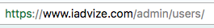

# Single Sign On

iAdvize offers a [Single Sign On](http://en.wikipedia.org/wiki/Single_sign-on) method that allows you to provide a unique authentication system to your operators who are already logged to your app.

## Benefits

If your users have to switch between several apps (including iAdvize) during their daily work, Single Sign On method has some interesting benefits :

*   Reducing password fatigue from different user name and password combinations
*   Reducing time spent re-entering passwords for the same identity
*   Reducing IT costs due to lower number of IT help desk calls about passwords

## Implementation

To connect an operator to its iAdvize console :

*   Get his sso_key in the [operator resource of the REST API](#operator).
*   Use it in the following URL : `https://www.iadvize.com/admin/login?key={SSO_KEY}`

That's all! When a user visit the URL, he will be automatically logged to its iAdvize account and no login / password will be asked to him.

## Use specific links

It's possible to use a specific link with a parameter called `dest` to go to a specific page.

Examples below:

| Page | URL |
| --- | --- |
| Discussion panel | `https://www.iadvize.com/admin/login?key={SSO_KEY}&dest=/pupitre` |
| Users | `https://www.iadvize.com/admin/login?key={SSO_KEY}&dest=/admin/users` |

To find the parameter `dest` that interest you, look the URL address of the page in your favorite web browser.

With this example, the SSO URL address will be:
`https://www.iadvize.com/admin/login?key={SSO_KEY}&dest=/admin/users/`
