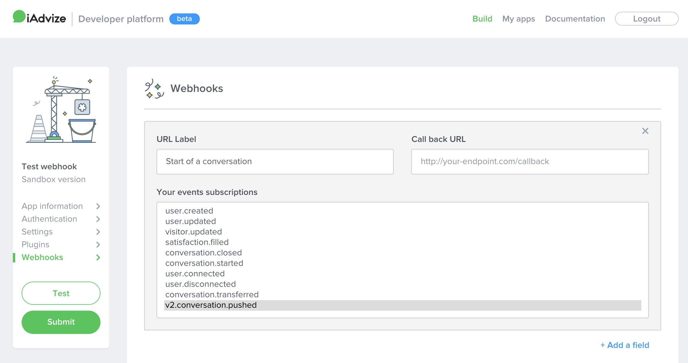

# Webhooks

## Overview webhooks

When an event occurs, an HTTP `POST` call is issued on the callback urls you set up with the event data.
Data is sent with `application/json` header content-type, and `json` format as payload.
Callback urls must be defined with HTTPS protocol and should be available with `POST` verb to send data payload.
iAdvize expect to have à 20x http status in callback result.

### Delivery headers
iAdvize will send the payload with three additional headers:

* X-iAdvize-Delivery: UUID, unique identifier to describe this webhook delivery
* X-iAdvize-CorrelationId: UUID, event identifier used in a retry webhooks to track same callback calls.
* X-iAdvize-Signature: Hash signature, cf. Security section

### Webhook retry management

If errors occur during webhook query (40x, 50x http status codes), we will retry two times.
We will try to send you the following requests:
* First time after delay of 10 seconds,
* and second time after 20 seconds (so, 30 seconds after first call).

In case of failure, you may need to track events in error, by following "X-iAdvize-CorrelationId" in headers, or "eventId" in the payload.

### Webhook security

Please refer to [this section](/documentation/build-apps#app-security).

## Reference webhooks

| Name | Description  |
| --- | --- | 
| [v2.conversation.pushed](/documentation/webhooks#v2.conversation.pushed) | Emitted on a beginning of a conversation or a receiving of a conversation transferred by another operator. |
| [v2.conversation.closed](/documentation/webhooks#v2.conversation.closed) | Emitted on an end of a conversation. Conversations on offsite channels are automatically closed after 7 days of inactivity.  
| [user.created](/documentation/webhooks#user.created) | Emitted on user creation in administration or API Rest. |
| [user.updated](/documentation/webhooks#user.updated) | Emitted on user update in administration or API Rest. |
| [user.connected](/documentation/webhooks#user.connected) | Emitted when user is connecting to administration or desk. |
| [user.disconnected](/documentation/webhooks#user.disconnected) | Emitted when user is disconnecting of administration or desk. |
| [visitor.updated](/documentation/webhooks#visitor.updated) | Emitted when a visitor information is updated from desk or admin view. |
| [satisfaction.answered](/documentation/webhooks#satisfaction.answered) | Emitted when visitor has answered a customer satisfaction, net promoter score or satisfaction comment.  Will be emitted at every click on answer by visitor. |
| [transaction.attributed](/documentation/webhooks#transaction.attributed) | Emitted when a transaction is attributed to a conversation. |

### `v2.conversation.pushed`

Emitted on a beginning of a conversation or a receiving of a conversation transferred by another operator.

<pre class="prettyprint lang-js">{
  "eventId": "0f0bb3af-5035-4ba3-b3fb-ff4879a3a74d",
  "eventType": "v2.conversation.pushed",
  "platform": "ha",
  "projectId": 1549,
  "clientId": 335,
  "conversationId": "4c8c7408-f73c-42cd-89e9-afbbee7d9024",
  "operatorId": 15253,
  "visitorExternalId": "63429889", // deprecated. Only available for ONSITE conversations. Use `visitorId` field instead.
  "channel": "CHAT",
  "visitorId": "b05f1b45-c891-4a9c-b47e-91ee6c8ffb44",
  "createdAt": "2019-04-12T07:58:35.171Z",
  "sentAt": "2019-04-12T07:58:35.496Z"
}
</pre>

Please note :

| Attribute | Description |
| --- | --- |
| channel | For onsite source :  -`CHAT`  -`CALL`  -`VIDEO`   For offsite:  -`FACEBOOK`  -`FACEBOOK_BUSINESS_ON_MESSENGER`  -`TWITTER`  -`MOBILE_APP`  -`SMS`|

### `v2.conversation.closed`

Emitted on an end of a conversation. Conversations on offsite channels are automatically closed after 7 days of inactivity.

<pre class="prettyprint lang-js">{
  "eventId": "0f0bb3af-5035-4ba3-b3fb-ff4879a3a74d",
  "eventType": "v2.conversation.closed",
  "platform": "ha",
  "projectId": 1549,
  "clientId": 335,
  "conversationId": "4c8c7408-f73c-42cd-89e9-afbbee7d9024",
  "operatorIds": [
    15253,
    15254
   ],
  "visitorExternalId": "63429889", // deprecated. Only available for ONSITE conversations. Use `visitorId` field instead.
  "channel": "CHAT",
  "visitorId": "b05f1b45-c891-4a9c-b47e-91ee6c8ffb44",
  "createdAt": "2019-04-12T07:58:35.171Z",
  "sentAt": "2019-04-12T07:58:35.496Z"
}
</pre>

Please note :

| Attribute | Description |
| --- | --- |
| channel | For onsite source :  -`CHAT`  -`CALL`  -`VIDEO`   For offsite:  -`FACEBOOK`  -`FACEBOOK_BUSINESS_ON_MESSENGER`  -`TWITTER`  -`MOBILE_APP`  -`SMS`|

### `user.created`

Emitted on user creation in administration or API Rest.

<pre class="prettyprint lang-js">{
    "eventId": "d36cd3c4-2d16-4a77-97c2-620bde859b29",
    "eventType": "user.created",
    "platform": "sd",
    "clientId": 1,
    "userId": 1,
    "createdAt": "2017-04-22T11:01:00+02:00",
    "sentAt": "2017-04-22T11:01:00+02:00"
}
</pre>

### `user.updated`

Emitted on user update in administration or API Rest.

<pre class="prettyprint lang-js">{
    "eventId": "d36cd3c4-2d16-4a77-97c2-620bde859b29",
    "eventType": "user.updated",
    "platform": "sd",
    "clientId": 1,
    "userId": 1,
    "createdAt": "2017-04-22T11:01:00+02:00",
    "sentAt": "2017-04-22T11:01:00+02:00"
}
</pre>

### `user.connected`

Emitted when user is connecting to administration or desk.

<pre class="prettyprint lang-js">{
    "eventId": "d36cd3c4-2d16-4a77-97c2-620bde859b29",
    "eventType": "user.connected",
    "platform": "sd",
    "clientId": 1,
    "userId": 1,
    "createdAt": "2017-04-22T11:01:00+02:00",
    "sentAt": "2017-04-22T11:01:00+02:00"
}
</pre>

### `user.disconnected`

Emitted when user is disconnecting to administration or desk.

<pre class="prettyprint lang-js">{
    "eventId": "d36cd3c4-2d16-4a77-97c2-620bde859b29",
    "eventType": "user.disconnected",
    "platform": "sd",
    "clientId": 1,
    "userId": 1,
    "createdAt": "2017-04-22T11:01:00+02:00",
    "sentAt": "2017-04-22T11:01:00+02:00"
}
</pre>

### `visitor.updated`

Emitted when a visitor information is updated from desk or admin view.

<pre class="prettyprint lang-js">{
    "eventId": "d36cd3c4-2d16-4a77-97c2-620bde859b29",
    "eventType": "visitor.updated",
    "platform": "sd",
    "clientId": 1,
    "operatorId": 1,
    "visitorId": "593de0891b628a50b09835dc6c0e92565329c74baa90e",
    "createdAt": "2017-04-22T11:01:00+02:00",
    "sentAt": "2017-04-22T11:01:00+02:00"
}
</pre>

### `satisfaction.answered`

Emitted when visitor has answered a customer satisfaction, net promoter score or satisfaction comment. Will be emitted at every click on an answer by the visitor.

***Example with `customerSatisfaction` filled***

<pre class="prettyprint lang-js">{
    "eventId": "d36cd3c4-2d16-4a77-97c2-620bde859b29",
    "eventType": "satisfaction.answered",
    "platform": "sd",
    "projectId": 3030,
    "clientId": 1,
    "createdAt": "2017-04-22T11:01:00+02:00",
    "sentAt": "2017-04-22T11:01:00+02:00",
    "conversationId": "2d90a8a2-16df-45f5-897e-31adf9aa165d",
    "customerSatisfaction" : 3
}
</pre>

***Example with `netPromoterScore` filled***

<pre class="prettyprint lang-js">{
    "eventId": "d36cd3c4-2d16-4a77-97c2-620bde859b29",
    "eventType": "satisfaction.answered",
    "platform": "sd",
    "projectId": 3030,
    "clientId": 1,
    "createdAt": "2017-04-22T11:01:00+02:00",
    "sentAt": "2017-04-22T11:01:00+02:00",
    "conversationId": "2d90a8a2-16df-45f5-897e-31adf9aa165d",
    "netPromoterScore" : 3
}
</pre>

***Example with `satisfactionComment` filled***

<pre class="prettyprint lang-js">{
    "eventId": "d36cd3c4-2d16-4a77-97c2-620bde859b29",
    "eventType": "satisfaction.answered",
    "platform": "sd",
    "projectId": 3030,
    "clientId": 1,
    "createdAt": "2017-04-22T11:01:00+02:00",
    "sentAt": "2017-04-22T11:01:00+02:00",
    "conversationId": "2d90a8a2-16df-45f5-897e-31adf9aa165d",
    "satisfactionComment" : "It was very helpful"
}
</pre>

### `transaction.attributed`

Emit when a transaction is attributed to a conversation.

<pre class="prettyprint lang-js">{
    "eventId": "d36cd3c4-2d16-4a77-97c2-620bde859b29",
    "eventType": "transaction.attributed",
    "platform": "sd",
    "projectId": 3030,
    "clientId": 1,
    "createdAt": "2017-04-22T11:01:00+02:00",
    "sentAt": "2017-04-22T11:01:00+02:00",
    "transactionId": "1d94c3e8-8cbe-4e46-933d-0433ec339f79",
    "receivedAt": "2017-04-22T11:01:00+02:00",
    "externalId": "transaction-1",
    "amount": 300.20,
    "conversationId": "2d90a8a2-16df-45f5-897e-31adf9aa165d",
    "source": "Onsite",
    "operatorId": 15253
}
</pre>

| Attribute | Description |
| --- | --- |
| source | `Onsite` for channels :  - CHAT  - CALL  - VIDEO   `Offsite` for channels:  - FACEBOOK  - FACEBOOK_BUSINESS_ON_MESSENGER  - TWITTER  - MOBILE_APP  - SMS|

### Deprecated events

⚠️ The following events should not be used anymore, they still appear in this documentation only for history purposes!

#### `conversation.started`

PLEASE DO NOT USE (refer to warning above).

<pre class="prettyprint lang-js">{
    "eventId": "d36cd3c4-2d16-4a77-97c2-620bde859b29",
    "eventType": "conversation.started",
    "platform": "sd",
    "websiteId": 1,
    "clientId": 1,
    "conversationId": 1,
    "operatorId": 1,
    "channel": "chat",
    "visitorId": "593de0891b628a50b09835dc6c0e92565329c74baa90e",
    "createdAt": "2017-04-22T11:01:00+02:00",
    "sentAt": "2017-04-22T11:01:00+02:00"
}
</pre>

#### `conversation.transferred`

PLEASE DO NOT USE (refer to warning above).

<pre class="prettyprint lang-js">{
    "eventId": "d36cd3c4-2d16-4a77-97c2-620bde859b29",
    "eventType": "conversation.transferred",
    "platform": "sd",
    "websiteId": 1,
    "clientId": 1,
    "conversationId": 2,
    "transferredConversationId": 1,
    "operatorId": 1,
    "channel": "chat",
    "visitorId": "593de0891b628a50b09835dc6c0e92565329c74baa90e",
    "createdAt": "2017-04-22T11:01:00+02:00",
    "sentAt": "2017-04-22T11:01:00+02:00"
}
</pre>

#### `conversation.closed`

PLEASE DO NOT USE (refer to warning above).

<pre class="prettyprint lang-js">{
    "eventId": "d36cd3c4-2d16-4a77-97c2-620bde859b29",
    "eventType": "conversation.closed",
    "platform": "sd",
    "websiteId": 1,
    "clientId": 1,
    "conversationId": 1,
    "operatorId": 1,
    "channel": "chat",
    "visitorId": "593de0891b628a50b09835dc6c0e92565329c74baa90e",
    "createdAt": "2017-04-22T11:01:00+02:00",
    "sentAt": "2017-04-22T11:01:00+02:00"
}
</pre>

## Guides webhooks

### Subscribe to your first webhook

In order to subscribe to the webhooks of your website, you need to create an app in our marketplace.
You'll need to have a developer account that you can get by signing up on <a href="https://developers.iadvize.com/login" target="_blank">this page</a>
You'll then be able to subscribe to all the available webhooks through our webhook building interface:

.
